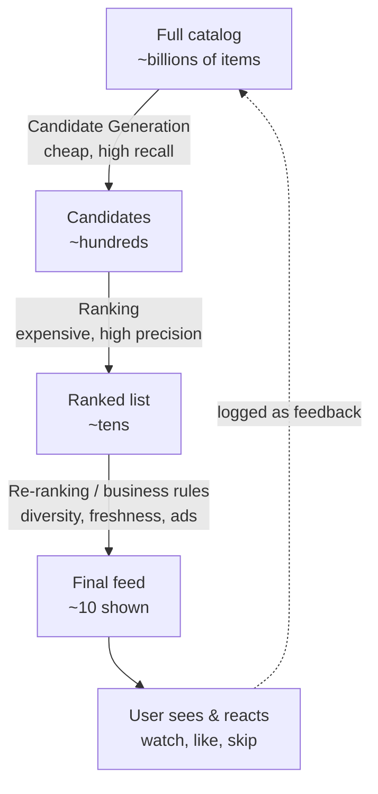

# ML & Recommendation Systems — Junior Interview Questions

> **Collection:** [System Design](../README.md) · **Level:** Junior · **Section 31 of 42**
> **Goal:** Explain how a large-scale recommender is shaped like a *funnel* —
> cheaply narrowing billions of items down to a handful — and reason about feature
> stores, candidate generation, ranking, online vs offline inference, and how A/B
> tests close the feedback loop without drawing on deep ML theory.

A junior is not expected to derive a loss function. They *are* expected to explain
how YouTube picks the next video from billions of options in under 100 ms, why the
system is split into a cheap "retrieve" stage and an expensive "rank" stage, and
where features come from. Each question lists **what the interviewer is really
probing**, a **model answer**, and often a **follow-up** they will ask next.

---

## Contents

1. [Recommendation Architecture (the retrieve → rank funnel)](#1-recommendation-architecture-the-retrieve--rank-funnel)
2. [Feature Store](#2-feature-store)
3. [Candidate Generation](#3-candidate-generation)
4. [Ranking & Scoring](#4-ranking--scoring)
5. [Online vs Offline Inference](#5-online-vs-offline-inference)
6. [A/B Testing & Feedback Loops](#6-ab-testing--feedback-loops)
7. [Rapid-Fire Self-Check](#7-rapid-fire-self-check)

---

## 1. Recommendation Architecture (the retrieve → rank funnel)

### Q1.1 — Why don't recommenders just score every item for every user?

**Probing:** Do you grasp that scale, not accuracy, forces the architecture?

**Model answer:** Because the catalog is enormous. YouTube has billions of videos;
running an expensive ranking model over all of them for one home-feed request would
take far too long and cost far too much. Instead the system is built as a **funnel**:
a cheap **candidate generation** (retrieval) stage narrows billions of items to a few
hundred, and an expensive **ranking** stage scores only those few hundred precisely.
You spend your compute budget where it matters — on the survivors, not the universe.

**Follow-up:** *"Why two stages instead of one really fast model?"* → No single model
is both cheap enough to run over billions of items *and* accurate enough to order the
final feed. Splitting the work lets each stage specialize: retrieval optimizes for
recall and speed, ranking optimizes for precision.

### Q1.2 — Sketch the two-stage funnel for a feed like TikTok's "For You."

**Probing:** Mechanical fluency with the canonical recommender flow.

**Model answer:** A request flows top to bottom. **Candidate generation** pulls a few
hundred plausible items out of billions using cheap signals (what's trending, what
similar users watched, the user's recent interests). **Ranking** then scores those few
hundred with a heavier model to predict, say, watch-time or like-probability. A final
**re-ranking** layer applies business rules — don't show three videos from the same
creator in a row, mix in something fresh, slot in ads. What the user does next is
logged and feeds back into training data.

### Q1.3 — Where does each funnel stage spend its compute budget, and why is that the right split?

**Probing:** Understanding the precision/recall division of labor.

**Model answer:** The early stage is **cheap per item but runs over many items**, so it
must be fast and is tuned for *recall* — "don't miss anything good," accepting some
junk. The late stage is **expensive per item but runs over few items**, so it can
afford a rich model tuned for *precision* — "order the survivors correctly." This is
the right split because cost is (items × cost-per-item): you keep the per-item cost low
where the item count is huge, and let the per-item cost rise only after the count has
collapsed to a few hundred.

---

## 2. Feature Store

### Q2.1 — What is a feature store, and what problem does it solve?

**Probing:** Do you know features are shared inputs, not one-off code?

**Model answer:** A **feature** is a single input signal a model uses — a user's
average watch-time, a video's age in hours, how many times this user watched this
creator. A **feature store** is the central system that *computes, stores, and serves*
those features so they're consistent across training and serving and reusable across
teams. Without it, every team re-derives "user's 7-day watch count" slightly
differently, and the version used to train the model differs from the version served in
production — a classic source of silent bugs.

**Follow-up:** *"What's the worst bug a feature store prevents?"* →
**Train/serve skew**: training on a feature computed one way but serving a
differently-computed value. The model then behaves worse in production than in
evaluation, and it's painful to debug.

### Q2.2 — A feature store has an "offline" and an "online" side. What's the difference?

**Probing:** The two access patterns, batch vs low-latency.

**Model answer:**

| | Offline store | Online store |
|---|---|---|
| **Purpose** | Build training datasets | Serve features at request time |
| **Access pattern** | Large batch reads | Single-key, very low latency |
| **Typical storage** | Data warehouse / columnar files | Key-value store (e.g., Redis-like) |
| **Latency budget** | Minutes to hours is fine | A few milliseconds |
| **Example** | "Every user's 30-day watch history, for training" | "This user's current watch count, right now" |

The offline side answers "give me a year of history to train on"; the online side
answers "give me *this* user's features in under 10 ms so I can rank their feed." A good
feature store keeps both in sync so the same definition powers training and serving.

### Q2.3 — Give an example each of a user feature, an item feature, and a context feature.

**Probing:** Can you ground the abstraction in a real feed?

**Model answer:** For a Netflix recommendation: a **user feature** is "genres this user
watched most in the last 30 days." An **item feature** is "this title's average rating
and its release year." A **context feature** is "it's Friday night on a TV device."
Context features matter because the *same* user wants different things on a phone at
lunch versus a TV on a weekend — the recommendation should change even though the user
and catalog didn't.

---

## 3. Candidate Generation

### Q3.1 — What is candidate generation, in one sentence?

**Probing:** Crisp definition of the retrieval stage.

**Model answer:** Candidate generation is the cheap first stage that retrieves a few
hundred plausible items out of the entire catalog, optimized for **recall and speed** —
its job is to make sure the good items are *somewhere in the shortlist*, not to order
them perfectly. That ordering is ranking's job.

### Q3.2 — Name a few simple ways to generate candidates.

**Probing:** Concrete sources, not hand-waving "the algorithm."

**Model answer:** Common, easy-to-explain sources:
- **Popularity / trending** — what's globally hot right now (a strong default, and the
  fallback for brand-new users).
- **Collaborative filtering** — "users who watched what you watched also watched X."
- **Content similarity** — items with similar tags, topics, or embeddings to what you
  liked.
- **Recent activity / continuation** — the next episode, or more from a creator you just
  watched.

A real system blends **several candidate sources** and unions their results, so the
shortlist isn't dominated by one signal.

**Follow-up:** *"Why blend multiple sources?"* → Each source has a blind spot.
Popularity ignores personal taste; pure similarity creates a filter bubble. Unioning
them gives both relevance and variety before ranking even starts.

### Q3.3 — How do you generate candidates for a brand-new user with no history?

**Probing:** Awareness of the **cold-start problem**.

**Model answer:** This is the **cold-start problem** — you have no behavioral signal yet.
You fall back to non-personalized sources: **trending/popular** items, **editorially
curated** picks, or whatever the user told you at sign-up (a few favorite genres). As
the user interacts, you collect signal and shift toward personalized candidates. The
same idea applies to a brand-new *item* nobody has watched: lean on its content features
(tags, description) until interaction data accumulates.

### Q3.4 — How can retrieval be fast over billions of items?

**Probing:** Light awareness of embeddings + nearest-neighbor lookup.

**Model answer:** A common trick is to turn each user and each item into a **vector
(embedding)** so that "similar" things sit close together in that space. Recommending
then becomes "find the items whose vectors are nearest to this user's vector" — and an
**approximate nearest-neighbor (ANN)** index answers that in milliseconds without
comparing against every item. Other candidates come from simple precomputed lists
(trending, "more like this") that are just looked up by key. You don't score billions
live; you precompute and index so retrieval is a fast lookup.

---

## 4. Ranking & Scoring

### Q4.1 — What does the ranking stage do that candidate generation doesn't?

**Probing:** The precision-vs-recall split again, from ranking's side.

**Model answer:** Ranking takes the few hundred candidates and scores each one
**precisely**, then sorts them, so it's optimized for **precision** — getting the top
few right. It can afford a much richer model than retrieval because it runs over
hundreds of items, not billions. Candidate generation answers "which items are worth
considering?"; ranking answers "in exactly what order should we show them?"

### Q4.2 — What is a recommender actually predicting when it scores an item?

**Probing:** Connecting the model to a measurable objective.

**Model answer:** It predicts the probability (or expected value) of an **engagement
event** the product cares about — for YouTube, expected **watch-time**; for a feed,
probability of a **click**, **like**, or **long dwell**. The score is essentially
"how likely is this user to engage well with this item, given everything we know?" Items
are sorted by that predicted score. Choosing the *right* objective matters: optimizing
pure click probability can promote clickbait, so real systems blend signals (click *and*
satisfaction *and* completion).

**Follow-up:** *"Why not just rank by raw popularity?"* → Popularity isn't personalized
and creates a rich-get-richer loop where popular items get shown more and stay popular.
Ranking by *predicted engagement for this specific user* is what makes the feed feel
tailored.

### Q4.3 — Candidate generation vs ranking — summarize the contrast.

**Probing:** Can you put the whole funnel in one table?

**Model answer:**

| | Candidate Generation | Ranking |
|---|---|---|
| **Input size** | Billions of items | Hundreds of candidates |
| **Output size** | Hundreds | A sorted list of tens |
| **Optimized for** | Recall (don't miss good items) | Precision (order the top right) |
| **Cost per item** | Very cheap | Expensive (richer model + features) |
| **Question it answers** | "What's worth considering?" | "In what order?" |

The two stages are complementary: retrieval makes the problem small enough that ranking
can afford to be smart.

### Q4.4 — Why is there often a "re-ranking" step after ranking?

**Probing:** Awareness that the model score isn't the final word.

**Model answer:** Because a feed needs more than raw predicted-engagement order.
**Re-ranking** applies business and UX rules on top: **diversity** (don't show five
clips from one creator back-to-back), **freshness** (mix in new content so the feed
doesn't feel stale), **fairness/exploration** (give new items a chance to be seen), and
**ads or sponsored slots**. The ML model proposes; re-ranking enforces the product's
constraints before the user sees the result.

---

## 5. Online vs Offline Inference

### Q5.1 — What's the difference between online and offline inference?

**Probing:** The core operational split for serving predictions.

**Model answer:** **Online (real-time) inference** computes recommendations *at request
time*, when the user opens the app — fresh, personalized to the current moment, but it
must fit inside a tight latency budget. **Offline (batch) inference** precomputes
recommendations ahead of time on a schedule and stores them, so serving is just a fast
lookup — cheaper and simpler, but the results can be stale by the time they're shown.

### Q5.2 — Compare the two and say when you'd pick each.

**Probing:** Trade-off reasoning, not memorized definitions.

**Model answer:**

| | Online (real-time) | Offline (batch / precomputed) |
|---|---|---|
| **When computed** | At request time | Ahead of time, on a schedule |
| **Freshness** | Uses the latest signals | Can be hours stale |
| **Latency to serve** | Must compute within budget | Instant lookup |
| **Cost** | Higher (compute per request) | Lower (amortized batch) |
| **Best for** | Fast-changing feeds (TikTok "For You") | Slow-changing lists ("recommended for you" email) |

**Pick online** when the right answer depends on what the user *just* did — TikTok must
react to the last few swipes immediately. **Pick offline** when recommendations change
slowly and freshness can lag — a daily "movies you might like" digest. Many real systems
do **both**: precompute candidates offline, then rank online with fresh context.

**Follow-up:** *"How can you keep online inference within its latency budget?"* → Do the
heavy lifting offline (precompute embeddings and candidate lists), keep online work to a
fast lookup plus ranking a few hundred items, cache hot results, and serve features from
the low-latency online store.

### Q5.3 — What goes wrong if recommendations are too stale?

**Probing:** Why freshness is a real product concern.

**Model answer:** Stale recommendations ignore what the user is doing *right now*. If
you precompute someone's feed at 6 a.m. and they spend the evening watching cooking
videos, an all-day-stale feed never reflects that interest — it feels unresponsive and
"doesn't know me." Worse, it can keep recommending an item the user already watched or
dismissed. The fix is to refresh more often or move the time-sensitive part (ranking
with current context) online.

---

## 6. A/B Testing & Feedback Loops

### Q6.1 — Why do recommender teams A/B test changes instead of just shipping them?

**Probing:** Do you know offline metrics aren't enough?

**Model answer:** Because a model that looks better *offline* (on logged historical
data) doesn't always perform better with *real users*. An **A/B test** splits live
traffic — group A (control) gets the current system, group B (treatment) gets the new
one — and you compare a real metric like watch-time, click-through, or retention. Only
the live experiment tells you whether the change actually improves the user experience
rather than just the offline score.

**Follow-up:** *"What's one metric you'd watch besides clicks?"* → A long-term or
satisfaction signal — watch-time completion, next-day retention, or explicit "not
interested" rates — because optimizing clicks alone can boost clickbait while hurting
how users actually feel.

### Q6.2 — What is a feedback loop in a recommender, and why is it both useful and dangerous?

**Probing:** The double-edged nature of "the model trains on its own outputs."

**Model answer:** A **feedback loop** is the cycle where the system recommends items,
users react (watch, like, skip), those reactions are logged, and the logs become
**training data** for the next model. It's *useful* because the system continuously
learns from real behavior. It's *dangerous* because the model only gets feedback on
items **it chose to show** — if it never shows a good item, it never learns the item is
good. This can create a **rich-get-richer** loop and **filter bubbles**, narrowing what
users ever see.

**Follow-up:** *"How do you fight that?"* → **Exploration**: deliberately show some items
the model is unsure about so you collect feedback on them, instead of always exploiting
the current best guess. That's the explore/exploit balance.

### Q6.3 — Where does an A/B test sit in the overall loop?

**Probing:** Tying experimentation back to the funnel and feedback.

**Model answer:** The loop is: **train a model → serve recommendations → log user
reactions → use logs to train the next model.** An A/B test is the **gate** between
"we built a candidate change" and "we roll it out to everyone." You run the new model on
a slice of live traffic, measure real engagement against the control, and only promote
it if it wins on the metrics that matter. So experimentation is how you safely decide
which change earns a place in the production feedback loop.

### Q6.4 — Name one metric that can be misleading if you optimize it alone.

**Probing:** Awareness that proxy metrics can backfire (Goodhart's law, in plain terms).

**Model answer:** **Click-through rate.** It's easy to measure and easy to game —
clickbait thumbnails and outrage-y titles raise clicks while lowering real satisfaction.
"When a measure becomes a target, it stops being a good measure." That's why teams
balance short-term engagement (clicks) against longer-term, harder-to-game signals like
watch-completion, return visits, and explicit feedback.

---

## 7. Rapid-Fire Self-Check

If you can answer each of these in a sentence, you're ready for the junior bar on this section:

- [ ] Why is a recommender shaped like a funnel? *(can't score billions per request — narrow cheaply, then rank precisely)*
- [ ] Candidate generation vs ranking — recall or precision for each? *(retrieval = recall, ranking = precision)*
- [ ] What is a feature store, and what bug does it prevent? *(shared feature definitions; prevents train/serve skew)*
- [ ] Offline vs online side of a feature store — one difference. *(batch training reads vs millisecond serving lookups)*
- [ ] What is the cold-start problem and one fix? *(no history; fall back to popular/curated/sign-up signals)*
- [ ] What does a ranking model actually predict? *(probability/value of an engagement event, e.g. watch-time)*
- [ ] Online vs offline inference — when do you pick each? *(online for fast-changing context; offline for slow, cacheable lists)*
- [ ] Why A/B test instead of trusting offline metrics? *(offline wins don't always translate to real-user wins)*
- [ ] What is a feedback loop's main danger and its antidote? *(filter bubbles / rich-get-richer; exploration)*

---

**Next step:** Section 32 — [Classic Problems](32-classic-problems.md): putting the building blocks together on the canonical end-to-end design questions.
