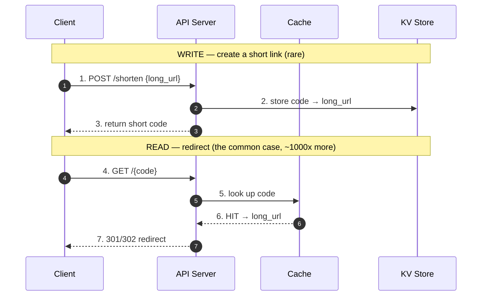

# Classic Problems — Junior Interview Questions

> **Collection:** [System Design](../README.md) · **Level:** Junior · **Section 32 of 42**
> **Goal:** Recognize each of the canonical system-design interview problems on sight,
> ask the right clarifying questions, name the 3–5 core components, classify the workload
> as read- or write-heavy, and point at the single hardest part — without pretending to
> deliver a full senior deep-dive.

The "classic problems" are a small set of prompts that recur in almost every interview:
shorten a URL, throttle requests, build a feed, run a chat, fan out notifications, power
autocomplete, crawl the web, store key-value pairs, and find what's nearby. At the junior
bar, nobody expects you to shard a global database live. They expect you to **not freeze**:
clarify the scope, sketch the data flow, name the pieces, and honestly identify where the
difficulty lives. Each problem below gives you that skeleton.

---

## Contents

1. [How to Approach Any Classic Problem](#1-how-to-approach-any-classic-problem)
2. [URL Shortener (TinyURL / bit.ly)](#2-url-shortener-tinyurl--bitly)
3. [Rate Limiter](#3-rate-limiter)
4. [News Feed / Timeline](#4-news-feed--timeline)
5. [Chat System](#5-chat-system)
6. [Notification System](#6-notification-system)
7. [Typeahead / Search Autocomplete](#7-typeahead--search-autocomplete)
8. [Web Crawler](#8-web-crawler)
9. [Key-Value Store](#9-key-value-store)
10. [Nearby / Proximity Service](#10-nearby--proximity-service)
11. [Read-Heavy vs Write-Heavy Cheat Sheet](#11-read-heavy-vs-write-heavy-cheat-sheet)
12. [Rapid-Fire Self-Check](#12-rapid-fire-self-check)

---

## 1. How to Approach Any Classic Problem

### Q1.1 — You're handed any "design X" prompt. What's your fixed opening sequence?

**Probing:** Do you have a *repeatable* routine so you never go blank, regardless of the problem?

**Model answer:** The same four moves every time:
1. **Clarify scope** — which features are in, which users, which scale? Pin the problem down before drawing anything.
2. **Classify the workload** — read-heavy or write-heavy? This single fact reshapes the design.
3. **Name the core components** — client → API → service → data store, plus the one or two pieces this problem specifically needs (a cache, a queue, a specialized index).
4. **Call out the hard part** — every classic problem has one dominant difficulty. Naming it honestly is what separates a junior who *understands* from one who memorized a diagram.

**Follow-up:** *"Why classify read vs write so early?"* → Because read-heavy problems push you toward caching, replication, and precomputation; write-heavy problems push you toward queues, partitioning, and write throughput. You can't choose tools until you know which way the traffic flows.

### Q1.2 — What are the three or four clarifying questions that apply to almost every problem?

**Probing:** Can you ask the *universal* questions before the problem-specific ones?

**Model answer:** Four that nearly always earn their keep:
- **Scale** — how many users / requests per second / items stored?
- **Read:write ratio** — are we mostly serving data or mostly accepting it?
- **Latency target** — is this a "feels instant" path (< 100 ms) or can it be a background job?
- **Consistency tolerance** — is stale-by-a-few-seconds acceptable, or must every read be exact?

The hard part of *approaching* is discipline: resisting the urge to draw boxes before these answers are in hand.

---

## 2. URL Shortener (TinyURL / bit.ly)

### Q2.1 — Design a URL shortener. What do you clarify, and what are the core components?

**Probing:** Do you spot that this is overwhelmingly **read-heavy** and that the interesting bit is key generation, not storage?

**Model answer:** **Clarify:** how many new URLs per day vs redirects per day (writes vs reads)? Custom aliases allowed? Do links expire? How short must the code be? Analytics needed? **Workload:** massively read-heavy — one URL is created once but redirected thousands of times. **Core components:**
- **API server** — `POST /shorten` (write) and `GET /{code}` (redirect/read).
- **Key-generation strategy** — turn a long URL into a short unique code.
- **Data store** — a key-value mapping `code → long URL` (a KV store or indexed SQL table).
- **Cache** — hot codes served from memory so redirects never touch disk.

**The single hardest part:** generating short, **unique**, collision-free codes at scale. The clean answer is a counter (auto-increment ID) encoded in **base62** (`[0-9a-zA-Z]`), which guarantees uniqueness without checking the database for collisions. Hashing the URL is tempting but invites collisions and must be checked.

**Follow-up:** *"Why base62 over a random string?"* → A counter in base62 is guaranteed unique with no collision check; random strings need a uniqueness lookup on every write and waste a round trip.

---

## 3. Rate Limiter

### Q3.1 — Design a rate limiter (e.g., 100 requests/minute per user). What do you clarify and name?

**Probing:** Do you know where it sits (in front of the service) and that the hard part is *shared, accurate counting* across many servers?

**Model answer:** **Clarify:** limit per user, per IP, or per API key? What's the limit and window? What happens on exceed — reject with `429`, queue, or throttle? Is a small amount of over-limit acceptable? **Workload:** every request hits it, so it must be *fast* and not become the bottleneck. **Core components:**
- **A counter store** — typically **Redis**, holding per-key request counts with expiry.
- **The limiting algorithm** — fixed window, sliding window, or **token bucket** (the common default, allows bursts).
- **Middleware/gateway hook** — runs before the real handler, returns `429` when over limit.

**The single hardest part:** keeping the count **accurate and shared across all app servers**. A naive in-memory counter per server lets a user multiply their limit by the number of servers. The fix is a centralized store (Redis) so all servers see one count — which then makes that store's latency and availability part of every request path.

**Follow-up:** *"Why token bucket over a fixed window?"* → Token bucket tolerates short bursts and avoids the fixed-window edge problem (a user firing 100 requests at the end of one window plus 100 at the start of the next — 200 in a blink). It refills tokens at a steady rate, smoothing traffic.

---

## 4. News Feed / Timeline

### Q4.1 — Design a news feed (Twitter/Instagram home timeline). Clarify, classify, name the pieces.

**Probing:** Do you reach for **fan-out** and recognize the read-vs-write trade-off behind it?

**Model answer:** **Clarify:** how many followers does a typical and a celebrity user have? How fresh must the feed be? Chronological or ranked? Read- or write-heavy? **Workload:** very read-heavy — users open the feed far more often than they post. **Core components:**
- **Post service + store** — where new posts land (write path).
- **Follow/graph store** — who follows whom.
- **Feed generation (fan-out)** — assemble each user's timeline.
- **Feed cache** — precomputed timelines in memory for instant reads.

**The single hardest part:** **fan-out strategy.** *Fan-out on write* (push) copies a new post into every follower's precomputed feed when it's published — feeds load instantly, but a celebrity with 50M followers triggers 50M writes. *Fan-out on read* (pull) builds the feed on demand by merging the posts of everyone you follow — cheap writes, but expensive, slow reads. The real answer is **hybrid**: push for normal users, pull for celebrities.

**Follow-up:** *"What breaks with pure fan-out-on-write?"* → The celebrity (or "hot key") problem: one post by a megastar causes a write storm. That's exactly why large platforms special-case high-follower accounts with a pull-based merge at read time.

---

## 5. Chat System

### Q5.1 — Design a 1:1 chat system (WhatsApp/Messenger). What do you clarify and name?

**Probing:** Do you know that polling doesn't cut it and that **persistent connections** are the heart of the problem?

**Model answer:** **Clarify:** 1:1 only or group chats? Online presence and "delivered/read" receipts? Message history retention? Expected concurrent connections? **Workload:** balanced reads and writes, but the defining trait is **real-time, low-latency push** — the server must reach the client *immediately*. **Core components:**
- **WebSocket (or long-lived) connection** — so the server can push, not wait to be polled.
- **Chat/connection servers** — hold the live connections; a map of `user → which server holds their socket`.
- **Message store** — persist messages (and for offline delivery).
- **Message queue** — buffer messages for users who are offline, deliver on reconnect.

**The single hardest part:** **routing a message to a recipient who is connected to a *different* server** (and delivering reliably when they're offline). You need a registry of which server holds each user's connection, plus a queue so messages aren't lost while a user is offline — delivered the moment they reconnect.

**Follow-up:** *"Why WebSocket instead of the client polling every second?"* → Polling wastes huge bandwidth and adds latency (you wait up to the poll interval). A WebSocket is one persistent connection the server can push down the instant a message arrives — lower latency, far less overhead.

---

## 6. Notification System

### Q6.1 — Design a notification system (push, email, SMS). Clarify, classify, name.

**Probing:** Do you see this as a **fan-out + async queue** problem with multiple delivery channels?

**Model answer:** **Clarify:** which channels (push/email/SMS)? Transactional ("your order shipped") or bulk marketing? Required delivery speed? Must we deduplicate or respect user opt-outs? **Workload:** write/dispatch-heavy and **bursty** — one event ("flash sale") can trigger millions of notifications at once. **Core components:**
- **Notification service / API** — accepts "notify these users about X."
- **Message queue** — absorbs bursts so the system isn't overwhelmed; decouples request from delivery.
- **Workers per channel** — pull from the queue and call the right provider (APNs/FCM for push, an email provider, an SMS gateway).
- **User preference + token store** — opt-outs, device tokens, contact info.

**The single hardest part:** **reliable, decoupled fan-out without melting on a burst.** A queue between "an event happened" and "send the message" is essential — it smooths spikes, lets you retry failed sends, and isolates a slow third-party provider from the rest of the system. The secondary hard part is avoiding duplicate notifications on retry (idempotency).

**Follow-up:** *"Why put a queue in the middle?"* → It decouples producers from consumers: the triggering service returns instantly, bursts are buffered instead of dropped, failed deliveries can be retried, and one slow provider (e.g., SMS) doesn't block the others.

---

## 7. Typeahead / Search Autocomplete

### Q7.1 — Design search autocomplete. What do you clarify, and what data structure is at the core?

**Probing:** Do you reach for a **trie** and recognize the brutal latency requirement?

**Model answer:** **Clarify:** how many suggestions to return? Ranked by popularity or just prefix match? How fresh must new/trending terms be? Personalized? **Workload:** extremely **read-heavy** with a punishing latency bar — suggestions must appear within a few tens of milliseconds *per keystroke*. **Core components:**
- **Trie (prefix tree)** — maps each prefix to its top completions; the canonical structure for prefix lookups.
- **Precomputed top-K per node** — store the best suggestions *at* each prefix node so a query is a single lookup, not a subtree scan.
- **Cache** — hot prefixes in memory.
- **Offline aggregation pipeline** — counts query frequencies and rebuilds the trie periodically.

**The single hardest part:** **sub-50ms responses on every keystroke** while ranking by popularity. You can't compute rankings live; you precompute and cache the top-K completions at each trie node offline, so a keystroke is a near-instant lookup. The trade-off: suggestions update on a delay, not in real time.

**Follow-up:** *"Why a trie and not a SQL `LIKE 'abc%'` query?"* → A `LIKE` prefix scan grows slow as data grows and can't cheaply return *ranked* top suggestions per keystroke. A trie with precomputed top-K per node turns each lookup into a constant-ish walk down a few characters.

---

## 8. Web Crawler

### Q8.1 — Design a web crawler. What do you clarify, and what are the core components?

**Probing:** Do you treat the **URL frontier** as the centerpiece and remember politeness + dedup?

**Model answer:** **Clarify:** how many pages, in what time? Just HTML or media too? How fresh must content be (re-crawl cadence)? Must we respect `robots.txt`? **Workload:** **write/ingest-heavy** and massively parallel — fetch, parse, store, repeat across billions of pages. **Core components:**
- **URL frontier** — the queue of URLs still to crawl (with priority and politeness scheduling).
- **Fetchers** — download pages, in parallel, politely (rate-limited per domain).
- **Parser** — extract content and new links to feed back into the frontier.
- **Seen-URL store / dedup** — so the same page isn't crawled endlessly (often a Bloom filter for cheap membership checks).
- **Content store** — where downloaded pages land.

**The single hardest part:** **avoiding traps and duplicates while staying polite.** The web is full of cycles and infinite URL spaces; without dedup the crawler loops forever, and without per-domain rate limiting you'll hammer (and get banned from) sites. The frontier plus a seen-URL filter is what keeps the crawl finite and well-behaved.

**Follow-up:** *"Why a Bloom filter for the seen set?"* → Tracking "have I seen this URL?" for billions of URLs in exact form is memory-prohibitive. A Bloom filter answers membership in tiny space, accepting a small false-positive rate (occasionally skipping a new URL) in exchange for fitting in memory.

---

## 9. Key-Value Store

### Q9.1 — Design a distributed key-value store. What do you clarify, and what are the core ideas?

**Probing:** Do you name **consistent hashing** and **replication** as the two load-bearing pieces?

**Model answer:** **Clarify:** what's the read:write ratio? Strong or eventual consistency? Value sizes? Expected throughput and total data size? Persistence required or cache-only? **Workload:** depends — but the design questions are about **distribution and durability** regardless. **Core components:**
- **Partitioning via consistent hashing** — spread keys across many nodes so adding/removing a node moves minimal data.
- **Replication** — keep N copies of each key on different nodes for durability and availability.
- **A coordinator / routing layer** — find which node(s) own a given key.
- **Per-node storage engine** — how each node persists its slice (often an LSM-tree for write-heavy loads).

**The single hardest part:** **distributing data evenly *and* surviving node failures** — i.e., the partition + replication combo. Plain `hash(key) % N` reshuffles almost everything when N changes; **consistent hashing** moves only a small fraction of keys, and replication ensures a key is still readable when a node dies. Together they're the heart of every Dynamo-style store, and they force you to confront the consistency trade-off (CAP).

**Follow-up:** *"Why consistent hashing over modulo hashing?"* → With `mod N`, adding one node changes the bucket for nearly every key, triggering a massive data reshuffle. Consistent hashing maps keys and nodes onto a ring so adding/removing a node only remaps the keys in one neighboring segment.

---

## 10. Nearby / Proximity Service

### Q10.1 — Design a "find nearby" service (Yelp / Uber drivers nearby). What do you clarify and name?

**Probing:** Do you realize plain lat/long columns can't answer "within 5 km" efficiently, and reach for **geospatial indexing**?

**Model answer:** **Clarify:** are the points static (restaurants) or moving (drivers)? Search radius or fixed result count? How many location updates per second (huge if vehicles move)? Read- or write-heavy? **Workload:** static-POI search is **read-heavy**; live driver tracking is **write-heavy** (constant location updates). **Core components:**
- **Geospatial index** — **geohash** or a quadtree to map 2D locations into a searchable structure.
- **Location store** — where POIs or live positions live (often Redis with geo support for moving objects).
- **Query service** — "give me everything within radius R of (lat, lng)."

**The single hardest part:** **efficiently querying by 2D proximity.** A `WHERE lat BETWEEN ... AND lng BETWEEN ...` scan doesn't scale and gives a box, not a true radius. A **geohash** encodes a 2D location into a string prefix so that nearby points share prefixes — turning "find nearby" into an indexed prefix lookup. For moving objects, the added difficulty is handling the firehose of location updates.

**Follow-up:** *"Why geohash instead of two indexed lat/long columns?"* → Two range conditions can't use a single index well and return a rectangle that still needs distance filtering. A geohash collapses 2D proximity into 1D string prefixes, so neighbors are findable with an ordinary prefix/range lookup on one indexed column.

---

## 11. Read-Heavy vs Write-Heavy Cheat Sheet

Classifying the workload is the first lever you pull on any of these. Here's the whole set at a glance:

| Problem | Workload | Core components (junior set) | Single hardest part |
|---|---|---|---|
| URL Shortener | Read-heavy (~1000:1) | API · key-gen · KV store · cache | Unique short-code generation (base62 counter) |
| Rate Limiter | Read path, every request | Redis counter · algorithm · gateway hook | Accurate shared counting across servers |
| News Feed | Read-heavy | Post store · graph · fan-out · feed cache | Fan-out strategy (push vs pull; celebrities) |
| Chat System | Balanced, real-time push | WebSocket · conn servers · store · queue | Routing to recipient's server / offline delivery |
| Notification System | Write/dispatch-heavy, bursty | API · queue · per-channel workers · prefs | Reliable decoupled fan-out under bursts |
| Typeahead | Read-heavy, ultra-low latency | Trie · top-K per node · cache · aggregator | Sub-50ms ranked suggestions per keystroke |
| Web Crawler | Write/ingest-heavy | Frontier · fetchers · parser · dedup · store | Traps/duplicates while staying polite |
| Key-Value Store | Varies | Consistent hashing · replication · routing · engine | Even distribution + surviving node failure |
| Proximity Service | Read (static) / Write (moving) | Geo-index · location store · query service | Efficient 2D proximity queries (geohash) |

The pattern to internalize: **read-heavy → cache, replicate, precompute** · **write-heavy → queue, partition, batch.**

---

## 12. Rapid-Fire Self-Check

If you can answer each in a sentence or two, you're at the junior bar for this section:

- [ ] What four moves open *any* "design X" problem? *(clarify scope → classify workload → name components → call out the hard part)*
- [ ] URL shortener: read- or write-heavy, and how do you generate codes? *(read-heavy; base62-encoded counter)*
- [ ] Rate limiter: what's the hard part across many servers? *(one accurate, shared count — use Redis)*
- [ ] News feed: what does "fan-out on write vs read" mean and what breaks it? *(push vs pull; the celebrity/hot-key problem)*
- [ ] Chat: why WebSockets, and what's the routing challenge? *(server push; reaching a user on another server / offline delivery)*
- [ ] Notification system: why is a queue essential? *(decouple + buffer bursts + retry)*
- [ ] Typeahead: which data structure, and why not SQL `LIKE`? *(trie with precomputed top-K; LIKE can't rank fast per keystroke)*
- [ ] Web crawler: what is the URL frontier, and why a Bloom filter? *(the to-crawl queue; cheap dedup at scale)*
- [ ] Key-value store: why consistent hashing? *(adding a node moves few keys, not all)*
- [ ] Proximity service: why geohash over lat/long range scans? *(collapses 2D proximity into indexable prefixes)*
- [ ] For each problem, can you state its workload class in one word? *(read- or write-heavy)*

---

**Next step:** Section 33 — [Real-World Architectures](33-real-architectures.md): how these building blocks combine in the systems behind real products.
