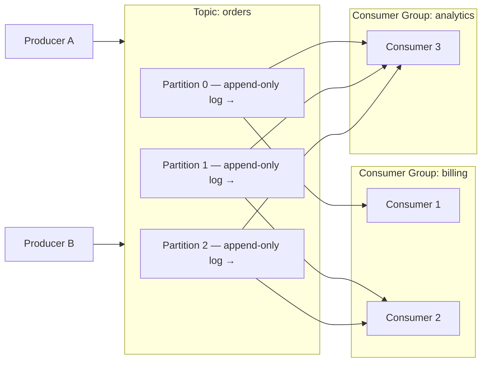
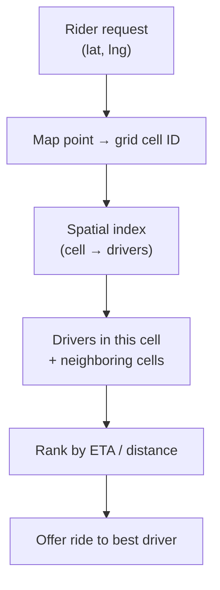
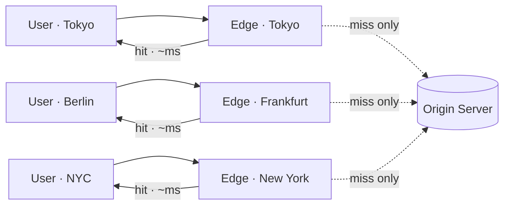

# Real-World Architectures — Junior Interview Questions

> **Collection:** [System Design](../README.md) · **Level:** Junior · **Section 33 of 42**
> **Goal:** For each famous production system, be able to say *what it is*, *the problem
> it solves*, and *the one design idea it is famous for* — the named concept an
> interviewer expects you to reach for without hesitation.

A junior answer here is not an architecture deep-dive. It is the ability to *place* a
system: which category it belongs to, what pain it removes, and the single signature
idea that makes it special. When an interviewer says "use something like Kafka here,"
they want to see that the word triggers the right mental model. Each question lists
**what the interviewer is really probing**, a **model answer** centered on the key idea,
and often a **follow-up** they will ask next.

---

## Contents

1. [Apache Kafka](#1-apache-kafka)
2. [Apache Cassandra](#2-apache-cassandra)
3. [Redis](#3-redis)
4. [Discord](#4-discord)
5. [Slack](#5-slack)
6. [Uber / Lyft Dispatch](#6-uber--lyft-dispatch)
7. [Google Spanner](#7-google-spanner)
8. [Amazon S3](#8-amazon-s3)
9. [Content Delivery Network (CDN)](#9-content-delivery-network-cdn)
10. [Amazon DynamoDB](#10-amazon-dynamodb)
11. [Cheat-Sheet: System → Category → Key Idea](#11-cheat-sheet-system--category--key-idea)
12. [Rapid-Fire Self-Check](#12-rapid-fire-self-check)

---

## 1. Apache Kafka

### Q1.1 — What is Kafka, and what problem does it solve?

**Probing:** Do you know it is a *log*, not a traditional message queue?

**Model answer:** Kafka is a distributed, durable, append-only **commit log** used as a
streaming platform. The problem it solves: in a large system, many producers generate
events (clicks, orders, sensor readings) and many independent consumers need those
events — some now, some replayed later. Wiring every producer directly to every
consumer is an N×M mess. Kafka becomes the central pipe: producers append events to a
**topic**, and any number of consumers read from it at their own pace, decoupling who
writes data from who reads it.

**Follow-up:** *"How is it different from a normal queue like RabbitMQ?"* → A classic
queue *deletes* a message once it's consumed. Kafka keeps the log on disk for a
retention window, so the same events can be re-read by new or recovering consumers.
It's a *replayable log*, not a one-shot mailbox.

### Q1.2 — Name Kafka's single most famous design idea.

**Probing:** Can you name "the partitioned, append-only log" and why it scales?

**Model answer:** The **partitioned append-only log**. A topic is split into
**partitions**; each partition is an ordered, immutable sequence of records that only
ever grows at the end. Partitioning is what lets Kafka scale horizontally — partitions
live on different brokers, so throughput grows by adding machines. Ordering is
guaranteed *within* a partition (not across the whole topic), and a **consumer group**
spreads partitions across its members so each event is processed once per group. The
combination — append-only durability plus partition-level parallelism — is Kafka's
signature.

**Follow-up:** *"Where does ordering hold?"* → Only within a single partition. If a
feature needs all events for one user in order, route them to the same partition using
the user ID as the key.

---

## 2. Apache Cassandra

### Q2.1 — What is Cassandra, and when do you reach for it?

**Probing:** Recognizing a *wide-column, write-optimized, no-single-master* store.

**Model answer:** Cassandra is a distributed **wide-column** NoSQL database built for
huge write volumes, horizontal scale, and no single point of failure. You reach for it
when you have a massive, ever-growing dataset (time-series, event history, messaging,
feeds) that must accept writes at very high rates across multiple data centers and stay
available even when nodes die. The trade-off you accept is a rigid query model: you
design tables *around the queries you'll run*, because there are no flexible joins or
ad-hoc filters like in SQL.

### Q2.2 — What is Cassandra famous for architecturally?

**Probing:** "Consistent-hashing ring" + "tunable consistency" + "masterless."

**Model answer:** Three linked ideas. **(1) The consistent-hashing ring** — every node
is a peer (no master); data is placed on the ring by hashing the partition key, so
adding or removing a node only reshuffles a small slice of the data. **(2) Replication**
— each row is copied to N nodes around the ring, so any node's death is survivable.
**(3) Tunable consistency** — *per query* you choose how many replicas must respond
(e.g., `ONE`, `QUORUM`, `ALL`), trading latency against freshness. The famous rule:
if read-replicas + write-replicas > total replicas (`R + W > N`), you get strong
consistency; otherwise you favor speed and availability. Masterless ring + tunable
consistency is the headline.

**Follow-up:** *"What's the cost of being masterless?"* → No strong global ordering and
eventual consistency by default; you resolve conflicting writes with "last write wins"
by timestamp, which can silently drop data if clocks or design are sloppy.

---

## 3. Redis

### Q3.1 — What is Redis, and why is it so fast?

**Probing:** "In-memory data-structure store," not just "a cache."

**Model answer:** Redis is an **in-memory data-structure store** — it keeps data in RAM
and exposes rich types: strings, hashes, lists, sets, sorted sets, streams, bitmaps. It
is fast for two reasons: data lives in memory (no disk seek on the hot path), and the
core is effectively single-threaded, so each command runs atomically with no lock
contention. People call it "a cache," but that undersells it — the *data structures* are
the point. A sorted set gives you a leaderboard in two commands; a list gives you a
queue; a hash gives you a compact object.

**Follow-up:** *"In-memory means data is lost on restart?"* → Not necessarily — Redis
can persist via snapshots (RDB) and an append-only file (AOF). But its durability story
is weaker than a disk-first database, so treat it as fast-and-mostly-durable, not a
system of record.

### Q3.2 — Name Redis's signature idea and two real uses.

**Probing:** Can you connect "data structures in memory" to concrete features?

**Model answer:** The signature idea is **server-side data structures in RAM** — you
offload computation onto the store instead of pulling raw data to the app. Two uses:
**caching** (store a computed result with a TTL so the database is hit far less often)
and **rate limiting / leaderboards** (an atomic counter caps requests per user; a sorted
set ranks players by score in real time). Redis also ships **pub/sub** and atomic
operations that make it a common choice for distributed locks and ephemeral coordination.

---

## 4. Discord

### Q4.1 — What problem is Discord solving, and what makes it hard?

**Probing:** Awareness that real-time, *persistent* group chat at huge scale is the
challenge.

**Model answer:** Discord delivers real-time text and voice messaging to enormous
communities ("servers" with millions of members) where messages must arrive instantly,
be stored forever, and be readable by anyone who scrolls back. The hard part is the
*combination*: low-latency live delivery (fan-out to thousands of online clients) **and**
durable storage of trillions of messages that stay cheap to write and query by channel.
Most chat systems do one of those well; Discord must do both at once.

### Q4.2 — What is Discord's most-cited architectural choice?

**Probing:** The well-known "messages on Cassandra (later ScyllaDB), partitioned by
channel + time."

**Model answer:** Storing the massive message history in a **wide-column store**
(Cassandra, later migrated to ScyllaDB) with a partition key of **channel ID bucketed by
time**. Because almost every read is "give me the recent messages in *this* channel,"
partitioning by channel keeps each query on a single partition, and the time bucket
keeps any one partition from growing unbounded. The live side uses persistent
**WebSocket** connections and a stateful gateway that fans new messages out to the
clients currently watching a channel. The lesson juniors should take: *partition your
data the way you read it.*

---

## 5. Slack

### Q5.1 — What is Slack, and how does its scale differ from Discord's?

**Probing:** Understanding the *workspace / team* unit and read-heavy, channel-scoped
access.

**Model answer:** Slack is team-messaging organized around **workspaces** — relatively
bounded organizations, each with channels, threads, search, and integrations. Compared
to Discord's open communities of millions, a Slack workspace is smaller and more
private, but the per-workspace expectations are high: full-text search, threaded
replies, presence, file sharing, and an app/bot ecosystem. The dominant pattern is many
reads (loading channel history, search) against data naturally **partitioned by
workspace**, which makes the workspace a clean sharding boundary.

### Q5.2 — Name a defining Slack design idea.

**Probing:** Real-time delivery over a persistent connection + workspace-scoped data.

**Model answer:** **Workspace-as-shard plus a real-time event layer.** Each workspace's
data can live on its own shard, so workspaces scale independently and one busy customer
doesn't slow another. On top, a persistent **WebSocket** (Slack's Real-Time Messaging
layer) pushes new messages, typing indicators, and presence to connected clients without
polling. The takeaway: choosing a natural tenancy boundary (the workspace) as your shard
key makes a multi-tenant system far simpler to scale and isolate.

---

## 6. Uber / Lyft Dispatch

### Q6.1 — What problem does ride dispatch solve, and why is geography the hard part?

**Probing:** Recognizing this as a *geospatial matching* problem in real time.

**Model answer:** Dispatch matches a rider to a nearby available driver in seconds. The
hard part is the query "which drivers are near *this* moving point, right now?" — over
millions of drivers whose positions update every few seconds. A naive "scan every driver
and compute distance" is hopeless at that scale and update rate. The system needs a way
to index location so that a proximity search touches only drivers in the relevant area,
not the whole fleet.

### Q6.2 — Name the key idea behind geospatial matching at this scale.

**Probing:** Spatial indexing — geohashing / grid cells (e.g., Uber's H3 hexagons).

**Model answer:** **Spatial indexing via grid cells.** The map is divided into cells —
Uber uses a hexagonal grid called **H3** (others use geohashes or quadtrees). A driver's
GPS position maps to a cell ID, and finding nearby drivers becomes "look up this cell and
its neighbors" instead of scanning everyone. Live positions are kept in fast in-memory
stores keyed by cell, so a match query is a handful of cell lookups. The general lesson:
*turn an expensive distance computation into a cheap key lookup by pre-bucketing space.*

---

## 7. Google Spanner

### Q7.1 — What is Spanner, and what problem makes it remarkable?

**Probing:** "Globally-distributed SQL with strong consistency" — the thing that was
supposed to be impossible.

**Model answer:** Spanner is a **globally distributed, horizontally scalable SQL
database** that offers strong consistency and SQL transactions *across continents*. The
remarkable part: conventional wisdom said you must give up either strong consistency or
global scale (a reading of the CAP theorem). Spanner delivers a relational database that
shards across data centers worldwide yet still supports `SERIALIZABLE` transactions and
joins. It solves the problem of "I want one logical SQL database, planet-wide, that never
shows me inconsistent data."

### Q7.2 — Name Spanner's single famous innovation.

**Probing:** TrueTime — synchronized clocks with a known error bound.

**Model answer:** **TrueTime.** Spanner equips its data centers with GPS and atomic
clocks so that every server knows the real time *within a small, explicitly bounded
uncertainty interval*. Instead of pretending it knows the exact instant, TrueTime returns
"now is somewhere in [earliest, latest]." Spanner uses this to assign globally meaningful
timestamps to transactions: it briefly **waits out the uncertainty** before committing,
guaranteeing that any later transaction sees a strictly larger timestamp. That trick —
turning bounded clock error into a tool for global ordering — is how Spanner achieves
strong consistency at planetary scale.

**Follow-up:** *"Why can't ordinary servers do this?"* → Ordinary clocks drift with
unknown error; you can't safely order events when you don't know how wrong your clock is.
TrueTime's value is the *guaranteed bound*, which requires special hardware.

---

## 8. Amazon S3

### Q8.1 — What is S3, and what problem does object storage solve?

**Probing:** Object storage vs file system vs block storage.

**Model answer:** S3 (Simple Storage Service) is **object storage**: you `PUT` a blob of
bytes under a key and `GET` it back over HTTP, with effectively unlimited capacity and no
servers to manage. It solves the problem of storing huge numbers of large, immutable-ish
files — images, videos, backups, logs, data-lake files — cheaply and durably, without
running and scaling your own storage cluster. Unlike a file system, there are no
directories to traverse or file handles to manage; it's a flat key → object map exposed
as an API.

### Q8.2 — What is S3 most famous for?

**Probing:** "Eleven nines" of durability and how that's achieved.

**Model answer:** **11 nines of durability — 99.999999999%.** That means if you store
ten million objects, you'd statistically expect to lose one object every ten thousand
years. S3 reaches this by automatically replicating every object across multiple devices
in multiple **Availability Zones** (physically separate facilities), often using
**erasure coding** to store redundancy efficiently rather than full copies. The headline
idea: *durability is a design property you engineer with redundancy across independent
failure domains*, not something you hope for. Note durability (don't lose data) is a
different promise from availability (can reach it right now).

---

## 9. Content Delivery Network (CDN)

### Q9.1 — What is a CDN, and what problem does it solve?

**Probing:** Edge caching to cut latency and origin load — treating the CDN as an
*architecture*, not a product.

**Model answer:** A CDN is a globally distributed network of **edge servers** that cache
copies of content close to users. The problem: if every user worldwide fetches assets
from one origin in, say, Virginia, distant users pay big round-trip latency and the
origin drowns under load. A CDN places **points of presence (PoPs)** around the world; a
user is routed to the nearest edge, which serves the cached asset in milliseconds and
only contacts the origin on a cache miss. It solves *latency* (content is geographically
near) and *scale/cost* (the origin sees a tiny fraction of total traffic).

### Q9.2 — Name the CDN's core idea and what it's best for.

**Probing:** Cache at the edge; understand cache hit/miss and what's cacheable.

**Model answer:** The core idea is **caching at the edge, near the user.** It shines for
**static and cacheable content** — images, CSS/JS, video segments, downloads — where the
same bytes serve many users. On a **cache hit** the edge answers directly; on a **miss**
it fetches from the origin, caches it for a TTL, then serves it. Truly dynamic,
per-user content can't be cached the same way, though modern CDNs push logic to the edge
to cache even some dynamic responses. Junior-level signal: reach for a CDN whenever a
design has globally distributed users pulling the same static assets.

---

## 10. Amazon DynamoDB

### Q10.1 — What is DynamoDB, and what problem does it solve?

**Probing:** Fully managed key-value/document store with predictable performance.

**Model answer:** DynamoDB is a fully **managed key-value and document database** that
delivers single-digit-millisecond latency at any scale, with no servers to provision.
It solves the operational problem behind Cassandra-style scaling: you want a database
that scales horizontally and never goes down, but you don't want to run a cluster
yourself. DynamoDB handles the partitioning, replication, and capacity scaling for you;
you just define tables and access patterns. It descends directly from the ideas in
Amazon's original **Dynamo** paper.

### Q10.2 — What is DynamoDB's key idea, and what's the catch?

**Probing:** The partition key drives everything; design for access patterns, not
relations.

**Model answer:** The key idea is the **partition key**. DynamoDB hashes the partition
key to decide which physical partition stores an item, which is how it spreads data and
load evenly across machines and stays fast at scale. The catch — and the most common
junior mistake — is that you can only query *efficiently* by the keys you designed for;
there are no flexible joins or arbitrary `WHERE` filters without scanning the whole
table. So you **model the table around your queries up front**, and you must pick a
partition key with good cardinality to avoid a **hot partition** (one overloaded key
that becomes a bottleneck). Choose the key, and design follows.

**Follow-up:** *"How is it different from Cassandra?"* → Same family (Dynamo-lineage,
partition-key-driven, eventually consistent by default). The headline difference is
operations: DynamoDB is a managed AWS service you don't run; Cassandra is open-source
software you deploy and operate yourself.

---

## 11. Cheat-Sheet: System → Category → Key Idea

The one table to internalize for this section. If you can fill it in from memory, you've
hit the junior bar.

| System | Category | Problem it solves | The one key idea |
|---|---|---|---|
| **Kafka** | Distributed log / streaming | Decouple many producers from many consumers | Partitioned append-only log (replayable) |
| **Cassandra** | Wide-column NoSQL | Huge writes, always-on, multi-DC | Consistent-hashing ring + tunable consistency (`R+W>N`) |
| **Redis** | In-memory data-structure store | Sub-millisecond reads & rich primitives | Server-side data structures in RAM |
| **Discord** | Real-time messaging | Live + durable group chat at scale | Messages in a wide-column store, partitioned by channel+time |
| **Slack** | Team messaging | Multi-tenant chat with search & threads | Workspace-as-shard + real-time WebSocket layer |
| **Uber/Lyft Dispatch** | Geospatial matching | Match rider to nearby driver in seconds | Spatial grid index (H3 / geohash) |
| **Spanner** | Globally distributed SQL | Strong consistency at planet scale | TrueTime (bounded-clock global ordering) |
| **S3** | Object storage | Cheap, durable blob storage at scale | 11 nines durability via cross-AZ redundancy |
| **CDN** | Edge caching | Cut latency & origin load for global users | Cache static content at the edge, near users |
| **DynamoDB** | Managed key-value/document | Scalable KV store with zero ops | Partition key drives placement; design for access patterns |

---

## 12. Rapid-Fire Self-Check

If you can answer each of these in a sentence, you're ready for the junior bar on this
section:

- [ ] Kafka is a _____ , and ordering holds only within a _____ . *(append-only log; partition)*
- [ ] Cassandra places data using a _____ ring and lets you tune _____ per query. *(consistent-hashing; consistency)*
- [ ] Redis is fast because data lives in _____ and it offers server-side _____ . *(RAM; data structures)*
- [ ] Discord and Slack both push live messages over a persistent _____ connection. *(WebSocket)*
- [ ] Discord partitions message history by _____ . *(channel ID + time bucket)*
- [ ] Slack uses the _____ as a natural shard boundary. *(workspace)*
- [ ] Ride dispatch turns a distance search into a cheap _____ lookup. *(grid cell / geohash)*
- [ ] Spanner achieves global strong consistency using _____ . *(TrueTime)*
- [ ] S3's headline number is _____ of durability. *(eleven nines, 99.999999999%)*
- [ ] A CDN serves a _____ from the edge and only hits the origin on a _____ . *(cache hit; cache miss)*
- [ ] DynamoDB's _____ key determines which partition stores an item. *(partition)*
- [ ] What's the danger of a low-cardinality partition key? *(a hot partition / bottleneck)*

---

**Next step:** Section 34 — [Interview Playbook](34-interview-playbook.md): how to run the
45-minute interview itself — clarify, estimate, sketch, deep-dive, and handle curveballs.
