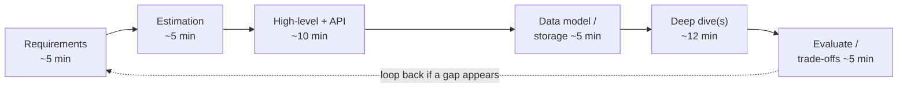
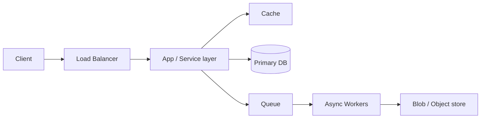

# Interview Playbook — Junior Interview Questions

> **Collection:** [System Design](../README.md) · **Level:** Junior · **Section 34 of 42**
> **Goal:** Run a system-design interview *as a process*, not a guessing game — drive a
> repeatable framework, budget your time across phases, clarify before you draw,
> estimate to find the hard part, and surface trade-offs out loud so the interviewer
> can follow your reasoning.

This section is *meta*: it's not about any one system, it's about how to **conduct
yourself** for the 45 minutes you're at the whiteboard. The strongest junior
candidates don't know more boxes than everyone else — they have a **method** they
trust, so they stay calm, cover the ground in order, and never freeze. Each question
below lists **what the interviewer is really probing**, a **model answer**, and where
useful a **follow-up** they'll ask next.

---

## Contents

1. [The RESHADED Framework](#1-the-reshaded-framework)
2. [Requirements Clarification](#2-requirements-clarification)
3. [Capacity Estimation in the Interview](#3-capacity-estimation-in-the-interview)
4. [API Design Step](#4-api-design-step)
5. [High-Level Design](#5-high-level-design)
6. [Data Model & Storage Choice](#6-data-model--storage-choice)
7. [Deep Dives & Bottlenecks](#7-deep-dives--bottlenecks)
8. [Trade-offs & Wrap-up](#8-trade-offs--wrap-up)
9. [Common Mistakes](#9-common-mistakes)
10. [Mock Interview Walkthroughs](#10-mock-interview-walkthroughs)
11. [Rapid-Fire Self-Check](#11-rapid-fire-self-check)

---

## 1. The RESHADED Framework

### Q1.1 — What does RESHADED stand for, and why use a framework at all?

**Probing:** Do you have a repeatable structure, or do you improvise and forget steps?

**Model answer:** RESHADED is a memory aid for the eight phases of a system-design
interview, in order:

| Letter | Phase | One-line job |
|---|---|---|
| **R** | Requirements | Pin down features (functional) and quality goals (non-functional) |
| **E** | Estimation | Back-of-envelope QPS, storage, bandwidth — find what's *hard* |
| **S** | Storage / data model | What entities, what database, what schema |
| **H** | High-level design | Boxes and arrows: client → API → services → data |
| **A** | API design | The contract: endpoints, methods, request/response shapes |
| **D** | Detailed design | Zoom into the 1–2 hard parts the estimates exposed |
| **E** | Evaluate | Trade-offs, bottlenecks, how it meets the requirements |
| **D** | Distinctive | The wrinkle that makes *this* system special (e.g., fan-out) |

Using a framework matters because the interview is time-boxed and stressful. A
framework guarantees you cover requirements before drawing, estimate before deep-diving,
and discuss trade-offs before time runs out — so you never burn 20 minutes on a detail
and forget to scope the problem.

**Follow-up:** *"Is the order rigid?"* → No. The *phases* are stable, but you loop back —
e.g., an estimate often sends you back to re-clarify a requirement. Treat it as a
checklist, not a one-way pipeline.

### Q1.2 — Roughly how should you budget 45 minutes across these phases?

**Probing:** Time discipline. The classic junior failure is running out of clock.

**Model answer:** Spend the *first third* framing, the *middle* designing, and *leave
room* to evaluate. A reasonable budget:

| Phase | Time | Why |
|---|---|---|
| Requirements | ~5 min | Wrong scope wastes everything after it |
| Estimation | ~5 min | Numbers tell you which part is hard |
| High-level + API | ~10 min | The skeleton everyone needs to see |
| Data model / storage | ~5 min | Entities and store choice |
| Deep dive(s) | ~12 min | Where you show depth on the hard part |
| Trade-offs / wrap-up | ~5 min | Never skip — it's how seniority shows |
| Buffer | ~3 min | Questions, course-correction |

The discipline: **glance at the clock at ~15 and ~30 minutes**. If you're still
clarifying at 15, move on. If you haven't started the deep dive at 30, pick one and go.



---

## 2. Requirements Clarification

### Q2.1 — The interviewer says "Design YouTube." What do you do in the first two minutes?

**Probing:** Do you scope before drawing? Jumping to boxes is the #1 junior mistake.

**Model answer:** I *don't draw anything yet*. I narrow the problem with questions in
three buckets:

1. **Functional scope** — "Which features are in scope? Upload and watch video? Search,
   comments, recommendations? Let's pick the core: upload, transcode, and stream."
2. **Scale / non-functional** — "Roughly how many users? Read-heavy (watching) vs
   write-heavy (uploading)? What latency for starting playback?"
3. **Constraints** — "Mobile and web? Global audience? Any features explicitly out of
   scope?"

Then I **state my assumptions back**: "So: focus on upload → transcode → stream, ~100M
DAU, heavily read-skewed, global. Sound right?" Getting a nod here means everything I
build afterward is on target.

**Follow-up:** *"What if the interviewer is vague on purpose?"* → That's deliberate;
they want to see you impose structure. Propose a reasonable scope yourself and ask them
to confirm — leading is better than waiting.

### Q2.2 — Why is "read-heavy or write-heavy?" such a high-value question?

**Probing:** Do you understand which clarifications actually change the design?

**Model answer:** Because the read/write ratio decides where the hard engineering lives.
A read-heavy system (Twitter timeline, YouTube watching) pushes you toward caching,
replicas, and fan-out-on-write. A write-heavy system (logging, IoT ingest) pushes you
toward write throughput, queues, and partitioning. Asking it early means your estimation
and your deep dive both aim at the right bottleneck instead of a made-up one.

### Q2.3 — How do you keep the requirements phase from eating the whole interview?

**Probing:** Balance — clarify enough, but don't stall.

**Model answer:** I time-box it to roughly five minutes and aim for **three or four
sharp questions, not twenty**. The goal is *enough* to choose an architecture, not a
complete product spec. Once I can name the core features and have a rough scale, I write
the assumptions in a corner of the board and move on. If something unclear comes up
later, I clarify it *then*, in context.

---

## 3. Capacity Estimation in the Interview

### Q3.1 — Why estimate at all? Can't you just design and skip the math?

**Probing:** Purpose of estimation, not rote arithmetic.

**Model answer:** Estimation is how you *discover which part of the problem is actually
hard*. The numbers convert a vague "design YouTube" into concrete pressure: if reads are
1000x writes, the design centers on caching and CDNs; if storage grows petabytes a year,
it centers on sharded blob storage. Without estimates, a deep dive is a guess. With them,
you can say "writes are only ~200/s — trivial; the real challenge is serving 2M
reads/s," and now you're solving the *right* problem.

**Follow-up:** *"What if you get the number wrong?"* → Order of magnitude is what
matters. Being off by 2x is fine; being off by 1000x (req/s vs req/day) is not. Round
aggressively and say your assumptions out loud so the interviewer can correct you.

### Q3.2 — Walk through estimating QPS for a service with 100M daily active users doing 10 reads each.

**Probing:** Can you do back-of-envelope math out loud, cleanly?

**Model answer:** Total daily reads = 100M × 10 = 10⁹ reads/day. A day is ~86,400 s,
which I round to **10⁵ s**. So average QPS = 10⁹ ÷ 10⁵ = **~10,000 reads/s**. Traffic
isn't flat, so I multiply by a peak factor of ~2–3x → design for **~20,000–30,000
reads/s**. That number alone tells me a single database can't serve reads directly — I
need caching and read replicas. The whole calculation took 30 seconds and shaped the
architecture.

### Q3.3 — Which quantities are worth estimating, and which aren't?

**Probing:** Judgment about what's load-bearing.

**Model answer:** Estimate the few numbers that **change the design**:

| Worth estimating | Why it matters |
|---|---|
| Peak QPS (reads & writes separately) | Decides caching, replicas, sharding |
| Storage growth / year | Decides single-node vs sharded vs blob store |
| Bandwidth (esp. media) | Decides CDN need |
| Memory for a hot cache | Decides if "cache it all" is even feasible |

I *skip* false precision — exact byte counts, exact user counts. I round to powers of
ten, keep one or two significant figures, and move on the moment the number has told me
what I needed.

---

## 4. API Design Step

### Q4.1 — When and how do you define the API in the interview?

**Probing:** Do you treat the API as a deliberate contract, or hand-wave it?

**Model answer:** Right after (or alongside) the high-level diagram, I define the **core
endpoints** as a short contract — one line each, covering the main functional
requirements. For a URL shortener:

```
POST /urls        body: {longUrl}            -> {shortCode}
GET  /{shortCode}                            -> 301 redirect to longUrl
```

I name the **method**, the **path**, the key **request fields**, and the **response**.
This forces clarity: it pins down what the client sends and gets back, and it naturally
exposes questions ("Do we need auth? Custom aliases? Pagination on a list endpoint?").
Three to five endpoints is plenty for an interview — I don't enumerate every CRUD route.

**Follow-up:** *"REST or RPC or GraphQL?"* → For most interviews, REST over HTTP is the
safe default and easiest to reason about. I mention the alternative only if the problem
clearly favors it (e.g., GraphQL when clients need flexible, nested reads).

### Q4.2 — What makes an API answer look junior vs. solid?

**Probing:** Concrete contract sense.

**Model answer:** A junior answer says "there's an endpoint to create a post." A solid
answer writes `POST /posts {text, mediaIds} -> {postId, createdAt}` — explicit method,
path, body, and response. The solid version also handles the unglamorous parts out loud:
how the client paginates a list (`GET /feed?cursor=...&limit=20`), what gets returned on
error, and which fields are required. Specificity is what signals you've actually built
APIs, not just read about them.

---

## 5. High-Level Design

### Q5.1 — What belongs in the first high-level diagram, and what doesn't?

**Probing:** Can you draw a clear skeleton without drowning in detail?

**Model answer:** The first diagram is the **happy-path skeleton**: client → load
balancer → application/service layer → data store, plus the one or two obvious
supporting pieces (a cache, a queue, a blob store) if the problem clearly needs them.



What does **not** belong yet: retry policies, exact replication topology, every
microservice, failure handling. I draw the skeleton, confirm the request flows through
it correctly, and *then* zoom into the hard part. Putting every detail in the first
diagram is how juniors run out of time and produce an unreadable board.

**Follow-up:** *"Where do you put the cache?"* → I narrate the read path: "Reads check
the cache first, fall through to the DB on a miss, and populate the cache on the way
back." Showing the *flow* matters more than the box's position.

### Q5.2 — How do you keep the app layer scalable in the high-level design?

**Probing:** The single most useful high-level move: statelessness.

**Model answer:** I keep the application servers **stateless** — no session or user data
held in a server's memory between requests — so any request can hit any server and I can
scale horizontally by adding boxes behind the load balancer. State that must persist
(sessions, user data) goes into a shared store like a database or a Redis cache. This one
decision is what makes the load balancer and horizontal scaling actually work, and it's
cheap to commit to early.

---

## 6. Data Model & Storage Choice

### Q6.1 — How do you decide SQL vs NoSQL in the time you have?

**Probing:** Can you justify a store choice with a reason, not a fashion?

**Model answer:** I tie it to the access pattern and the requirements, not to a
preference:

| Pick | When | Example |
|---|---|---|
| **Relational (SQL)** | Strong consistency, transactions, rich queries/joins, moderate scale | Payments, orders, user accounts |
| **Key-value / wide-column (NoSQL)** | Huge scale, simple lookups by key, flexible schema, write-heavy | Session store, feed cache, time-series |
| **Blob / object store** | Large binary files | Images, video, backups |

I state the choice with a *because*: "User and payment data go in Postgres because we
need transactions; the feed cache is a key-value store keyed by user ID because it's a
simple high-volume lookup; videos go to object storage because they're large blobs."
Naming a reason beats naming a brand.

**Follow-up:** *"What if you're unsure?"* → Default to relational for the source of
truth — it's the safe, well-understood choice — and add specialized stores only where a
clear access pattern justifies them.

### Q6.2 — What should the data model actually contain at junior depth?

**Probing:** Concrete entities and keys, not vague nouns.

**Model answer:** I list the **core entities, their key fields, and the relationships** —
just enough to support the API. For a chat app: `User(userId, name)`,
`Conversation(convId, memberIds)`, `Message(messageId, convId, senderId, body,
createdAt)`. I call out the **primary key** and the **fields I'll query or index on**
(here, `convId + createdAt` to fetch a conversation's messages in order). That's the
right altitude — enough to show the design is buildable, without writing full DDL.

---

## 7. Deep Dives & Bottlenecks

### Q7.1 — How do you choose *what* to deep-dive into?

**Probing:** Do you let the estimates guide depth, or dive randomly?

**Model answer:** I deep-dive into the part the **estimates flagged as hard**, or the
part the interviewer steers me toward. If reads are 1000x writes, I dive into the read
path: caching strategy, replica fan-out, CDN. If the system has a viral fan-out problem
(a celebrity with 50M followers), I dive into timeline generation. The skill is *not*
covering everything shallowly — it's picking the one or two real bottlenecks and showing
genuine depth there, including failure cases.

**Follow-up:** *"What if the interviewer doesn't steer you?"* → I propose: "The hard part
here is X — shall I go deep on that?" Leading shows judgment; waiting passively doesn't.

### Q7.2 — Give an example of identifying and addressing a bottleneck out loud.

**Probing:** Can you reason from a number to a mechanism?

**Model answer:** "We estimated ~30,000 reads/s. A single primary database tops out far
below that, so it's the bottleneck. I'll address it in layers: first a **cache** in front
of the DB to absorb the hot reads, which alone might serve 90% of traffic; then **read
replicas** for cache misses; and a **CDN** for any static or media content so those reads
never reach our servers at all. After that, writes (~200/s) fit comfortably on the
primary." That's the pattern: name the bottleneck from a number, then knock it down with
specific, ordered mechanisms.

### Q7.3 — How do you bring failure into a deep dive at junior level?

**Probing:** Awareness that things break, even if you can't go deep on every failure mode.

**Model answer:** I name the **single points of failure** and how I'd remove them: "If
the primary DB dies, we lose writes — so I'd add a replica with failover. If a worker
crashes mid-job, the queue should redeliver the message, so jobs must be idempotent." I
don't need an exhaustive failure analysis at junior level, but showing I *expect* partial
failure and design for it — redundancy, retries, idempotency — is what separates a real
distributed-systems answer from a single-machine one.

---

## 8. Trade-offs & Wrap-up

### Q8.1 — Why is the trade-off discussion the part you must never skip?

**Probing:** Do you understand that *judgment*, not box-count, is what's graded?

**Model answer:** Because there's no perfect design — every choice trades something for
something else, and articulating those trades is exactly what senior engineers do.
Saying "I cache the timeline, which trades a few seconds of staleness for fast reads —
acceptable here because a slightly stale feed is fine" shows you understand the
*consequences* of your decisions, not just their mechanics. A design presented as if it
has no downsides reads as naïve. I always reserve the last ~5 minutes for this.

**Follow-up:** *"Name a trade-off you made today."* → I keep one ready: e.g., "I chose
eventual consistency for the feed to get availability and speed, accepting that two users
might briefly see slightly different orderings."

### Q8.2 — How do you wrap up the last five minutes well?

**Probing:** A clean close, not a clock-out mid-sentence.

**Model answer:** I do three things: **(1) restate how the design meets the
requirements** ("this serves 30K reads/s via cache + replicas + CDN, and survives a DB
failure via replica failover"); **(2) name the main trade-offs and what I'd revisit at
10x scale** (e.g., "next I'd shard the database"); and **(3) call out what I left out for
time** (auth, analytics) so the interviewer knows I'm aware of it, not ignorant of it.
That summary leaves the impression of someone who finishes deliberately.

---

## 9. Common Mistakes

### Q9.1 — What are the most common ways juniors lose points, and the fix for each?

**Probing:** Self-awareness about interview anti-patterns.

**Model answer:**

| Mistake | Why it hurts | Fix |
|---|---|---|
| Drawing boxes before clarifying | You design the wrong system | Spend the first 5 min on requirements |
| Skipping estimation | You deep-dive into a non-problem | Do back-of-envelope QPS/storage first |
| Going silent while thinking | Interviewer can't follow or help | Narrate your reasoning out loud |
| Over-engineering for 1000x today | Wastes time, looks like cargo-culting | Design for ~10x; defer sharding/multi-region |
| Diving into one detail too early | Run out of time, skeleton incomplete | Skeleton first, then deep-dive |
| Presenting a design with no downsides | Reads as naïve | Always state trade-offs |
| Name-dropping tech without reasons | "I'll use Kafka" — why? | Justify each choice with the requirement it serves |

**Follow-up:** *"Which is the worst?"* → Drawing before clarifying — it can invalidate the
entire rest of the interview, because you'll have built something the interviewer never
asked for.

### Q9.2 — You realize 25 minutes in that you misunderstood a requirement. What now?

**Probing:** Composure and recovery, which interviewers value highly.

**Model answer:** I say so plainly: "I think I misread the scale — let me adjust." Then I
correct the affected part rather than starting over. Interviewers respond *well* to
honest course-correction; it mirrors real engineering, where requirements shift and you
adapt. Quietly pretending the mistake isn't there, or scrapping everything in a panic,
both score worse than a calm "let me fix this."

---

## 10. Mock Interview Walkthroughs

### Q10.1 — Walk the full flow on a small problem: "Design a URL shortener," in five quick beats.

**Probing:** Can you actually *run* the framework end-to-end, briefly?

**Model answer:** Compressing RESHADED into a worked example:

1. **Requirements (R).** Functional: shorten a long URL, redirect a short code to it.
   Non-functional: redirects must be fast (< 50 ms) and highly available; reads ≫ writes.
   Out of scope: analytics, custom expiry. *(Confirm with interviewer.)*
2. **Estimation (E).** Say 100M new URLs/month → ~40 writes/s, trivial. But each URL is
   read many times: assume 100:1 → ~4,000 reads/s, peaking ~10,000/s. Storage: 100M/mo ×
   12 × ~500 bytes ≈ low hundreds of GB/year — fits a single sharded DB. **The hard part
   is read latency and availability, not write volume.**
3. **High-level + API (H, A).** Client → LB → stateless app servers → DB, with a cache in
   front. API:

```
POST /urls   {longUrl}      -> {shortCode}
GET  /{shortCode}           -> 301 redirect
```

4. **Storage + key generation (S, D).** Store `shortCode (PK) -> longUrl` in a key-value
   store; it's a pure key lookup at high volume. Generate the code by base-62 encoding a
   unique counter/ID (collision-free), rather than hashing-and-checking. Put the hot codes
   in a cache so most redirects never touch the DB.
5. **Evaluate (E) + Distinctive (D).** Trade-off: the cache gives speed and availability
   but I must handle the rare cache-miss path to the DB. Distinctive wrinkle: the read
   path can lean almost entirely on caching/CDN because mappings are immutable once
   created. At 10x, I'd shard the key-value store by code prefix. Left out for time:
   analytics, abuse/rate-limiting.

That's the whole loop in a couple of minutes — proof the framework scales down to small
problems too.

### Q10.2 — In the walkthrough above, where did the *estimate* actually change the design?

**Probing:** Do you see estimation as load-bearing, or decorative?

**Model answer:** In two places. First, the **40 writes/s** number told me writes are a
non-issue, so I *didn't* waste deep-dive time on write throughput. Second, the **~10,000
peak reads/s** told me the redirect path is the real challenge, which is exactly why the
design centers on a cache (and could add a CDN) rather than on the database. Without those
two numbers I might have over-built the write side and under-built the read side — the
estimate is what pointed the deep dive at the right target.

---

## 11. Rapid-Fire Self-Check

If you can answer each of these in a sentence, you're ready for the junior bar on this section:

- [ ] What do the eight letters of RESHADED stand for? *(Requirements, Estimation, Storage, High-level, API, Detailed, Evaluate, Distinctive)*
- [ ] How do you budget 45 minutes across the phases? *(~5 clarify, ~5 estimate, ~10 high-level+API, ~5 data, ~12 deep dive, ~5 trade-offs)*
- [ ] What's the #1 junior mistake? *(drawing boxes before clarifying requirements)*
- [ ] Why estimate before deep-diving? *(the numbers reveal which part is actually hard)*
- [ ] Convert 100M DAU × 10 reads to peak QPS. *(~10K avg → ~20–30K peak)*
- [ ] What makes app servers horizontally scalable? *(keeping them stateless)*
- [ ] Give a reason-based SQL vs NoSQL choice. *(transactions/joins → SQL; high-volume key lookup → NoSQL)*
- [ ] How do you pick what to deep-dive? *(the bottleneck the estimates flagged)*
- [ ] Why never skip the trade-off discussion? *(judgment, not box-count, is what's graded)*
- [ ] You misunderstood a requirement at minute 25 — what do you do? *(say so, correct it calmly, don't restart)*

---

**Next step:** Section 35 — [Architecture Decision-Making](35-architecture-decision-making.md): how to choose, justify, and record the decisions this playbook surfaces.
