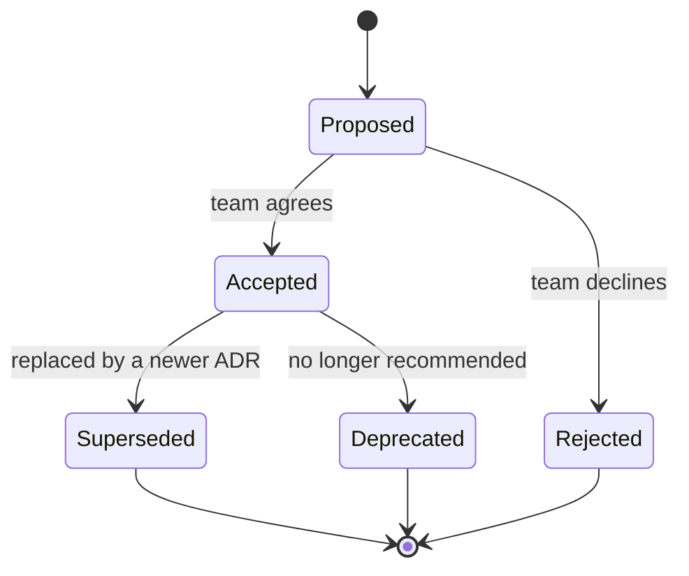
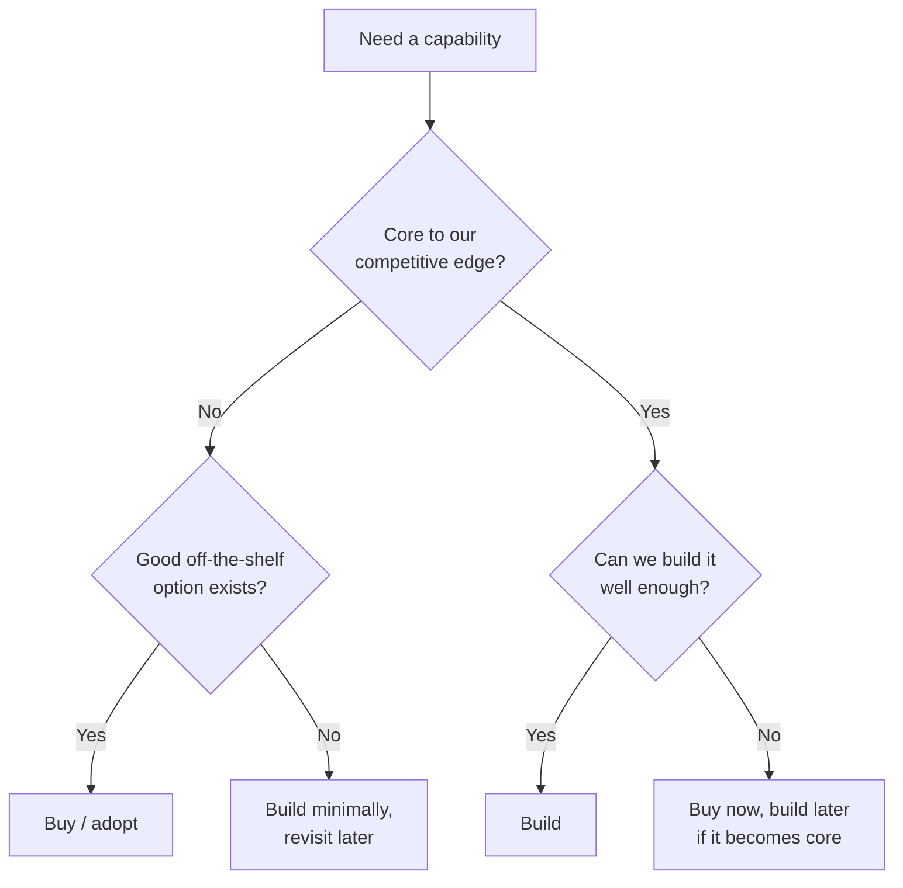

# Architecture Decision-Making — Junior Interview Questions

> **Collection:** [System Design](../README.md) · **Level:** Junior · **Section 35 of 42**
> **Goal:** Show you can *record* a design decision, run it through a lightweight
> review process, keep an architecture *changeable* over time, and reason about
> build-vs-buy and trade-offs with a framework instead of a gut feeling.

Junior engineers are rarely asked to *make* the call that splits a monolith — but they
are absolutely expected to understand the *machinery* teams use to make and remember
such calls: ADRs, RFCs, fitness functions, a tech radar. The interviewer is checking
that you know decisions are artifacts to be written down and revisited, not one-time
conversations that evaporate. Each question lists **what the interviewer is really
probing**, a **model answer**, and often a **follow-up**.

---

## Contents

1. [Architecture Decision Records (ADRs)](#1-architecture-decision-records-adrs)
2. [RFC Process](#2-rfc-process)
3. [Evolutionary Architecture](#3-evolutionary-architecture)
4. [Fitness Functions](#4-fitness-functions)
5. [Tech Radar](#5-tech-radar)
6. [Build vs Buy](#6-build-vs-buy)
7. [Trade-off Analysis Frameworks](#7-trade-off-analysis-frameworks)
8. [Rapid-Fire Self-Check](#8-rapid-fire-self-check)

---

## 1. Architecture Decision Records (ADRs)

### Q1.1 — What is an ADR, and why bother writing one?

**Probing:** Do you understand that decisions decay from memory unless captured?

**Model answer:** An Architecture Decision Record is a short, dated document that
captures *one* significant architectural decision: the **context** (what forced the
choice), the **decision** itself, and its **consequences** (what we now accept, good
and bad). The point is institutional memory — six months later, when someone asks "why
on earth are we using Postgres and not DynamoDB here?", the ADR answers them without a
meeting. It records not just *what* was chosen but *why*, including the options that
were rejected, so future engineers don't relitigate a settled question or accidentally
undo a deliberate trade-off.

**Follow-up:** *"Where do ADRs live?"* → In the repository, in version control,
usually a `docs/adr/` folder, one Markdown file per decision (`0001-use-postgres.md`).
Keeping them next to the code means they're versioned, reviewed, and diffable like code.

### Q1.2 — What are the core sections of an ADR?

**Probing:** Concrete familiarity with the format (Michael Nygard's template).

**Model answer:** The minimal, widely used template has four parts:

| Section | What it captures |
|---|---|
| **Title & Status** | A number + short name, and one of: *Proposed / Accepted / Deprecated / Superseded* |
| **Context** | The forces at play — constraints, requirements, the problem we must solve |
| **Decision** | "We will…" — the choice we are making, stated plainly |
| **Consequences** | What becomes easier, what becomes harder, what we now must live with |

The discipline is in **Consequences**: a good ADR is honest about the downsides it is
knowingly accepting, not a sales pitch for the chosen option.

### Q1.3 — What happens to an ADR when the decision later changes?

**Probing:** Do you know ADRs are *immutable* records, not living documents?

**Model answer:** You don't edit or delete the old ADR — that would erase history.
Instead you write a **new** ADR that *supersedes* it, and you mark the old one's status
as **Superseded by ADR-0042**. The original stays in place as a true record of what was
decided and why, at the time. This is the lifecycle:

**Follow-up:** *"Why keep a rejected or superseded ADR around at all?"* → Because the
*reasoning* still has value. A future engineer tempted by the same rejected option can
read why it didn't fit, saving them from repeating the analysis or the mistake.

---

## 2. RFC Process

### Q2.1 — What is an RFC in an engineering organization?

**Probing:** Do you distinguish *proposing* a decision from *recording* one?

**Model answer:** An RFC ("Request for Comments") is a written proposal circulated for
feedback *before* a decision is made. An engineer writes up a problem and a proposed
approach, shares it with the team or org, and people comment, push back, and suggest
alternatives over a fixed review window. It's the *forward-looking* counterpart to an
ADR: an RFC is how a decision gets *debated and approved*; an ADR is how the resulting
decision gets *remembered*. Many teams convert an accepted RFC into an ADR once the dust
settles.

**Follow-up:** *"When is an RFC overkill?"* → For small, reversible, local changes
(renaming an internal function, tweaking a config). RFCs are worth the ceremony for
decisions that are **expensive to reverse** or that **affect multiple teams** — a new
service boundary, a shared library, a change to the deployment pipeline.

### Q2.2 — Why write a proposal down instead of just discussing it in a meeting?

**Probing:** Awareness of the practical benefits of async, written decision-making.

**Model answer:** Writing forces clarity — vague ideas survive a hallway chat but fall
apart on the page. A written RFC also lets people in different time zones and on
different teams review on their own schedule, leaves a durable record of *who raised
what concern*, and lets the author address objections deliberately rather than
improvising under pressure in a room. The act of writing often surfaces problems the
author hadn't noticed, before any code is written.

### Q2.3 — What does a typical RFC contain?

**Model answer:** Conventions vary, but most include: a **summary** of the problem,
the **motivation** (why now, why it matters), the **proposed design**, the
**alternatives considered** (and why they lost), the **drawbacks** of the proposal, and
**open questions** for reviewers to weigh in on. The "alternatives" and "drawbacks"
sections are what separate a real RFC from a press release — they prove the author
genuinely weighed options.

---

## 3. Evolutionary Architecture

### Q3.1 — What does "evolutionary architecture" mean?

**Probing:** Do you reject the myth that architecture is decided once, up front?

**Model answer:** Evolutionary architecture is the idea that an architecture should be
designed to **change safely and incrementally** over time, rather than being locked in
by a big upfront design that's expected to last forever. Requirements, scale, and
technology all shift; an architecture that can't absorb change becomes a liability. The
practical implication is favoring loose coupling, clear interfaces, and automated
guardrails (tests, fitness functions) so that you can evolve the system in small,
verified steps without fear of breaking it.

**Follow-up:** *"What is a 'last responsible moment' decision?"* → Deferring a
decision until you have the most information but *just before* delaying further would
cost you. It avoids both premature lock-in and reckless procrastination — you keep
options open while it's cheap to do so.

### Q3.2 — What property of a codebase makes it easy to evolve?

**Probing:** Connecting evolvability to concrete design properties.

**Model answer:** Above all, **low coupling and high cohesion** at well-defined
boundaries. When modules interact only through stable interfaces, you can replace what's
behind an interface without touching its callers. Add to that **comprehensive automated
tests** (so change is verifiable) and **incremental deployability** (so you can ship
small changes often). Tight coupling is the enemy: when everything depends on everything,
any change risks breaking something far away, so people stop changing things at all.

---

## 4. Fitness Functions

### Q4.1 — What is an architectural fitness function?

**Probing:** Do you know architecture qualities can be *tested automatically*?

**Model answer:** A fitness function is an automated check that verifies the system
still meets a desired **architectural characteristic** — an "-ility." Just as a unit
test guards behavior, a fitness function guards a quality attribute. Examples: a test
that fails the build if a 95th-percentile API latency exceeds 200 ms; a test that fails
if a UI module imports directly from the database layer (guarding a layering rule); a
scan that fails if a service's startup time regresses. They turn fuzzy goals like
"stay fast" or "stay decoupled" into objective, continuously enforced criteria.

**Follow-up:** *"Why automate it instead of reviewing it in code review?"* → Humans
forget and reviewers miss things; a fitness function never gets tired and runs on every
commit. It catches *architectural drift* — the slow accumulation of small violations —
before it compounds into a structural problem.

### Q4.2 — Give two concrete examples of fitness functions you could add to a CI pipeline.

**Probing:** Can you make the concept tangible?

**Model answer:**

| Characteristic guarded | Fitness function (a CI check that fails the build when…) |
|---|---|
| **Performance** | A load test shows p99 latency > 300 ms, or throughput drops below a threshold |
| **Modularity** | A dependency-analysis tool detects a forbidden import (e.g., `domain` importing `web`) |
| **Security** | A dependency scanner finds a known-critical CVE in a third-party library |
| **Reliability** | Test coverage on a critical module falls below an agreed floor |

Each one encodes a quality the team has decided matters, so that a violation breaks the
build loudly instead of leaking silently into production.

---

## 5. Tech Radar

### Q5.1 — What is a Tech Radar?

**Probing:** Familiarity with how orgs manage technology choices at scale.

**Model answer:** A Tech Radar (popularized by Thoughtworks) is a visual snapshot of an
organization's stance on technologies — languages, tools, platforms, techniques —
plotted on a radar divided into rings of *adoption advice*. It answers, at a glance,
"what are we standardizing on, what are we trying out, and what are we moving away
from?" It's a shared, living guide that keeps teams from each independently re-deciding
which database or framework to reach for.

### Q5.2 — What do the rings on a Tech Radar mean?

**Probing:** Knowing the four standard adoption levels.

**Model answer:** The classic radar has four concentric rings, from "use freely" at the
center to "stop using" at the edge:

| Ring | Meaning |
|---|---|
| **Adopt** | Proven; use this by default for new work |
| **Trial** | Promising; use on real projects where the risk is manageable |
| **Assess** | Worth a closer look / a spike, but not yet on real projects |
| **Hold** | Avoid for new work; proceed with caution (often: legacy or fading tech) |

Technologies are also grouped into **quadrants** (e.g., *Languages & Frameworks*,
*Tools*, *Platforms*, *Techniques*). The radar is reviewed periodically so things move
inward as they prove out, or outward as they fall out of favor.

**Follow-up:** *"How does this relate to evolutionary architecture?"* → It's the
*organizational* expression of the same idea: technology choices are not permanent; the
radar makes the org's evolving stance explicit and reviewable instead of tribal
knowledge.

---

## 6. Build vs Buy

### Q6.1 — How do you decide whether to build something in-house or buy/adopt an existing solution?

**Probing:** Do you reason with criteria rather than "building it ourselves is cooler"?

**Model answer:** You weigh whether the capability is a **core differentiator** for the
business or **undifferentiated heavy lifting**. You build when it's central to your
competitive edge and no good off-the-shelf option fits; you buy (or adopt open source)
when it's a solved, commoditized problem — auth, payments, email, search — where a mature
product will be cheaper and more reliable than anything you'd build. The decision turns
on total cost of ownership, not just upfront price: a "free" in-house build carries
ongoing maintenance, on-call, and opportunity cost.

### Q6.2 — What criteria do you put in a build-vs-buy comparison?

**Probing:** Can you structure the trade-off instead of arguing feelings?

**Model answer:**

| Criterion | Build favors… | Buy favors… |
|---|---|---|
| **Strategic importance** | Core differentiator | Commodity / undifferentiated |
| **Time to market** | We have time | We need it now |
| **Upfront cost** | Low (use our team) | Budget for licensing |
| **Ongoing cost** | We accept maintenance + on-call | Vendor handles upkeep |
| **Customization needs** | Highly specific, unusual needs | Standard needs fit the product |
| **Expertise** | We have/​can hire the skill | Skill is rare or expensive |
| **Lock-in risk** | We control it fully | Acceptable vendor dependence |

The honest answer names *which criteria dominate for this decision* — e.g., "for our
payment processing, security expertise and compliance burden dominate, so we **buy**."

**Follow-up:** *"What's the hidden cost of building?"* → The maintenance tail. The
initial build is often the small part; the years of patching, scaling, securing, and
on-call support are the real cost, and they pull engineers away from the product's core.

---

## 7. Trade-off Analysis Frameworks

### Q7.1 — Why do we say "there are no right answers in architecture, only trade-offs"?

**Probing:** The single most important mindset in this whole section.

**Model answer:** Because every architectural choice *buys* one quality at the *expense*
of another. Caching buys speed at the cost of consistency. Microservices buy independent
deployability at the cost of operational complexity. Replication buys availability at the
cost of cost and complexity. There is no option that's better on every axis — so the job
is not to find "the right answer" but to make the trade-off that best fits *this
system's* priorities, and to state honestly what you gave up to get what you wanted.

**Follow-up:** *"So how do you defend a choice?"* → By naming the trade-off explicitly:
"We chose eventual consistency here because availability matters more than
read-your-writes for this feed, and we accept that a user might briefly see stale
data." A defensible decision is one whose *cost is acknowledged*, not hidden.

### Q7.2 — Name a structured way to compare architectural options.

**Probing:** Awareness that the comparison can be made rigorous, not just opinion.

**Model answer:** A simple, effective tool is a **weighted decision matrix**: list the
candidate options as columns, the quality attributes that matter as rows, assign each
attribute a weight reflecting its importance to *this* system, score each option per
attribute, and compute weighted totals. It forces you to be explicit about *what you're
optimizing for*. For example, comparing data stores:

| Attribute (weight) | Option A: SQL | Option B: Document DB |
|---|---|---|
| Strong consistency (×3) | 5 → 15 | 2 → 6 |
| Flexible schema (×1) | 2 → 2 | 5 → 5 |
| Team familiarity (×2) | 5 → 10 | 3 → 6 |
| **Weighted total** | **27** | **17** |

The number isn't the point — the *weights* are. Changing what you value changes the
winner, which is exactly the insight a junior engineer should walk away with. (A more
formal sibling is ATAM — the Architecture Trade-off Analysis Method — which analyzes how
decisions affect quality attributes via scenarios; the matrix is its lightweight cousin.)

### Q7.3 — How does reversibility change how much analysis a decision deserves?

**Probing:** Do you calibrate effort to the cost of being wrong (one-way vs two-way doors)?

**Model answer:** Decisions that are easy to reverse ("two-way doors") deserve *less*
deliberation — just pick a reasonable option and move, because if it's wrong you can back
out cheaply. Decisions that are expensive or impossible to reverse ("one-way doors") —
choosing a database, defining a public API, splitting a service — deserve heavy analysis,
an RFC, and an ADR, because the cost of being wrong is high. Spending equal effort on
both wastes time on the reversible ones and under-invests in the irreversible ones.

---

## 8. Rapid-Fire Self-Check

If you can answer each of these in a sentence, you're ready for the junior bar on this section:

- [ ] What three things does an ADR capture? *(context, decision, consequences)*
- [ ] What do you do to an ADR when its decision changes? *(write a new one that supersedes it; don't edit the old)*
- [ ] RFC vs ADR — which proposes and which records? *(RFC proposes/debates, ADR records)*
- [ ] What makes an architecture "evolutionary"? *(designed to change safely and incrementally)*
- [ ] What is a fitness function? *(an automated test that guards an architectural quality)*
- [ ] Name the four Tech Radar rings. *(Adopt, Trial, Assess, Hold)*
- [ ] When do you buy instead of build? *(commodity / undifferentiated capability with a good off-the-shelf fit)*
- [ ] What's the hidden cost of building in-house? *(the long maintenance and on-call tail)*
- [ ] Why are there "only trade-offs"? *(every choice buys one quality at another's expense)*
- [ ] One-way vs two-way door — how does it change deliberation? *(reversible = decide fast; irreversible = analyze hard)*

---

**Next step:** Section 36 — [Large-Scale Migrations](36-large-scale-migrations.md): strangler fig, dual writes, and moving a live system without an outage.
