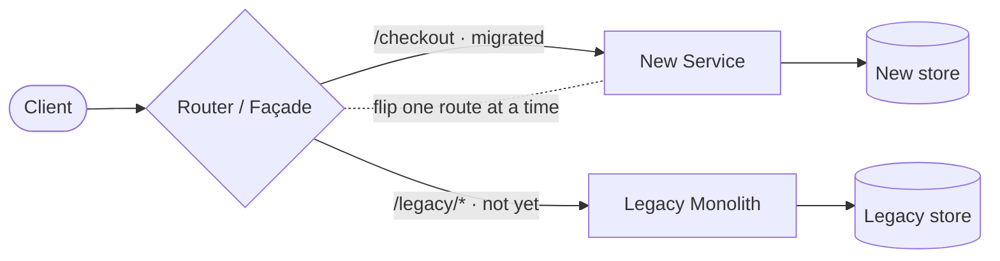
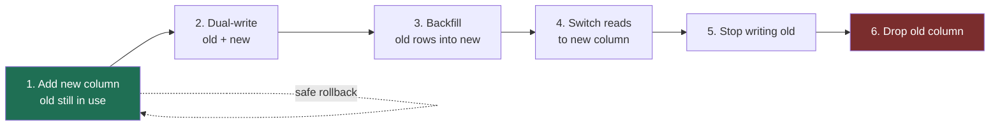
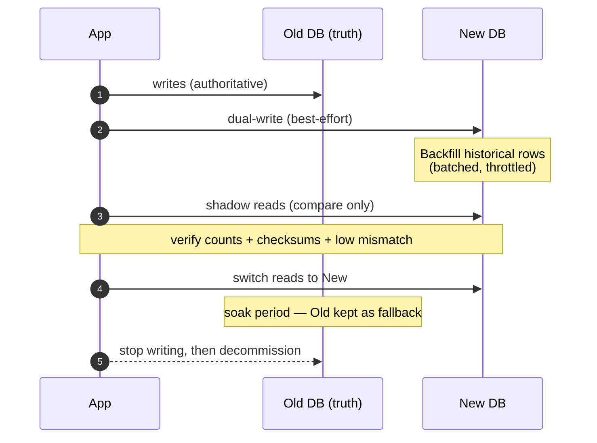

# Large-Scale Migrations — Junior Interview Questions

> **Collection:** [System Design](../README.md) · **Level:** Junior · **Section 36 of 42**
> **Goal:** Show you can change a running system — splitting a monolith, reshaping a
> schema, moving terabytes of data — *without taking the product down*, by leaning on
> incremental patterns (strangler fig, expand-contract, dual-write) instead of risky
> big-bang cutovers.

The hardest migrations are not the ones with the most code — they are the ones that
must happen while real users keep using the system. A "junior" answer here proves you
know the safe, boring playbook: make changes **additive and reversible**, run old and
new side by side, verify before you cut over, and only delete the old path once the new
one has earned trust. Each question lists **what the interviewer is really probing**, a
**model answer**, and often a **follow-up**.

---

## Contents

1. [Monolith to Microservices](#1-monolith-to-microservices)
2. [Strangler Fig at Scale](#2-strangler-fig-at-scale)
3. [Zero-Downtime Migration](#3-zero-downtime-migration)
4. [Expand-Contract Pattern (Parallel Change)](#4-expand-contract-pattern-parallel-change)
5. [Dual-Write & Backfill](#5-dual-write--backfill)
6. [Data Migration at Scale](#6-data-migration-at-scale)
7. [Deprecation Strategy](#7-deprecation-strategy)
8. [Rapid-Fire Self-Check](#8-rapid-fire-self-check)

---

## 1. Monolith to Microservices

### Q1.1 — Why would a team split a monolith into microservices? Name a real cost.

**Probing:** Do you see microservices as a *trade-off*, not a default upgrade?

**Model answer:** The usual driver is **independent deployability and team autonomy** —
when 200 engineers all merge into one codebase, the shared build, shared database, and
shared deploy pipeline become a bottleneck; one team's bug blocks everyone's release.
Splitting along business capabilities (payments, search, notifications) lets each team
ship and scale its piece on its own cadence. The real cost is that a function call
becomes a **network call**: you inherit latency, partial failure, distributed
transactions, and far harder debugging. A monolith you can step through in a debugger;
a microservice mesh you must trace across processes. You split when the *organizational*
pain of the monolith outweighs this added operational complexity — not because
microservices are "modern."

**Follow-up:** *"Is a monolith always wrong at scale?"* → No. A well-modularized
"modular monolith" can serve enormous traffic. The split is justified by team scaling
and differing scaling needs of subsystems, not by traffic alone.

### Q1.2 — How would you decide *which* part of the monolith to extract first?

**Probing:** Sequencing instinct — do you de-risk, or grab the scariest piece first?

**Model answer:** Pick a service that is **loosely coupled, well-bounded, and valuable
to separate** — ideally one with few inbound dependencies and a clear data boundary.
Good first candidates are "leaf" capabilities like *notifications*, *PDF/report
generation*, or *image processing*: they read a little, do work, and don't sit on the
critical write path of the whole product. Extracting an easy one first lets the team
build the muscle — service scaffolding, CI/CD, observability, on-call — on something
that won't sink the business if it wobbles. You save the deeply entangled core (e.g.,
the orders/accounts tables half the app joins against) for *after* you've proven the
pattern.

### Q1.3 — What is a "distributed monolith," and why is it the worst outcome?

**Probing:** Awareness of the classic failure mode.

**Model answer:** A distributed monolith is when you've paid the *cost* of microservices
(network hops, separate deploys, more infra) but kept the *coupling* of a monolith —
the services can't be deployed independently because they share a database, call each
other synchronously in tight chains, or must be released in lockstep. You get the
latency and failure modes of distribution **plus** the rigidity of a monolith, with
none of the autonomy benefit. The tell is: "we can't deploy service A without also
deploying B and C." The fix is enforcing real boundaries — each service owns its data,
talks over well-defined contracts, and degrades gracefully when a dependency is down.

---

## 2. Strangler Fig at Scale

### Q2.1 — Explain the Strangler Fig pattern as if to a new teammate.

**Probing:** Do you understand *incremental replacement* behind a façade?

**Model answer:** The name comes from a vine that grows around a tree, slowly takes
over, and the old tree eventually rots away — leaving the vine standing in its shape.
In software, you put a **façade (a proxy or router) in front of the old system**, then
migrate functionality piece by piece: each time you rebuild a feature in the new
system, you flip that *route* from old to new. The old system keeps serving everything
not yet migrated. Over many small steps the new system "strangles" the old one until
nothing routes to the legacy code, and you delete it. The win is that you never do a
big-bang rewrite-and-cutover; every step is small, shippable, and reversible.

**Follow-up:** *"What's the alternative this avoids?"* → The "big rewrite," where you
build a replacement in parallel for two years and switch over in one weekend. It almost
always slips, drifts from the live system's behavior, and fails catastrophically.

### Q2.2 — Where does the routing decision live, and what makes the pattern safe?

**Probing:** Concrete mechanics plus the rollback story.

**Model answer:** The routing lives in a **façade layer** — an API gateway, reverse
proxy, or a thin routing service — that inspects each request and forwards it to old or
new. What makes it safe is that the switch is **per-route and config-driven**: you can
migrate `/checkout` while everything else still hits the monolith, and if the new
checkout misbehaves you flip *that one route* back in seconds, without redeploying. You
can also route a *percentage* of traffic to the new path (a canary) and watch error
rates before going to 100%. Small blast radius plus instant rollback is the whole point.

---

## 3. Zero-Downtime Migration

### Q3.1 — What does "zero-downtime migration" actually require?

**Probing:** Do you grasp that *old and new must coexist*?

**Model answer:** Zero downtime means users never see an outage or error while the
change rolls out. The core requirement is that, for some window, **the old and new
versions run at the same time** and are *mutually compatible* — old code must tolerate
the new schema/format, and new code must tolerate the old. That's why you never do a
breaking change in one step. You make changes **additive first** (add a column, add an
endpoint), deploy code that can use either form, migrate data in the background, switch
traffic, and only *then* remove the old form. If at any point old and new can't coexist,
you've designed a downtime window, not a zero-downtime migration.

### Q3.2 — Why is a backward-incompatible change in a single deploy dangerous?

**Probing:** Understanding of rolling deploys and mixed-version states.

**Model answer:** In any real fleet, a deploy is **rolling** — for several minutes, some
servers run the new code and some still run the old, and clients may hold either
version. If you, say, rename a database column and ship the renamed query in the same
release, the still-old servers immediately start throwing errors against the new schema
(or vice versa). There is no instant in which the whole system flips atomically. So a
change that assumes "everyone is on the new version right now" breaks the mixed-version
window. Safe migrations are explicitly designed so that **every intermediate state —
old+old, old+new, new+new — works**.

**Follow-up:** *"What if you must rename that column?"* → You don't rename it directly.
You add the new column, write to both, backfill, switch reads, then drop the old — the
expand-contract pattern in Section 4.

### Q3.3 — How do feature flags help a zero-downtime migration?

**Probing:** Decoupling *deploy* from *release*.

**Model answer:** A feature flag lets you **deploy the new code path turned off**, then
turn it on at runtime — for 1% of users, then 10%, then everyone — without another
deploy. This decouples shipping code from activating behavior, so you can roll the new
path forward gradually, watch metrics, and **kill it instantly** if something breaks,
all without a rollback deploy. For migrations it's the safety switch on top of strangler
routing and expand-contract: the code is live but dormant until you trust it.

---

## 4. Expand-Contract Pattern (Parallel Change)

### Q4.1 — Walk through the expand-contract pattern step by step.

**Probing:** The single most important migration pattern at this level.

**Model answer:** Expand-contract (a.k.a. *parallel change*) turns one risky breaking
change into three safe, additive steps:

1. **Expand** — add the new thing (column, field, table, endpoint) *alongside* the old.
   Nothing reads it yet. This is purely additive and safe.
2. **Migrate** — make the code write to **both** old and new, backfill historical data
   into the new form, then switch **reads** to the new form once it's complete and
   verified.
3. **Contract** — once nothing reads or writes the old form, **remove** it.

At every moment the system is consistent and rollback is cheap, because you never had a
window where old and new were incompatible.

### Q4.2 — Concrete example: split a `full_name` column into `first_name` / `last_name` with zero downtime.

**Probing:** Can you apply the abstract pattern to a real schema change?

**Model answer:**
1. **Expand** — add `first_name` and `last_name` columns (nullable). No code change for
   readers yet.
2. **Dual-write** — deploy code that, on every insert/update, writes the split values
   into the new columns *and* keeps `full_name` populated.
3. **Backfill** — run a batched job that parses existing `full_name` rows into the new
   columns. Verify counts match.
4. **Switch reads** — point the app at `first_name`/`last_name`. `full_name` is now
   write-only, kept for safety.
5. **Contract** — after a soak period with no issues, stop writing `full_name` and drop
   the column.

If anything looks wrong before step 5, you roll back reads to `full_name` instantly —
the old data is still there.

### Q4.3 — Why is each step individually deployable a feature, not an accident?

**Probing:** The discipline behind the pattern.

**Model answer:** Because the safety *comes from* each deploy being independently
correct. If you bundled "add column + switch reads + drop column" into one release,
you'd recreate the breaking-change window. Keeping each step its own deploy means every
release leaves the system in a valid, rollback-able state, and you can pause for hours
or days between steps to watch production. Migrations go wrong when people get impatient
and collapse the steps.

---

## 5. Dual-Write & Backfill

### Q5.1 — What is dual-writing and why is it needed during a migration?

**Probing:** Understanding of keeping two stores in sync *going forward*.

**Model answer:** Dual-writing means that during the migration, every write goes to
**both** the old store/format and the new one, so the new store stays current with live
traffic while you migrate the *historical* data behind it. Without it, you'd backfill a
snapshot and immediately fall behind every new write. Dual-write handles the *future*
(new writes land in both); **backfill** handles the *past* (existing rows copied over).
Together they get the new store to "caught up and staying caught up," which is the
precondition for switching reads.

**Follow-up:** *"Which write happens first, old or new?"* → Treat the existing store as
the source of truth and write it first; the new store's write is best-effort and
reconciled. You want a failure to never lose data from the authoritative store.

### Q5.2 — Dual-writes can drift out of sync. How do you catch and fix that?

**Probing:** Awareness that dual-write is not atomic.

**Model answer:** A dual-write is **two separate operations**, so one can succeed while
the other fails (a crash between them, a transient error on the new store). That causes
**drift**. You handle it three ways: (1) **make writes idempotent** so retries are safe;
(2) run a **reconciliation job** that periodically compares old vs new and repairs
mismatches; and (3) emit a **discrepancy metric** so you can *see* drift instead of
discovering it at cutover. You don't trust dual-write to be perfectly consistent — you
trust it to be *eventually* consistent and you actively verify before switching reads.

### Q5.3 — How do you run a backfill of millions of rows without hurting production?

**Probing:** Operational care for bulk jobs.

**Model answer:** Never one giant query. You **batch** (e.g., 1,000–10,000 rows at a
time, paged by primary key), **throttle** (sleep between batches, or watch DB load and
back off), and make the job **resumable** (record the last processed key so a crash
restarts where it stopped, not from zero). You run it off-peak, on a **read replica**
where possible, and verify row counts and checksums afterward. The goal is for the
backfill to be invisible to live users — a slow, steady trickle, not a stampede that
spikes CPU and locks tables.

---

## 6. Data Migration at Scale

### Q6.1 — Compare big-bang cutover vs incremental migration.

**Probing:** Can you articulate the trade-off and pick the safe default?

**Model answer:**

| | Big-bang cutover | Incremental (dual-write + backfill) |
|---|---|---|
| **How** | Freeze writes, copy everything, switch all at once | Migrate continuously while live; switch reads gradually |
| **Downtime** | Usually a maintenance window | None (zero-downtime) |
| **Rollback** | Hard — you've already cut over | Easy — flip reads back |
| **Risk** | High; all-or-nothing | Low; small reversible steps |
| **Complexity** | Simpler to reason about | More moving parts (sync, reconcile) |
| **When OK** | Small data, internal tool, accepted downtime | Large data, 24/7 product |

The incremental approach is the default for anything user-facing at scale; big-bang is
acceptable only when data is small and a brief downtime window is genuinely fine.

### Q6.2 — How do you *verify* a data migration before trusting it?

**Probing:** Do you prove correctness, or just hope?

**Model answer:** You verify with **counts and checksums** before switching reads:
compare row counts between source and target, and compare hashes/checksums of records
(or sampled records) to confirm content matches, not just quantity. Many teams also run
a **shadow-read** phase — the new store serves reads in parallel but its result is only
*compared* against the old store's answer and logged, not returned to the user — so you
measure the real mismatch rate under production traffic before you flip the switch. Only
when discrepancies are at zero (or a known, explained level) do you cut reads over.

**Follow-up:** *"Counts match but checksums don't — what does that tell you?"* → Same
number of rows but wrong content: likely a transformation bug in the backfill or
dual-write, not a missing-data problem. You fix the transform and re-run.

### Q6.3 — You're migrating a database to a new engine. What's your safe sequence?

**Probing:** Putting the whole playbook together.

**Model answer:** (1) Stand up the new DB. (2) **Dual-write** so new writes land in both,
old DB authoritative. (3) **Backfill** history in throttled batches. (4) **Shadow-read**
and compare to measure correctness under real load. (5) When verified, **switch reads**
to the new DB. (6) **Soak** — keep the old DB written and on standby as a fallback for a
while. (7) Once confident, **stop dual-writing and decommission** the old DB. Every step
is reversible until step 7.

---

## 7. Deprecation Strategy

### Q7.1 — How do you deprecate an old API endpoint without breaking clients?

**Probing:** Empathy for consumers and the importance of communication.

**Model answer:** Deprecation is a *process*, not a delete. The steps: **(1) Announce** —
publish a deprecation notice with a clear sunset date and a migration guide to the
replacement. **(2) Signal in-band** — add a `Deprecation` / `Sunset` header (or a
warning field) so clients learn about it from the responses they're already getting.
**(3) Measure** — track who still calls the old endpoint, by client, so you know who's
left. **(4) Nudge** — reach out to remaining heavy users directly. **(5) Sunset** — only
after usage has dropped to near zero (or the deadline passes for an internal API) do you
remove it. You never silently delete something other teams depend on.

**Follow-up:** *"Usage won't drop to zero before the deadline — now what?"* → For an
*internal* API you escalate and hold a hard deadline. For a *public* one you may extend,
return errors with a clear message pointing to the new endpoint, or apply throttling —
but the call is a business decision, made with data on who's affected.

### Q7.2 — Why keep the old path running for a "soak" period after cutover?

**Probing:** Understanding rollback windows.

**Model answer:** Because some bugs only surface under real production traffic over time
— a rare code path, a month-end batch, a specific client. Keeping the old path warm and
writeable for a soak period gives you a **cheap, fast rollback** if something goes wrong
days after the switch. Deleting the old path immediately removes your safety net at
exactly the moment you most need it. You contract (delete) only after the new path has
proven itself across a full cycle of real usage.

### Q7.3 — What signals tell you it's finally safe to delete the legacy code?

**Probing:** Decision criteria, not vibes.

**Model answer:** Concrete signals: **zero (or negligible) traffic** to the old path in
your metrics; a completed **soak period** with no rollbacks; **passed verification**
(counts/checksums matched, error rates normal); and the **deprecation deadline reached**
with remaining clients migrated or accepted. When traffic is flat-zero and you've had a
clean soak, you remove the old code, drop the old columns/tables, and delete the routing
rule. The deletion itself should be its own small, reversible-by-revert commit — the
last step of expand-*contract*.

---

## 8. Rapid-Fire Self-Check

If you can answer each of these in a sentence, you're ready for the junior bar on this section:

- [ ] Why split a monolith — and what's the real cost? *(team autonomy/independent deploy; calls become network calls)*
- [ ] What is a "distributed monolith" and why is it the worst case? *(coupling of a monolith + cost of microservices)*
- [ ] What does the Strangler Fig façade do? *(routes per-feature from old → new, one flip at a time)*
- [ ] Why is a breaking change in one deploy dangerous? *(rolling deploy → mixed-version window)*
- [ ] Name the three phases of expand-contract. *(expand → migrate/dual-write+backfill+switch reads → contract)*
- [ ] Dual-write vs backfill — what does each cover? *(future writes vs past rows)*
- [ ] How do you backfill millions of rows safely? *(batch, throttle, resumable, verify)*
- [ ] Big-bang vs incremental — which is the safe default and why? *(incremental; reversible, zero-downtime)*
- [ ] How do you verify a migration before cutover? *(counts + checksums + shadow reads)*
- [ ] What signals mean it's safe to delete the legacy path? *(zero traffic + clean soak + passed verification)*

---

**Next step:** Section 37 — [Sociotechnical & Org Design](37-sociotechnical-org-design.md): Conway's Law, team topologies, and how org structure shapes the systems you build.
