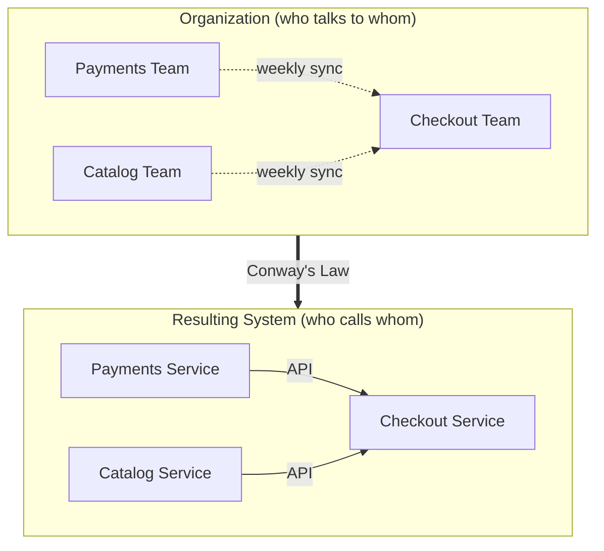

# Sociotechnical & Org Design — Junior Interview Questions

> **Collection:** [System Design](../README.md) · **Level:** Junior · **Section 37 of 42**
> **Goal:** Show that you understand the system you ship is shaped by the org that
> builds it — that team boundaries, ownership, and cognitive load are *design
> decisions*, not HR trivia, and that Conway's Law, Team Topologies, and platform
> engineering are tools for making those decisions on purpose.

A "junior" answer here is not about reorganizing a company — nobody expects that from
you. It is about *naming the forces*: why two services that should be separate keep
leaking into each other, why one team is drowning while another is idle, and why a
shared internal tool exists. Interviewers want to see that you've noticed software
architecture and human organization are the same drawing viewed twice. Each question
below lists **what the interviewer is really probing**, a **model answer**, and often a
**follow-up**.

---

## Contents

1. [Conway's Law](#1-conways-law)
2. [Team Topologies](#2-team-topologies)
3. [Platform Engineering / Internal Developer Platform (IDP)](#3-platform-engineering--internal-developer-platform-idp)
4. [Ownership & Boundaries](#4-ownership--boundaries)
5. [Cognitive Load](#5-cognitive-load)
6. [Rapid-Fire Self-Check](#6-rapid-fire-self-check)

---

## 1. Conway's Law

### Q1.1 — State Conway's Law in one sentence, and then in plain English.

**Probing:** Do you actually know the law, or just the buzzword?

**Model answer:** The formal statement (Melvin Conway, 1968) is: *"Any organization that
designs a system will produce a design whose structure is a copy of the organization's
communication structure."* In plain English: **your software ends up shaped like your
org chart.** If four teams build a compiler, you get a four-pass compiler. If frontend
and backend are separate teams who rarely talk, you get a rigid, over-formalized API
between them — because that API *is* their communication channel made concrete.

**Follow-up:** *"Is it a law of nature or a tendency?"* → A strong, well-observed
tendency, not physics. It holds because the cheapest way for code to communicate
mirrors the cheapest way for the people to communicate. You can fight it, but it's
swimming upstream.

### Q1.2 — Show how the same org structure forces the same system structure.

**Probing:** Can you make the "org shape ≈ system shape" idea concrete and visual?

**Model answer:** Three teams that own three concerns will almost always produce three
services with boundaries drawn exactly where the *team* boundaries are — not
necessarily where the *domain* boundaries should be. The communication links between
teams (the dotted lines) become the integration points between services (the API
arrows). If two teams sit together and pair constantly, their code tends to merge into
one tightly-coupled module; if they're in different time zones and only meet weekly,
their code develops a hard, formal interface. The system is a photograph of the org.

### Q1.3 — What is the "Inverse Conway Maneuver"?

**Probing:** Do you know you can *use* the law deliberately, not just suffer it?

**Model answer:** Instead of letting the org accidentally shape the system, you do it on
purpose: **first decide the architecture you want, then reshape the teams to match it.**
If you want three loosely-coupled, independently-deployable services, you create three
small teams each owning one service end-to-end — and the desired architecture tends to
emerge because the org now *rewards* it. It's "Conway's Law, run backwards" as a design
tool. The catch: reorganizing people is slow and political, so you do it sparingly and
early.

**Follow-up:** *"Give a sign Conway's Law is hurting you."* → Two services that should
be independent constantly ship together and break each other — usually because one team
secretly owns both, or two teams share a database. The org seam and the system seam are
misaligned.

---

## 2. Team Topologies

### Q2.1 — Name the four fundamental team types from Team Topologies and what each is for.

**Probing:** Vocabulary check on the standard model (Skelton & Pais).

**Model answer:** Team Topologies says you only need four kinds of team, and most teams
should be the first one:

| Team type | Purpose | Owns | Example |
|---|---|---|---|
| **Stream-aligned** | Deliver a continuous flow of value for one product/domain | A user-facing slice, end to end | The "Checkout" team owning the checkout flow |
| **Platform** | Provide internal services that make stream-aligned teams faster | Self-service infra/tooling (the IDP) | The team that owns the CI/CD + deploy platform |
| **Enabling** | Coach other teams to adopt new skills/practices, then leave | Capability uplift, *not* a product | A testing-practices team helping squads adopt contract tests |
| **Complicated-subsystem** | Own a part that needs deep specialist expertise | One hairy technical component | A team owning the video-encoding or pricing-math engine |

The whole point is that **stream-aligned teams are the default**, and the other three
exist only to reduce those teams' load so they can keep shipping.

### Q2.2 — What's the difference between an enabling team and a platform team? People confuse them.

**Probing:** Can you distinguish "we teach you" from "we run it for you"?

**Model answer:** A **platform team gives you a thing** — a self-service product (deploy
pipelines, a paved-road service template, observability out of the box) that you consume
forever without talking to them much. An **enabling team gives you a skill** — they
embed temporarily, coach you on, say, performance testing or a new framework, and then
*deliberately leave* once you're capable. Platform = a durable product and a permanent
relationship; enabling = a temporary teacher and a *deliberately temporary* relationship.
If an "enabling" team never leaves, it has quietly become a bottleneck or a hidden
platform team.

### Q2.3 — Team Topologies defines three "interaction modes." Name them.

**Probing:** Do you know teams interact in defined ways, not ad hoc?

**Model answer:** Three modes:
1. **Collaboration** — two teams work closely together for a while to figure something
   out (high bandwidth, high cost, good for discovery; bad as a permanent state).
2. **X-as-a-Service** — one team consumes something another team provides, with minimal
   talking (e.g., you use the platform's deploy API). This is the low-friction default
   you want most of the time.
3. **Facilitating** — one team (usually enabling) helps another remove an impediment or
   learn a practice.

The healthy pattern is **collaborate briefly to define a clean boundary, then switch to
X-as-a-Service** so the two teams can move independently.

**Follow-up:** *"Why limit how teams interact at all?"* → Every persistent
collaboration link is communication overhead and a Conway's-Law coupling. Fewer, cleaner
interaction modes mean fewer accidental dependencies in the resulting system.

---

## 3. Platform Engineering / Internal Developer Platform (IDP)

### Q3.1 — What problem does platform engineering solve?

**Probing:** Do you see the platform as a *product for developers*, not a pile of scripts?

**Model answer:** As a company grows, every stream-aligned team independently re-solves
the same boring-but-hard problems: how do I deploy, get a database, set up CI, add
logging, manage secrets, run on Kubernetes? That's enormous duplicated effort and
enormous cognitive load. **Platform engineering builds an Internal Developer Platform
(IDP): a self-service product that paves a "golden path"** so a product team can ship a
new service in minutes instead of wiring up infrastructure for weeks. The platform team
treats developers as its customers and the developer experience as its product.

### Q3.2 — What makes it a "platform" rather than just a shared ops team?

**Probing:** The self-service, product-mindset distinction — this is the heart of it.

**Model answer:** The defining property is **self-service**. With a platform, a developer
fills in a template or calls an API and gets a deployed, monitored service *without
filing a ticket and waiting for a human*. A traditional ops team is a queue: you ask,
they do it, you wait. A platform is a product: it's there 24/7, you serve yourself, and
the platform team's job is to make the paved path so good that people choose it. The
slogan is "**golden paths, not gates**" — make the easy way the right way, but don't
force it.

**Follow-up:** *"Should you mandate the platform?"* → Generally no — you make it
*attractive* enough that teams adopt it voluntarily. If you have to mandate it, that's a
signal the developer experience isn't good enough yet.

### Q3.3 — Roughly what lives inside a typical IDP?

**Probing:** Concreteness — can you list real capabilities, not adjectives?

**Model answer:** Common building blocks: a **service catalog / templates** (scaffold a
new service from a golden template), **CI/CD pipelines** (build, test, deploy without
hand-rolling YAML each time), **environment & infrastructure provisioning** (get a
database, a queue, a cluster namespace on demand), **secrets management**, and
**observability baked in** (logging, metrics, and tracing wired up automatically). The
test is: *a new engineer can go from "I have an idea" to "it's running in production with
dashboards" the same day, touching only the platform's self-service surface.*

---

## 4. Ownership & Boundaries

### Q4.1 — What does "ownership" mean for a team, and why does it matter?

**Probing:** Do you connect ownership to accountability and speed?

**Model answer:** Ownership means **one team is responsible for a piece of the system end
to end** — they build it, deploy it, run it in production, and get paged when it breaks
("you build it, you run it"). It matters because clear ownership removes the two worst
failure modes: the **orphan** (a service nobody owns, so bugs rot and security patches
never land) and the **tug-of-war** (two teams half-own something, so every change needs a
meeting and nobody is accountable when it fails). Clear ownership is what lets a team move
fast *without asking permission*, because the thing they're changing is theirs.

### Q4.2 — What makes a *good* boundary between two services or two teams?

**Probing:** Can you articulate high-cohesion / low-coupling in human terms?

**Model answer:** A good boundary is drawn where **change rarely crosses it.** Inside the
boundary things change together and belong together (high cohesion); across the boundary,
the two sides can evolve independently behind a stable, explicit interface (low coupling).
Practical tells of a *good* boundary: each team can deploy without coordinating with the
other, they don't share a database, and a typical feature touches only one side. Tells of
a *bad* boundary: every change requires a cross-team meeting, the two services always
deploy together, and they reach into each other's data. Bad boundaries recreate a
monolith with network calls in the middle — the worst of both worlds.

**Follow-up:** *"Why is a shared database such a strong sign of a bad boundary?"* →
Because it's an invisible, uncontrolled interface. Either team can change a table and
silently break the other; there's no stable contract, so the two teams are coupled no
matter what the box diagram says.

### Q4.3 — How do Domain-Driven Design boundaries relate to team boundaries?

**Probing:** Do you connect "bounded context" to "team" and back to Conway?

**Model answer:** In Domain-Driven Design, a **bounded context** is a part of the domain
with its own consistent model and language (e.g., "Order" means something specific inside
Checkout that's different from "Order" inside Shipping). The clean move is to **align one
team to one bounded context** — that team owns that model, that vocabulary, and the
service(s) implementing it. This is the Inverse Conway Maneuver in practice: pick domain
boundaries deliberately, then put a team on each one, so the org seams and the domain
seams line up instead of fighting.

---

## 5. Cognitive Load

### Q5.1 — What is "cognitive load" in a team context, and why should a designer care?

**Probing:** Do you treat the team's mental capacity as a finite, designable resource?

**Model answer:** Cognitive load is **the total amount a team has to hold in its head to
do its job** — all the services it owns, the tech it must understand, the domains it must
reason about, plus the operational toil of keeping it all running. It's finite. A team
past its cognitive limit slows down, makes more mistakes, can't onboard new people, and
burns out — regardless of how skilled they are. A good org/system designer treats team
cognitive load like a budget: **if a team owns too much, the fix is to reduce what they
must think about, not to tell them to try harder.**

### Q5.2 — Team Topologies splits cognitive load into three kinds. What are they, and which do you attack?

**Probing:** The intrinsic / extraneous / germane distinction (borrowed from learning
science).

**Model answer:**

| Kind | What it is | What to do about it |
|---|---|---|
| **Intrinsic** | The essential difficulty of the problem domain itself | Reduce via training and hiring; can't remove it |
| **Extraneous** | Accidental load from clunky tooling, manual deploys, fragile environments | **Eliminate it** — this is what a platform/IDP exists to absorb |
| **Germane** | The valuable thinking about *your* domain and product | **Maximize the share of capacity spent here** |

The strategy: **kill extraneous load** (give teams a golden path so they stop fighting
infrastructure), **manage intrinsic load** (don't pile unrelated domains on one team),
and free up capacity for **germane load** — the thinking that actually creates value.

### Q5.3 — Connect cognitive load back to the platform and team-type ideas.

**Probing:** Can you tie the whole section together?

**Model answer:** It's the unifying thread. **Stream-aligned teams should own as much as
they can — but no more than they can hold in their heads.** When a stream-aligned team's
cognitive load gets too high, you don't just add people; you **offload** to the other team
types: a **platform team** absorbs the extraneous infrastructure load via self-service, an
**enabling team** temporarily lifts the learning load for a new skill, and a
**complicated-subsystem team** takes a deeply specialized chunk off their plate entirely.
And by Conway's Law, keeping each team's load sane keeps the *system* boundaries clean too
— overloaded teams produce tangled, overloaded systems.

**Follow-up:** *"A team owns 12 microservices and is constantly firefighting. Junior-level
fix?"* → Name it as a cognitive-load problem, not a "work harder" problem. Either the team
owns too many unrelated domains (split it, or consolidate services that always change
together) or it's drowning in extraneous toil (push that onto a platform). More people on
the same tangle rarely helps.

---

## 6. Rapid-Fire Self-Check

If you can answer each of these in a sentence, you're ready for the junior bar on this section:

- [ ] State Conway's Law and what it predicts about your architecture. *(system shape ≈ org communication shape)*
- [ ] What is the Inverse Conway Maneuver? *(design the architecture, then shape teams to match)*
- [ ] Name the four Team Topologies team types. *(stream-aligned, platform, enabling, complicated-subsystem)*
- [ ] Platform team vs enabling team — one line each. *(gives you a thing forever vs teaches you a skill then leaves)*
- [ ] What single property makes an IDP a "platform"? *(self-service — golden paths, not gates)*
- [ ] What's the tell of a *bad* service boundary? *(can't deploy independently / shared database)*
- [ ] What's a bounded context, and how does it relate to a team? *(one consistent domain model → one team owns it)*
- [ ] Name the three kinds of cognitive load and which one you eliminate. *(intrinsic / extraneous / germane — kill extraneous)*

---

**Next step:** Section 38 — [Cost & Efficiency (FinOps)](38-cost-efficiency-finops.md): turning architecture decisions into dollars, and owning the bill.
