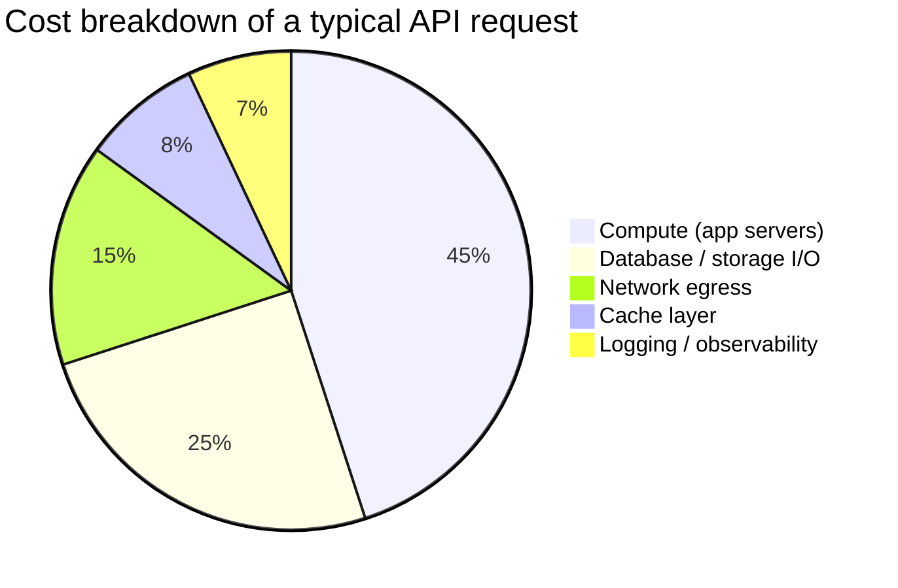

# Cost & Efficiency (FinOps) — Junior Interview Questions

> **Collection:** [System Design](../README.md) · **Level:** Junior · **Section 38 of 42**
> **Goal:** Show you can put a dollar figure on a design — reason about cost per
> request and per user, plan capacity without over-provisioning, treat efficiency as
> a feature rather than an afterthought, respect what the hardware actually costs, and
> tell when an optimization pays for itself.

Cloud bills are the part of system design that follows you into the next sprint
retro. A "junior" answer here is not a spreadsheet — it is the instinct to ask *"what
does this cost, and per what?"* before adding a service, plus the arithmetic to back
it up. Interviewers want to see that you can convert load numbers into money, that you
know the rough price tiers (on-demand vs reserved vs spot), and that you don't optimize
things that don't matter. Each question lists **what the interviewer is really
probing**, a **model answer** with simple cost math, and often a **follow-up**.

---

## Contents

1. [Cost Modeling (cost per request / per user)](#1-cost-modeling-cost-per-request--per-user)
2. [Capacity Planning](#2-capacity-planning)
3. [Efficiency as a Feature](#3-efficiency-as-a-feature)
4. [Hardware-Aware Design](#4-hardware-aware-design)
5. [Performance Economics (when optimization pays for itself)](#5-performance-economics-when-optimization-pays-for-itself)
6. [Rapid-Fire Self-Check](#6-rapid-fire-self-check)

---

## 1. Cost Modeling (cost per request / per user)

### Q1.1 — What is "cost per request," and why is it a more useful number than the total bill?

**Probing:** Do you normalize cost to a unit of work instead of staring at a lump sum?

**Model answer:** Cost per request is the total infrastructure spend attributable to a
service divided by the number of requests it served in the same period. The total bill
tells you *how much* you spent; cost per request tells you whether spending is
*healthy*. A $50,000/month bill is fine for 5 billion requests (that's $0.00001 each)
and alarming for 5 million ($0.01 each). Normalizing to a unit lets you compare months,
compare services, and predict the bill *before* a launch: if cost per request is stable,
3x the traffic means roughly 3x the bill.

Quick worked example: a service costs **$8,000/month** and serves **400M requests/month**.

```
$8,000 / 400,000,000 = $0.00002 per request = $20 per 1M requests
```

**Follow-up:** *"Your traffic doubles but the bill goes up 1.4x — good or bad?"* → Good:
cost per request *fell* (sub-linear scaling), usually because fixed costs (a load
balancer, a baseline of always-on instances) got spread over more requests.

### Q1.2 — Walk through the components that add up to the cost of a single request.

**Probing:** Can you decompose a bill into where the money actually goes?



**Model answer:** A request's cost is the sum of every resource it touches. **Compute**
is usually the biggest slice — the CPU-seconds your app server burns. **Database and
storage** I/O is next: reads, writes, and the disk those rows live on. **Network egress**
is the sneaky one — data leaving the cloud provider is billed per GB, and cross-region or
internet egress is far from free. Then the **cache** (memory you rent to avoid hitting
the DB), and **logging/observability**, which feels free but isn't — you pay to ingest,
store, and query every log line. The lesson: a single request is a little bill made of
many line items, and the cheapest request is the one your cache answers without waking
the database.

### Q1.3 — How do you compute cost *per user* when users vary wildly in activity?

**Probing:** Awareness that "per user" hides a heavy-tail distribution.

**Model answer:** The naive version is total cost ÷ active users. With **$8,000/month**
and **200,000 monthly active users**, that's **$0.04 per user per month**. But users are
not uniform: a handful of power users may drive most of the load. So the honest model is
*cost per user by segment* — a free-tier viewer might cost $0.005/month while a power user
who streams video costs $2/month. This matters for pricing: if your subscription is
$5/month but your heaviest 1% cost $8/month to serve, you lose money on them. Junior
move: report the average, but always check whether a small group dominates the bill.

**Follow-up:** *"Why does this matter for a freemium product?"* → Because free users are a
pure cost. You must know their unit cost to size how many free users a paying user can
subsidize before the model breaks.

### Q1.4 — A read-heavy endpoint gets a cache. How does that change cost per request?

**Probing:** Connecting an architecture choice directly to the unit economics.

**Model answer:** Caching trades a cheap cache lookup for an expensive database query.
Say a DB-backed request costs **$30 per 1M** and a cache-served request costs **$3 per
1M**. At a **90% cache hit rate**, the blended cost is:

```
0.90 × $3  +  0.10 × $30  =  $2.70 + $3.00  =  $5.70 per 1M requests
```

That's roughly a **5x reduction** versus $30. The cache itself costs money to run, but as
long as that fixed cost is smaller than the database load it removes, you come out ahead.
The break-even insight: caching pays off precisely when reads are frequent and repeated.

---

## 2. Capacity Planning

### Q2.1 — What is capacity planning, and what goes wrong if you skip it?

**Probing:** Do you understand the cost of *both* under- and over-provisioning?

**Model answer:** Capacity planning is deciding how much compute, memory, storage, and
bandwidth to provision so the system meets its load and latency targets without wasting
money. Skip it in one direction — **under-provision** — and you get dropped requests,
timeouts, and a 2 a.m. page during a traffic spike. Skip it in the other direction —
**over-provision** — and you pay for idle servers every hour of every day. The goal is
headroom, not a fortress: enough spare capacity to absorb normal peaks and a node
failure, but not 5x what you'll ever use.

### Q2.2 — A service averages 1,000 req/s; how many servers do you provision?

**Probing:** Can you turn a load number into a server count with peak and headroom?

**Model answer:** You can't answer from the average alone — you need three numbers:

1. **Peak, not average.** Traffic is bursty; peak is often **2–3x** the average. So plan
   for ~**3,000 req/s**, not 1,000.
2. **Per-server capacity.** Say one server safely handles **500 req/s** before latency
   degrades. That's **3,000 ÷ 500 = 6 servers** at peak.
3. **Headroom for failure.** Add at least **N+1** so one server can die without
   overload → **7 servers**.

So roughly **7**, not 2. The mistake is sizing to the average and getting paged the first
time traffic spikes.

**Follow-up:** *"Why not just autoscale and skip the math?"* → Autoscaling reacts with a
lag (minutes to boot instances); the math gives you the *baseline* and *max* the
autoscaler should target, and it tells you what you'll pay at peak.

### Q2.3 — How does autoscaling change the cost equation versus a fixed fleet?

**Probing:** Understanding that you pay for the shape of demand, not just the peak.

**Model answer:** A fixed fleet sized for peak pays for peak capacity 24/7 even though
real demand looks like a wave — low at night, high midday. Autoscaling tracks the wave,
so you pay roughly for the *area under the demand curve* instead of the *peak line across
the whole day*. If your peak is 10 servers but your daily average is 4, a fixed fleet pays
for ~10 all day while autoscaling averages ~4 — potentially a **~60% saving** on compute.
The catch: autoscaling needs stateless servers, a warm-up buffer, and sane min/max bounds,
or you trade money for cold-start latency.

### Q2.4 — How do you forecast storage growth a year out?

**Probing:** Simple linear extrapolation from a per-unit rate.

**Model answer:** Find the per-unit growth rate, then multiply. Suppose you add **2M
records/day** at **1 KB each**:

```
2,000,000 × 1 KB        = 2 GB/day
2 GB × 365              ≈ 730 GB/year  (raw)
730 GB × 3 (replication) ≈ 2.2 TB/year provisioned
```

So budget a couple of terabytes a year, then add index overhead and a margin. The point
isn't precision — it's knowing whether you're adding gigabytes or petabytes annually,
because that decides single-node vs sharded storage and what the storage line on the bill
will look like next year.

---

## 3. Efficiency as a Feature

### Q3.1 — What does "efficiency is a feature" mean?

**Probing:** Do you see cost/performance work as product value, not just cleanup?

**Model answer:** It means treating resource efficiency — fewer CPU cycles, less memory,
fewer bytes over the wire — as something that delivers user and business value, the same
way a new screen does. A leaner service is cheaper to run (lower bill), faster for users
(lower latency), and greener (less energy). Framed this way, "make the search endpoint
use half the CPU" isn't a chore you slip in between features — it directly improves
margins and the user experience, and it deserves a place on the roadmap.

### Q3.2 — Give a concrete example where efficiency directly improved the product.

**Probing:** Can you tie an efficiency win to a user-visible outcome?

**Model answer:** Shrinking the mobile API payload. Suppose a list endpoint returns
**40 KB** of JSON and you trim unused fields and compress it to **8 KB**. That's **5x
less data**: pages load faster on slow networks, the app feels snappier, and users on
metered data plans pay less to use you. On the cost side, if you serve **1 billion** of
those responses a month at an egress price of **$0.09/GB**:

```
Before: 1B × 40 KB = 40 TB → 40,000 GB × $0.09 ≈ $3,600/month
After:  1B ×  8 KB =  8 TB →  8,000 GB × $0.09 ≈   $720/month
```

One efficiency change is a faster app *and* ~**$2,880/month** saved. Same feature, better
in every dimension.

### Q3.3 — Why can "just add more servers" be the wrong first answer to a slow system?

**Probing:** Do you reach for efficiency before brute-force spend?

**Model answer:** Because throwing hardware at an inefficient system pays the inefficiency
tax forever. If a request does a needless N+1 query and you "fix" the slowness by doubling
the fleet, you've doubled the bill to paper over a bug that a single query rewrite would
solve for free. Scaling out is the right move when the work itself is genuinely large;
it's the wrong move when the work is *wasteful*. The discipline is: profile first, remove
the waste, *then* scale what's left. Efficiency is usually the cheapest capacity you can
buy.

---

## 4. Hardware-Aware Design

### Q4.1 — What does it mean to design with the hardware in mind?

**Probing:** Awareness that physical resources have different costs and characteristics.

**Model answer:** It means matching your workload to the resource it actually stresses,
because CPU, memory, disk, and network have very different price/performance profiles.
A workload that's mostly waiting on the database doesn't need a CPU-heavy (and expensive)
instance — it needs memory and I/O. Picking a compute-optimized machine for an I/O-bound
job means paying for cores that sit idle. Hardware-aware design is choosing the right
*shape* of machine (and the right storage tier) for what the work bottlenecks on, instead
of buying one big general-purpose box for everything.

### Q4.2 — Compare the rough cost and use of storage tiers.

**Probing:** Do you know that not all storage is priced or built the same?

**Model answer:** Storage is a ladder from fast-and-expensive to slow-and-cheap, and you
put data where its access pattern fits:

| Tier | Rough relative cost | Speed | Good for |
|---|---|---|---|
| RAM / cache | Highest | Nanoseconds | Hot data read constantly |
| Local SSD (NVMe) | High | Microseconds | Low-latency DB working set |
| Network block storage | Medium | ~1 ms | General DB / app disks |
| Object storage (e.g., blob) | Low | ~10–100 ms | Files, backups, media |
| Cold / archive storage | Lowest | Minutes–hours | Logs, compliance archives |

The skill is not memorizing prices but knowing the *order*: keep the small hot set in
memory, the working set on SSD, and the rarely-touched bulk in cheap object or archive
storage. Storing year-old logs in a hot database is paying RAM prices for archive data.

### Q4.3 — When does picking the right instance type save real money?

**Probing:** Matching instance family to bottleneck instead of defaulting to general-purpose.

**Model answer:** Whenever your workload leans hard on one resource. Cloud providers sell
**compute-optimized** (high CPU), **memory-optimized** (high RAM), and **general-purpose**
families. A caching layer that holds 200 GB in memory wants a memory-optimized box; paying
for a general-purpose box with the same RAM means also paying for cores you won't use.
Concretely, if a memory-optimized instance gives you the RAM you need at **70%** of the
price of an over-spec'd general-purpose one, that's a flat **30% saving** on that fleet for
zero performance loss. Right-sizing the *family*, not just the *size*, is one of the
cheapest FinOps wins.

**Follow-up:** *"What's the risk of over-optimizing instance choice?"* → Specialized
instances can be harder to source, less flexible when the workload shifts, and a
maintenance burden. For small or unpredictable workloads, general-purpose is often the
right *boring* default.

---

## 5. Performance Economics (when optimization pays for itself)

### Q5.1 — How do you decide whether a performance optimization is worth doing?

**Probing:** Cost-benefit thinking, not "optimize everything."

**Model answer:** Compare the cost of the work (engineering time, added complexity,
maintenance) against the value it returns (lower bill, lower latency, more revenue). An
optimization is worth it when the return clears the cost within a reasonable payback
window. If a senior spends **two weeks** (say **$8,000** of loaded time) to cut the
monthly bill by **$3,000**, it pays for itself in under **three months** and saves
money every month after — clearly worth it. If the same two weeks saves **$50/month**,
the payback is over a decade; don't do it. Always ask: *how much does this save, and how
long until it pays back the effort?*

### Q5.2 — Where should you focus optimization effort first?

**Probing:** Do you target the hot path and the dominant cost, per Amdahl-style reasoning?

**Model answer:** On whatever dominates the cost or latency — the hot path, not the rare
one. If 80% of your spend is one query endpoint, halving its cost saves more than
eliminating ten rarely-hit endpoints entirely. Optimizing code that runs once a day is
wasted effort no matter how clever it is; optimizing the path that runs a billion times a
month is where pennies turn into thousands of dollars. Profile to find the dominant term,
fix that, then re-measure. Premature optimization of cold paths is the classic junior
trap.

### Q5.3 — Compare on-demand, reserved, and spot pricing, and when to use each.

**Probing:** Knowing the three big purchasing levers and their trade-offs.

**Model answer:** These are three ways to pay for the same compute, trading commitment and
reliability for price:

| Model | Rough price | Commitment | Can be reclaimed? | Best for |
|---|---|---|---|---|
| **On-demand** | Baseline (100%) | None | No | Spiky, unpredictable, short-lived load |
| **Reserved / committed** | ~40–60% of on-demand | 1–3 years | No | Steady baseline you'll always need |
| **Spot / preemptible** | ~10–30% of on-demand | None | **Yes, anytime** | Fault-tolerant batch, stateless workers |

The strategy is a blend: cover your **always-on baseline** with reserved instances for the
big discount, handle **bursts** with on-demand for flexibility, and run **interruptible
batch work** (data processing, CI, rendering) on spot for the deepest discount. A worked
mix — 10 always-on servers at on-demand **$0.10/hr** is **$720/month**; move them to
reserved at **$0.05/hr** and it's **$360/month** — a flat **50% saving** on steady
capacity for committing a year.

**Follow-up:** *"Why not put everything on spot to save the most?"* → Because spot can be
reclaimed with little warning. Stateful or latency-critical services would be killed
mid-request; spot only suits work that can be safely interrupted and retried.

### Q5.4 — Give a small payback calculation for adding a cache.

**Probing:** End-to-end: does the saving exceed the new cost?

**Model answer:** Adding a cache has a cost (the cache cluster) and a benefit (less
database load). Say the cache costs **$400/month** to run, and it cuts database load enough
to drop one DB replica worth **$1,200/month**:

```
Net monthly saving = $1,200 − $400 = $800/month
```

Positive, so it pays off immediately and keeps saving. But flip the numbers: if the cache
only removed **$300/month** of database cost, you'd be spending **$400** to save **$300** —
a net **loss of $100/month**, and you shouldn't add it for cost reasons (though latency
gains might still justify it). The habit: always net the new cost against the saving before
declaring a win.

---

## 6. Rapid-Fire Self-Check

If you can answer each of these in a sentence, you're ready for the junior bar on this section:

- [ ] Why is cost *per request* more useful than the total bill? *(normalizes spend to a unit of work)*
- [ ] Name three components that add up to one request's cost. *(compute, DB/storage, egress, cache, logging)*
- [ ] $8,000/month over 400M requests ≈ ? per 1M. *(~$20 per 1M)*
- [ ] How many servers for 1,000 req/s average? *(peak ×2–3, ÷ per-server capacity, +N+1 → ~7)*
- [ ] What does autoscaling let you pay for? *(area under the demand curve, not the peak all day)*
- [ ] What does "efficiency is a feature" mean? *(cheaper + faster + greener = real product value)*
- [ ] Order the storage tiers cheapest to most expensive. *(archive → object → block → SSD → RAM)*
- [ ] On-demand vs reserved vs spot — one use case each.
- [ ] How do you decide if an optimization is worth it? *(saving vs effort, within a payback window)*
- [ ] Net saving of a $400 cache that removes a $1,200 DB replica? *(+$800/month)*

---

**Next step:** Section 39 — [Global / Multi-Region](39-global-multi-region.md): serving users worldwide, replication across regions, and the latency-vs-cost trade-offs of going global.
