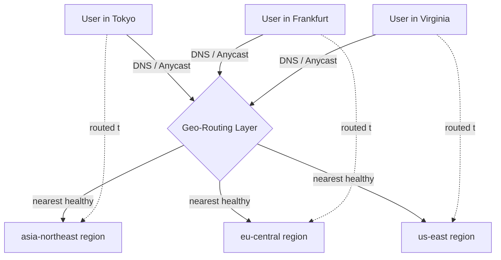
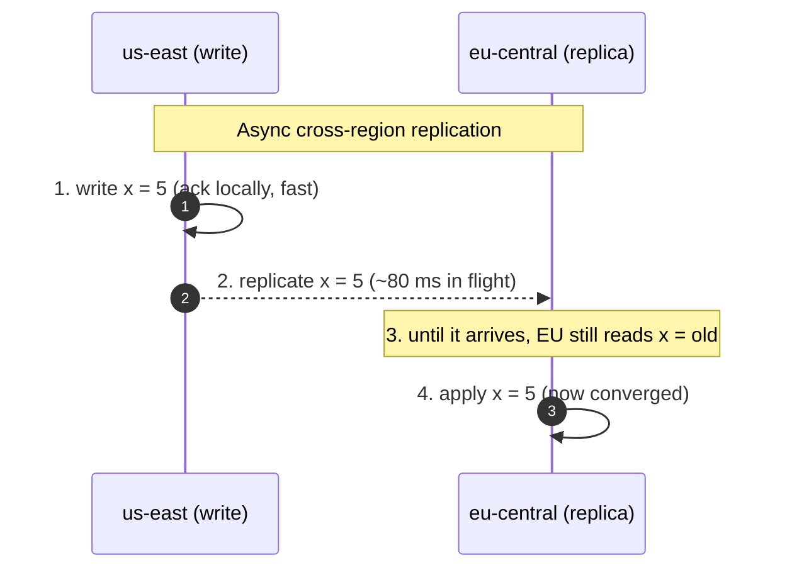

# Global / Multi-Region Architecture — Junior Interview Questions

> **Collection:** [System Design](../README.md) · **Level:** Junior · **Section 39 of 42**
> **Goal:** Confirm you can explain why systems span multiple regions, route users to
> the nearest healthy one, and reason honestly about the consistency and conflict
> trade-offs that going global forces on you.

Going multi-region is one of the most expensive decisions in system design, so
interviewers want to see that you know *why* you'd pay that cost — latency for users,
survival of a regional outage, and legal data-residency rules — and that you understand
the hard problem hiding underneath: the speed of light makes a single global "now"
impossible, so you must choose what to do about it. Each question lists **what the
interviewer is really probing**, a **model answer**, and often a **follow-up**.

---

## Contents

1. [Active-Active Architecture](#1-active-active-architecture)
2. [Data Sovereignty & Residency](#2-data-sovereignty--residency)
3. [Geo-Routing (latency-based, GeoDNS, Anycast)](#3-geo-routing-latency-based-geodns-anycast)
4. [Global Consistency](#4-global-consistency)
5. [Conflict Resolution (last-write-wins, CRDTs)](#5-conflict-resolution-last-write-wins-crdts)
6. [Follow-the-Sun (ops handoff)](#6-follow-the-sun-ops-handoff)
7. [Rapid-Fire Self-Check](#7-rapid-fire-self-check)

---

## 1. Active-Active Architecture

### Q1.1 — What is the difference between active-active and active-passive multi-region?

**Probing:** The core vocabulary. Juniors often say "multi-region" without knowing whether traffic actually hits both regions.

**Model answer:** Both run your stack in two or more regions, but they differ in who
serves traffic in normal operation.

| | Active-Passive | Active-Active |
|---|---|---|
| **Who serves traffic** | One region serves; the other(s) stand by | Every region serves live traffic simultaneously |
| **On regional failure** | Fail *over* to the standby (takes time, often minutes) | Traffic shifts to surviving regions almost instantly |
| **User latency** | Far users still hit the one active region | Each user hits a nearby region — lower latency |
| **Cost** | Standby is mostly idle (cheaper to reason about) | All regions fully utilized (and harder to keep in sync) |
| **Hard part** | Failover correctness and not losing recent writes | Keeping data consistent while *both* sides accept writes |

The headline trade-off: active-passive is **simpler** because only one region writes at
a time, so there are no cross-region write conflicts — but failover is slow and you
waste a standby. Active-active gives **low latency and instant resilience**, at the cost
of solving conflict resolution and consistency across regions that both accept writes.

**Follow-up:** *"Why is active-active so much harder?"* → Because two users can write to
the same record in two different regions at nearly the same instant, and the speed of
light means neither region knows about the other's write yet. You now *must* have a
story for which write wins — that's the conflict-resolution problem in Part 5.

### Q1.2 — Give a concrete reason a company would pay for active-active.

**Probing:** Can you connect the architecture to a real business motive, not just "it's better"?

**Model answer:** Two common ones. **(1) Latency for a global audience** — a user in
Singapore hitting a US-only service pays ~200 ms per round trip; an active-active region
in Singapore drops that to single-digit milliseconds, which directly improves
conversion and engagement. **(2) Surviving a region outage with zero downtime** — when
an entire cloud region goes dark (it happens), an active-passive setup is down until
failover completes, whereas active-active just stops sending traffic to the dead region
and users barely notice. Payment networks and large social platforms run active-active
precisely because minutes of downtime cost real money.

### Q1.3 — In active-active, what has to be true about a request to make it "safe" to serve from any region?

**Probing:** The statelessness intuition, applied globally.

**Model answer:** The request should not depend on session state that lives only in one
region. App servers should be **stateless** — any per-user state (session, cart) lives
in a shared or replicated data store, not in the memory of one server. If a request
*can* be answered correctly using only data that every region has (or can fetch), it's
safe to route anywhere. The moment a request needs the single freshest copy of a
strongly-consistent value — say, "is this the *only* booking for seat 14A?" — you can no
longer freely serve it from any region without coordination.

---

## 2. Data Sovereignty & Residency

### Q2.1 — What is data residency, and why does it constrain a global design?

**Probing:** Awareness that *law*, not just engineering, shapes architecture.

**Model answer:** Data residency (or data sovereignty) is the legal requirement that
certain data about a country's residents be stored, and sometimes processed, **inside
that country's or region's borders**. For example, regulations may require EU personal
data to stay in the EU, or Indian payment data to be stored in India. This constrains
design because you can no longer freely replicate every record to every region "just for
latency" — some data is *pinned* to a jurisdiction, and copying it elsewhere can be
illegal regardless of how much faster it would make the system.

**Follow-up:** *"How does that change your data model?"* → You typically partition users
by region (a EU user's row lives in the EU region as its home) and design so that
their regulated data is created, stored, and processed there. Global, non-personal data
(say, a product catalog) can still be replicated everywhere.

### Q2.2 — How do you reconcile "store EU data in the EU" with wanting a fast global experience?

**Probing:** Practical compromise, not an all-or-nothing answer.

**Model answer:** Split data by sensitivity. **Personal / regulated data** is pinned to
its home region and never copied out. **Non-regulated, shareable data** — public
profiles, catalogs, aggregate counters, anonymized analytics — can be replicated
globally for speed. A user travelling abroad still has their regulated data served from
the home region (a bit slower), while everything else is fast and local. The design
principle is: *default global for what's legal to share, default pinned for what isn't.*

### Q2.3 — A user in Germany travels to Brazil. Where does their personal data live and get served from?

**Probing:** Do you understand residency follows the *data subject's jurisdiction*, not the user's current location?

**Model answer:** Their regulated personal data stays in its **home region (the EU)**;
it does not move to Brazil just because the user did. Requests that need that data are
routed back to the EU region, which is slower but legally correct. The Brazilian region
can still serve everything global/cached quickly. Residency is about where the data is
*allowed to live*, which is tied to the user's jurisdiction, not their GPS coordinates
on a given day.

---

## 3. Geo-Routing (latency-based, GeoDNS, Anycast)

### Q3.1 — When a user opens your app, how do they end up talking to the nearest region?

**Probing:** Mechanical understanding of how routing decisions actually get made.

**Model answer:** Before any application logic runs, the network layer decides which
region a user reaches. The three common mechanisms are **GeoDNS** (DNS returns a
different IP based on the resolver's geographic location), **latency-based routing** (DNS
returns the region with the lowest measured latency to the user, not just the closest on
a map), and **Anycast** (many regions announce the *same* IP, and the internet's routing
naturally delivers the packet to the nearest one).

Each user is steered to the closest *healthy* region; if a region is down, the routing
layer stops handing it out and sends users to the next-nearest one.

**Follow-up:** *"Why 'latency-based' instead of just 'closest on the map'?"* → Geographic
distance and network distance differ. The nearest city might have a poor network path,
while a slightly farther region has a fast direct link. Latency-based routing measures
the real round-trip and picks the genuinely fastest region.

### Q3.2 — Compare GeoDNS and Anycast in one breath each.

**Probing:** Precise distinction between two things juniors blur together.

**Model answer:** **GeoDNS** makes the routing decision at *DNS resolution time* — the
name server hands back a region-specific IP, so the choice is sticky until DNS caching
expires. **Anycast** makes the decision at *packet-routing time* — the same IP is
announced from many regions and the network delivers each packet to the nearest one, so
failover can be near-instant (a dead region stops announcing the route). GeoDNS is
simpler and works at the application/DNS layer; Anycast is more powerful for fast
failover but operates at the network/BGP layer and is harder to run.

### Q3.3 — A region goes down. With GeoDNS, why might users still hit the dead region for a while?

**Probing:** The DNS-caching gotcha — a very common real-world failure.

**Model answer:** Because DNS answers are **cached** by resolvers and clients for the
record's TTL (time-to-live). Even after you update GeoDNS to stop pointing at the dead
region, anyone holding a cached answer keeps trying the old IP until their cache
expires. That's why DNS-based failover isn't instant, and why you keep TTLs low (e.g.,
30–60 s) on records you may need to fail over — and why Anycast, which reroutes at the
network layer, can shift traffic faster than DNS can.

---

## 4. Global Consistency

### Q4.1 — Why is keeping data consistent across regions fundamentally hard?

**Probing:** Do you reach for the speed of light, not just "it's complicated"?

**Model answer:** Because regions are separated by real distance, and information can't
travel faster than light. A write in Virginia takes ~80 ms to even *reach* Frankfurt, so
for that window the two regions genuinely disagree about the latest value — there is no
shared, instantaneous global "now." If you insist every region always sees the same
value at the same instant (**strong global consistency**), every write must wait for a
cross-region round trip before it's acknowledged, making writes slow. If you let regions
diverge briefly and converge later (**eventual consistency**), writes are fast but a read
right after a write in another region may be stale.

### Q4.2 — A user updates their profile in the US region and immediately reloads from the EU region — what might they see?

**Probing:** Can you make eventual consistency concrete from the user's seat?

**Model answer:** With asynchronous replication, they might briefly see the **old**
profile, because the EU region hasn't received the replicated write yet. This is
*replication lag* — usually milliseconds to a couple of seconds. For a profile bio it's
harmless and the right trade-off. For something the same user expects to see
immediately, you can offer **read-your-own-writes**: route that user's reads to the
region that took their write (or wait for the write to replicate) so they never see their
own change disappear, even while other users tolerate the small lag.

**Follow-up:** *"So is eventual consistency a bug?"* → No — it's a deliberate trade. The
bug would be promising strong consistency and silently not delivering it. Choosing
eventual consistency for data that tolerates brief staleness (likes, view counts,
profiles) is exactly right; you reserve strong consistency for data that can't be wrong
(account balances, inventory).

### Q4.3 — Which kinds of data are safe to make eventually consistent, and which are not?

**Probing:** Judgment about matching the consistency level to the data.

**Model answer:** **Safe (eventual is fine):** like counts, view counters, social feeds,
profile fields, product catalog — brief staleness causes no harm and converges quickly.
**Not safe (needs strong consistency):** money movement, inventory/seat reservations,
uniqueness guarantees (one username, one booking). The rule of thumb: if two regions
briefly disagreeing could let someone *spend the same dollar twice* or *book the same
seat twice*, that data needs strong consistency or single-region ownership — never
casual multi-region eventual writes.

---

## 5. Conflict Resolution (last-write-wins, CRDTs)

### Q5.1 — In active-active, two regions write to the same key at nearly the same time. What's the problem and the simplest fix?

**Probing:** Understanding that concurrent writes *will* collide, and the cheapest strategy.

**Model answer:** The problem is a **write conflict**: neither region saw the other's
write before accepting its own, so now there are two competing values and the system must
pick one deterministically (the same answer everywhere, or regions never converge). The
simplest strategy is **last-write-wins (LWW)**: attach a timestamp to each write and keep
the one with the later timestamp. It's trivial to implement and always converges.

**Follow-up:** *"What's the catch with last-write-wins?"* → It silently **discards** the
losing write — that data is just gone. And it depends on clocks: if two regions' clocks
are skewed, "latest" may be wrong, so an *earlier* real edit can beat a *later* one. LWW
is fine when losing an occasional concurrent update is acceptable (a cached setting), but
dangerous when every write matters (a shopping cart where dropped items mean lost sales).

### Q5.2 — What is a CRDT, and why might you use one instead of last-write-wins?

**Probing:** Knowing there's a principled alternative to throwing data away.

**Model answer:** A **CRDT** (Conflict-free Replicated Data Type) is a data structure
designed so that concurrent updates in different regions can be **merged automatically**
into the same result, no matter what order they arrive — without a coordinator and
without discarding writes. A classic example is a *grow-only counter*: each region counts
its own increments locally, and the global value is the sum, so two regions incrementing
at once both count. A shopping-cart CRDT merges by union, so items added in two regions
both survive instead of one overwriting the other.

| | Last-Write-Wins | CRDT |
|---|---|---|
| **On conflict** | Keep latest timestamp, drop the rest | Merge both deterministically |
| **Data loss** | Yes — losing write is discarded | No — designed to preserve all updates |
| **Complexity** | Very simple | More complex data structures |
| **Good for** | Single overwritable values, settings | Counters, sets, carts, collaborative text |
| **Relies on clocks** | Yes (timestamp ordering) | No (merge is order-independent) |

You choose CRDTs when **dropping a concurrent write is unacceptable** and you still want
fast, coordinator-free writes in every region.

### Q5.3 — Give a real product where CRDT-style merging matters.

**Probing:** Connecting theory to something tangible.

**Model answer:** **Collaborative editing** — two people editing the same document from
different regions. Last-write-wins would let one person's paragraph silently erase the
other's. A text CRDT instead merges both sets of edits so everyone converges on the same
document containing *both* changes. The same idea powers offline-first apps (notes,
to-do lists) that sync when reconnected: edits made independently must merge, not
clobber. The mental model: CRDTs trade some data-structure complexity for the guarantee
that no concurrent edit is ever lost.

---

## 6. Follow-the-Sun (ops handoff)

### Q6.1 — What does "follow-the-sun" mean in operating a global system?

**Probing:** Awareness that running a global service is also an *organizational* design, not just a technical one.

**Model answer:** Follow-the-sun is a staffing model where on-call and operational
responsibility is handed off around the globe so that **someone is always working during
their normal daytime hours**. As the workday ends in Asia, the on-call baton passes to
Europe, then to the Americas, and back around. It means incidents at 3 a.m. in one
location are handled by a team for whom it's the afternoon — fresh, awake engineers
instead of someone jolted out of bed.

**Follow-up:** *"Why does this matter for a multi-region *system*?"* → Because a globally
distributed system can have incidents at any hour, and tired humans at 3 a.m. cause
*more* outages and slower recovery. Spreading ops across time zones improves both
response time and decision quality, which directly affects your real-world availability.

### Q6.2 — What's the main risk of a follow-the-sun handoff, and how do you reduce it?

**Probing:** The handoff itself is the weak point — do you see it?

**Model answer:** The main risk is **context loss at the handoff** — the incoming team
doesn't know what the outgoing team just tried, what's still degraded, or what's being
watched. You reduce it with disciplined handoff practices: a shared incident timeline and
runbooks, an explicit written handoff summary ("here's the open issue, what we tried,
what to watch"), and a brief live overlap where the two teams talk before the baton
passes. The technical system and the human process both need to be designed; an
undocumented handoff turns a minor incident into a prolonged one.

---

## 7. Rapid-Fire Self-Check

If you can answer each of these in a sentence, you're ready for the junior bar on this section:

- [ ] Active-active vs active-passive — who serves traffic, and which is harder? *(both vs one; active-active, due to write conflicts)*
- [ ] Two business reasons to go active-active? *(low latency for global users; survive a region outage)*
- [ ] What is data residency, and does it follow the user's location or jurisdiction? *(law pins data to a region; jurisdiction, not GPS)*
- [ ] Name the three geo-routing mechanisms. *(GeoDNS, latency-based, Anycast)*
- [ ] Why is DNS-based failover not instant? *(resolvers cache the answer for the TTL)*
- [ ] Why can't every region share the same value at the same instant? *(speed of light → replication lag, no global "now")*
- [ ] Which data is safe to make eventually consistent, which is not? *(counts/feeds yes; money/inventory/uniqueness no)*
- [ ] Last-write-wins vs CRDT — what does each do on a conflict? *(drop the loser vs merge both)*
- [ ] What is follow-the-sun, and its main risk? *(round-the-globe on-call handoff; context loss at the handoff)*

---

**Next step:** Section 40 — [SRE & Reliability Engineering](40-sre-reliability-engineering.md): SLOs, error budgets, and operating systems for reliability at scale.
