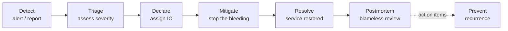

# SRE & Reliability Engineering — Junior Interview Questions

> **Collection:** [System Design](../README.md) · **Level:** Junior · **Section 40 of 42**
> **Goal:** Show you can reason about reliability as an *engineered, measurable*
> property — set and spend an error budget, own an SLO, run an incident calmly,
> write a blameless postmortem, attack toil, and keep a system *partly* alive when
> it can't stay *fully* alive.

Site Reliability Engineering is the discipline of treating operations as a software
problem: you decide *how* reliable a service should be, *measure* whether it is, and
*spend* the gap deliberately on shipping features. A junior answer here is not a
buzzword tour — it is concrete: real numbers, the right vocabulary (SLI / SLO / SLA),
and an honest grasp of trade-offs. Each question lists **what the interviewer is really
probing**, a **model answer**, and often a **follow-up** they will ask next.

---

## Contents

1. [Error Budgets](#1-error-budgets)
2. [SLO Ownership](#2-slo-ownership)
3. [Incident Management](#3-incident-management)
4. [Postmortems](#4-postmortems)
5. [Toil Reduction](#5-toil-reduction)
6. [Load Shedding](#6-load-shedding)
7. [Graceful Degradation](#7-graceful-degradation)
8. [Rapid-Fire Self-Check](#8-rapid-fire-self-check)

---

## 1. Error Budgets

### Q1.1 — What is an error budget, in one sentence?

**Probing:** Do you see that "100% reliable" is the wrong goal, and that unreliability is a *budget you can spend*?

**Model answer:** An error budget is the amount of unreliability a service is *allowed*
over a window, derived directly from its SLO: if the SLO is 99.9% successful requests
per 30 days, the error budget is the remaining **0.1%** — about 43 minutes of full
outage, or the equivalent in elevated error rates. It reframes reliability from "never
fail" to "you may fail *this much*, and no more," which gives the team a concrete,
shared number to manage against.

**Follow-up:** *"Why not aim for 100%?"* → Because the last fraction of a nine costs
exponentially more (redundancy, multi-region, freeze on change) and users usually can't
perceive it — their ISP and device are less reliable than that anyway. 100% also leaves
*no room to ship*: every change risks reliability, so a zero budget means a permanent
feature freeze.

### Q1.2 — A team has burned 90% of its monthly error budget by day 10. What should happen?

**Probing:** Do you know an error budget is meant to *change behavior*, not just decorate a dashboard?

**Model answer:** The burn rate is far too high — at this pace the budget is gone before
the window ends. The typical **error-budget policy** kicks in: slow or freeze risky
feature launches, redirect engineering effort to reliability work (fixing the dominant
failure source), and tighten change controls until burn returns to a sustainable rate.
The point is that the budget is a *control loop*: plenty of budget → ship faster; budget
exhausted → stop shipping and stabilize.

**Follow-up:** *"And if the budget is mostly *unspent* late in the month?"* → That's
permission to take *more* risk — ship the backlog, run that risky migration. A
chronically unspent budget can even signal the SLO is set too loosely.

### Q1.3 — How does an error budget connect an SRE team and a product team?

**Probing:** Understanding it as a shared, blame-free contract.

**Model answer:** It turns "reliability vs. features" from an argument into arithmetic.
Both teams agree on the SLO up front, so the budget becomes a neutral referee: nobody
debates *opinions* about whether it's "safe to ship" — they look at the remaining
budget. Product gets a clear green light to move fast while budget remains, and SRE gets
an automatic, pre-agreed brake when it runs out. The decision is depersonalized.

---

## 2. SLO Ownership

### Q2.1 — Define SLI, SLO, and SLA, and how they relate.

**Probing:** The single most important vocabulary in this section. Juniors blur these constantly.

**Model answer:** They are three layers — a *measurement*, a *target*, and a *promise*.

| Term | Stands for | What it is | Example |
|---|---|---|---|
| **SLI** | Service Level *Indicator* | A measured number — the actual quality | "99.95% of requests succeeded in < 300 ms this week" |
| **SLO** | Service Level *Objective* | The internal *target* for that SLI | "≥ 99.9% successful in < 300 ms over 30 days" |
| **SLA** | Service Level *Agreement* | An external *contract* with consequences | "99.5% or we refund 10% of your bill" |

The relationship: you **measure** the SLI, **aim** for the SLO, and **promise** the SLA.
A key rule of thumb: the SLA must be *looser* than the SLO, so you breach your internal
target (and react) well before you breach a contract that costs money.

**Follow-up:** *"Why keep the SLO stricter than the SLA?"* → To give yourself a buffer:
the gap between them is your early-warning zone. You want to be alerting and fixing while
still safely above the contractual line.

### Q2.2 — What makes a *good* SLI?

**Probing:** Do you know to measure what the *user* feels, from the user's vantage point?

**Model answer:** A good SLI tracks something users actually care about — typically
**availability** (fraction of valid requests served successfully), **latency** (fraction
served fast enough), or **correctness/freshness** of data. It should be measured as close
to the user as possible (e.g., at the load balancer or client), framed as a *ratio of
good events to total valid events*, and **not** be a proxy that can look healthy while
users suffer — CPU utilization is a poor SLI because the box can be at 30% CPU while every
request times out.

### Q2.3 — What does it mean for a team to "own" an SLO?

**Probing:** Ownership = authority + accountability, not just a metric on a wall.

**Model answer:** Owning an SLO means the team is **accountable** for keeping the service
within it and has the **authority** to act on it: they set the target with their
stakeholders, they get paged when burn threatens it, they decide the remediation, and they
invoke the error-budget policy when it's exhausted. Ownership without authority is just
blame; an SLO nobody is empowered to defend is decoration. A practical sign of real
ownership: the on-call rotation, the alerts, and the budget policy all point back to one
clearly named team.

---

## 3. Incident Management

### Q3.1 — Walk me through the lifecycle of an incident.

**Probing:** Mechanical fluency with the standard flow — and that *mitigate* comes before *root-cause*.

**Model answer:** An alert or user report **detects** a problem. The on-call **triages**
it — is it real, and how bad? If it's significant they **declare** an incident and an
**Incident Commander** is assigned. The team then focuses on **mitigation** — stopping
user pain *now* (roll back, fail over, shed load), *before* hunting the root cause. Once
the service is **resolved** (back within SLO), the incident closes and a **blameless
postmortem** captures what happened and produces action items to **prevent** recurrence.
The crucial ordering for juniors: *mitigate first, diagnose later* — users care that it's
fixed, not why, in the moment.

### Q3.2 — What are severity levels for, and what does a SEV1 vs SEV3 look like?

**Probing:** Can you map impact to urgency and the right level of response?

**Model answer:** Severity ranks an incident by **user/business impact**, which sets how
fast and how widely you respond. A rough scale:

| Severity | Impact | Response |
|---|---|---|
| **SEV1** | Critical — major outage, data loss, or revenue-stopping | All-hands, IC + comms, wake people up |
| **SEV2** | Significant — core feature broken for many users | Urgent, on-call + IC, page now |
| **SEV3** | Minor — degraded or limited scope, workaround exists | Handle in business hours |

The value of fixed levels is a *shared, pre-agreed* meaning: when someone says "SEV1,"
everyone knows to drop other work, without re-arguing severity mid-crisis.

### Q3.3 — What does the Incident Commander (IC) do? Do they fix the bug?

**Probing:** Understanding the IC as a *coordinator*, not the hero engineer.

**Model answer:** The IC **owns coordination, not the keyboard.** They keep the response
organized: maintain the single shared picture of what's happening, delegate
investigation and mitigation to specific people ("Maya, check the database; Sam, prep a
rollback"), decide trade-offs, and ensure **communication** flows to stakeholders. They
deliberately *don't* dive into debugging — if the IC is heads-down in logs, nobody is
steering. Separating the *commander* role from the *responder* role is what keeps a
chaotic incident from turning into five people fixing five different things with no
coordination.

**Follow-up:** *"Who declares the incident over?"* → The IC, once the service is verified
back within SLO — and they hand off to whoever will drive the postmortem.

---

## 4. Postmortems

### Q4.1 — What is a "blameless" postmortem, and why blameless?

**Probing:** Do you understand it as a *systems* tool, not an HR or punishment exercise?

**Model answer:** A blameless postmortem is a written review after an incident that
focuses on **what in the system and process allowed the failure**, not on *who* made a
mistake. "Blameless" means we assume everyone acted reasonably given the information they
had, and we ask *why the system let a reasonable action cause an outage* — not "why was
Alex careless." The reason is purely practical: if people fear punishment, they hide
details, and you lose the very information you need to actually fix things. Psychological
safety produces honest, complete postmortems; blame produces cover-ups.

**Follow-up:** *"But what if someone genuinely did something wrong?"* → Then the right
question is "why did the system make that easy to do and hard to catch?" — e.g., a deploy
command with no confirmation, no canary, no automated rollback. You fix the guardrail, not
the person.

### Q4.2 — What should a postmortem document contain?

**Probing:** Concrete structure, and that *action items* are the whole point.

**Model answer:** At minimum: a short **summary**, **impact** (who/what was affected and
for how long, ideally in SLO/error-budget terms), a **timeline** (detect → mitigate →
resolve with timestamps), the **root cause(s)** and contributing factors, **what went
well and what went poorly**, and — most importantly — concrete, **owned, tracked action
items** to prevent recurrence. A postmortem with no action items, or items nobody owns
and nobody schedules, is just a story; the value is in the follow-through.

### Q4.3 — What is "root cause," and why is "human error" rarely a satisfying one?

**Probing:** Depth of causal reasoning; resisting the easy scapegoat.

**Model answer:** The root cause is the deepest contributing factor that, if removed,
would have prevented the incident — usually a *systemic* gap, not a single act. "Human
error" stops the analysis one level too early: humans will always occasionally make
mistakes, so a system that turns a single human slip into an outage is the real defect.
The useful question is the chain of *whys*: the engineer ran a bad config → because there
was no validation → because there was no staging check → because deploys skip canarying.
The action items attach to those systemic gaps, which is where prevention actually lives.

---

## 5. Toil Reduction

### Q5.1 — What is "toil," precisely?

**Probing:** A specific definition — not just "work I dislike."

**Model answer:** Toil is operational work that is **manual, repetitive, automatable,
reactive, and scales linearly with the service** — and produces *no lasting improvement*.
Restarting a stuck process by hand every morning, manually approving the same routine
provisioning requests, copy-pasting the same runbook steps for each incident: that's
toil. Note what it *isn't* — toil is not "overhead" like meetings or code review, and not
"hard but valuable" engineering. The defining trait is that doing it once leaves the
system no better than before, and the more the service grows, the more of it you do.

### Q5.2 — Why does SRE care about *capping* and reducing toil?

**Probing:** Connecting toil to scalability and engineering leverage.

**Model answer:** Because toil scales linearly with the system but headcount shouldn't —
if every new customer adds an hour of manual ops, you eventually do nothing but firefight,
and reliability work never happens. Many SRE teams set an explicit **toil budget** (often
≤ ~50% of time) so the rest goes to *engineering away* the toil: automation, self-healing,
better tooling. Reducing toil is leverage — you spend finite engineering effort once to
delete a recurring cost forever, which is exactly the software-eats-operations idea at the
heart of SRE.

**Follow-up:** *"Give a concrete example of eliminating toil."* → A nightly manual disk
cleanup replaced by an automated job with an alert only when it *can't* free space — the
routine case is now zero-touch, and a human is involved only on the genuine exception.

### Q5.3 — Is *all* automation worth it?

**Probing:** Judgment — automation has a cost too.

**Model answer:** No. Automation has an upfront cost and ongoing maintenance, so it's
worth it when the task is **frequent, well-understood, and stable** — the time saved
across many runs exceeds the build-and-maintain cost. A one-off task, or one that changes
every time, is often better left manual (or just documented in a runbook). The honest test
is a rough payback calculation: *(time per run × frequency × remaining lifetime)* versus
*(cost to build + cost to maintain)*. Automating a rare, ever-changing task can create
*more* toil than it removes.

---

## 6. Load Shedding

### Q6.1 — What is load shedding, and why would a system deliberately reject requests?

**Probing:** The counter-intuitive idea that dropping *some* traffic protects *most* of it.

**Model answer:** Load shedding is **intentionally rejecting some incoming requests when a
service is overloaded**, so it can keep serving the rest correctly. The logic: a system
past its capacity doesn't just slow down gracefully — it can collapse, where queues grow
unboundedly, latency explodes, timeouts cascade, and it ends up serving *nobody*. By
shedding the excess (usually returning a fast `503` / "try again later"), the service
stays healthy for the requests it *does* accept. It's the principle of "fail some requests
cleanly rather than fail all requests by melting down."

**Follow-up:** *"What status code and behavior should a shed request get?"* → A quick
`503 Service Unavailable`, ideally with a `Retry-After` hint, returned *cheaply* — the
whole point is to spend almost no resources on the rejected request.

### Q6.2 — If you must shed load, which requests do you drop first?

**Probing:** Awareness that shedding should be *prioritized*, not random.

**Model answer:** You drop the **least valuable / least critical** traffic first and
protect the most important. Common strategies: prioritize by request type (serve checkout
and login; shed analytics, prefetch, and best-effort background calls), by customer tier,
or by criticality flags on the request. You'd much rather drop a "recommended for you"
panel than a payment. Random shedding is better than collapse, but *prioritized* shedding
is far better — it keeps the system's most important function alive under pressure.

### Q6.3 — How does load shedding relate to rate limiting?

**Probing:** Distinguishing two often-confused mechanisms.

**Model answer:** Both reject requests, but for different reasons and on different signals.
**Rate limiting** is a *policy* — it caps how much a given client/key may send (fairness,
abuse prevention, quota) regardless of current server health. **Load shedding** is a
*reaction to the server's own health* — it kicks in only when the system is actually
overloaded, dropping traffic to survive. You can have one without the other: rate limiting
protects you from a single greedy client; load shedding protects you from aggregate
overload even when every client is behaving.

---

## 7. Graceful Degradation

### Q7.1 — What is graceful degradation? Give an example.

**Probing:** The idea of *partial* functionality instead of a total outage.

**Model answer:** Graceful degradation means that when part of a system fails, it **drops
to a reduced but still-useful mode** instead of failing entirely. Example: an e-commerce
page where the personalized-recommendations service is down — instead of erroring the
whole product page, you render the page *without* the recommendations panel (or with a
generic bestsellers list). The user still browses and buys; they just miss a non-essential
feature. The mindset is "degrade the experience, don't deny it" — keep the core function
alive even when peripherals are broken.

**Follow-up:** *"How would you implement that fallback?"* → Wrap the dependency call with a
timeout and a fallback: if recommendations don't return quickly (or a circuit breaker is
open), serve a cached/default response and continue rendering, rather than blocking or
500-ing the whole request.

### Q7.2 — How do load shedding, graceful degradation, and a circuit breaker fit together?

**Probing:** Can you place these resilience patterns relative to each other?

**Model answer:** They're complementary layers of "fail well":

| Pattern | Trigger | What it does |
|---|---|---|
| **Load shedding** | *My* service is overloaded | Reject excess requests to protect the rest |
| **Circuit breaker** | A *dependency* keeps failing/timing out | Stop calling it for a while; fail fast |
| **Graceful degradation** | A feature/dependency is unavailable | Serve a reduced experience instead of an error |

In practice they chain: a circuit breaker *detects* a sick dependency and trips → the
service *gracefully degrades* by serving the fallback for that feature → and if the
service *itself* is drowning, it *sheds load* to stay up. Together they turn hard failures
into soft, contained ones.

### Q7.3 — Why is degrading better than returning an error, from a reliability standpoint?

**Probing:** Connecting the pattern back to SLOs and user impact.

**Model answer:** Because reliability is measured by *user-facing success*, and a degraded
response is still a success — the user accomplished their goal. If your SLI counts
successful requests, serving the page minus a sidebar keeps you *within* SLO, whereas a
500 burns error budget. It also contains **blast radius**: one failing dependency affects
one feature instead of taking down the whole product. The reliability win is that you've
converted a hard failure (everyone sees an error) into a soft one (everyone gets a slightly
lesser, working experience).

---

## 8. Rapid-Fire Self-Check

If you can answer each of these in a sentence, you're ready for the junior bar on this section:

- [ ] What is an error budget, and where does the number come from? *(1 − SLO)*
- [ ] What happens when the error budget is exhausted? *(slow/freeze risky launches, fix reliability)*
- [ ] SLI vs SLO vs SLA — measurement, target, promise — and which is loosest? *(SLA)*
- [ ] What makes a good SLI? *(user-facing, ratio of good to total valid events)*
- [ ] In an incident, what comes first — mitigate or root-cause? *(mitigate)*
- [ ] What does the Incident Commander do — and do they fix the bug? *(coordinate; no)*
- [ ] Why "blameless"? *(blame hides information; fix systems, not people)*
- [ ] What is toil, precisely? *(manual, repetitive, automatable, no lasting value, scales with load)*
- [ ] Why shed load instead of letting the system slow down? *(avoid total collapse; serve the rest)*
- [ ] Graceful degradation vs returning an error — why degrade? *(stays within SLO, contains blast radius)*

---

**Next step:** Section 41 — [Performance Engineering & Tail Latency](41-performance-engineering.md): why the slowest 1% of requests defines the user experience, and how to find and fix tail latency.
