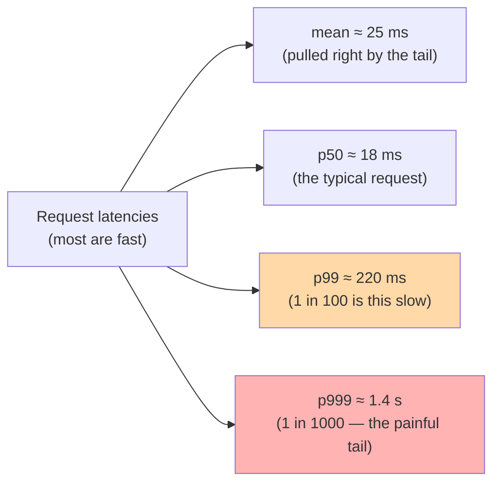
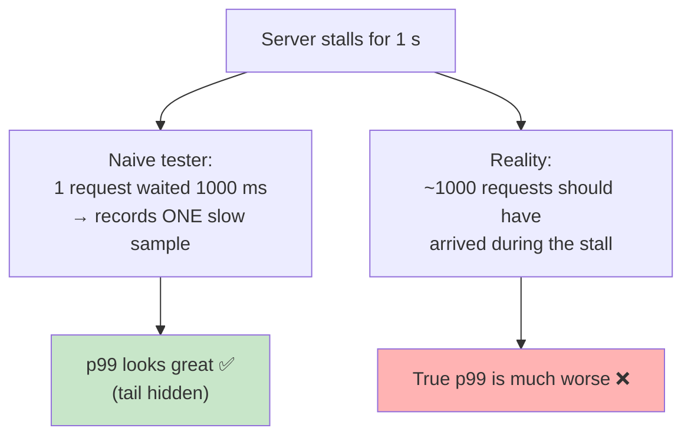
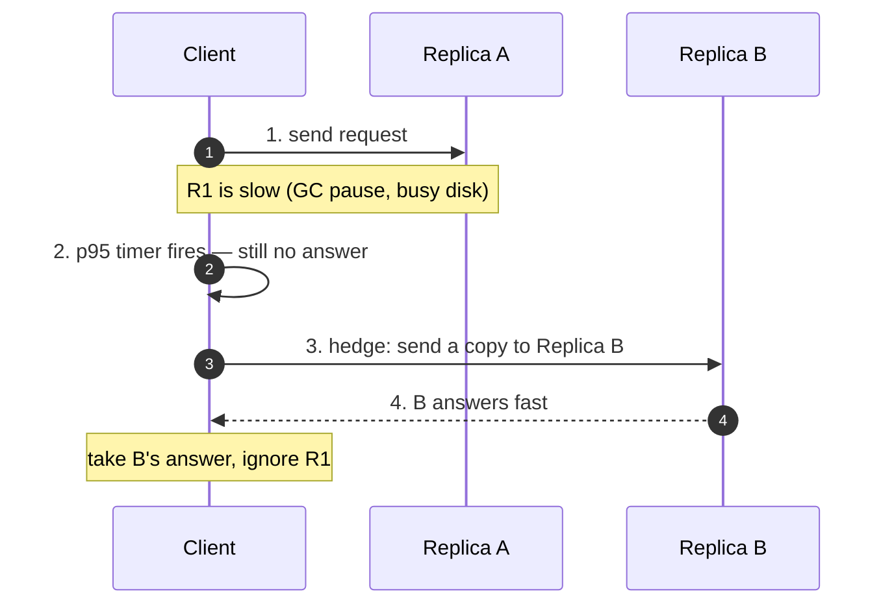
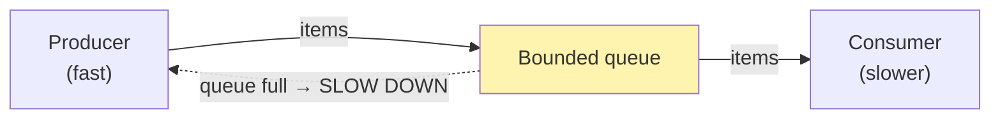
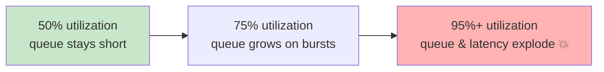
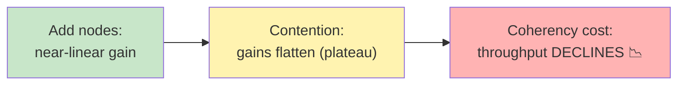

# Performance Engineering & Tail Latency — Junior Interview Questions

> **Collection:** [System Design](../README.md) · **Level:** Junior · **Section 41 of 42**
> **Goal:** Confirm you can explain why *averages hide the pain*, name the traps that
> make latency measurements lie, recognize the classic laws that bound throughput and
> speedup, and reason — with simple arithmetic — about why tail latency, not mean
> latency, decides how a large system *feels*.

These are advanced, "senior-sounding" topics, but the junior bar is honest and
concrete: **know the term, know why it matters, and give one consequence you can
compute on a napkin.** Interviewers aren't asking you to derive queueing theory — they
want to see that you'd reach for p99 instead of the average, that you'd suspect a
benchmark that looks too clean, and that you know throughput doesn't scale forever just
because you add machines. Each question lists **what the interviewer is really
probing**, a **model answer**, and often a **follow-up**.

---

## Contents

1. [Tail Latency (p99 / p999 — why averages lie)](#1-tail-latency-p99--p999--why-averages-lie)
2. [Coordinated Omission](#2-coordinated-omission)
3. [Hedged Requests](#3-hedged-requests)
4. [Backpressure (deep)](#4-backpressure-deep)
5. [Queueing Theory — Little's Law](#5-queueing-theory--littles-law)
6. [Universal Scalability Law](#6-universal-scalability-law)
7. [Amdahl's Law](#7-amdahls-law)
8. [Rapid-Fire Self-Check](#8-rapid-fire-self-check)

---

## 1. Tail Latency (p99 / p999 — why averages lie)

### Q1.1 — What is "tail latency," and why do we look at p99 instead of the average?

**Probing:** Do you understand that latency is a *distribution*, not a single number?

**Model answer:** Latency isn't one value — it's a spread of values, one per request.
The **tail** is the slow end of that spread: the small fraction of requests that take
much longer than typical. **p99** is the value that 99% of requests come in *under*
(equivalently, the 1% slowest are *above* it); **p999** is the 99.9th percentile. We
prefer percentiles to the average because the average is easily dragged around and hides
the slow requests that actually hurt users. A service can have a 20 ms *average* while
1% of requests take 2 seconds — and those 2-second requests are exactly the ones users
complain about.

**Follow-up:** *"Why does the mean sit above the p50 here?"* → Because latency
distributions are **right-skewed** (a long slow tail, a hard floor at zero). A few very
slow requests pull the mean up well past the median, which is exactly why the mean
flatters a bad system.

### Q1.2 — Why does tail latency dominate when one request fans out to many services?

**Probing:** The single most important tail-latency intuition for distributed systems.

**Model answer:** If a user request fans out to many backends *in parallel* and must
wait for **all** of them, the overall latency is the **slowest** of those responses —
so even a rare slow backend becomes common at the request level. Say each backend is
slow (above its p99) only 1% of the time. With **one** backend, 99% of requests are
fast. But fan out to **100** backends and the chance that *at least one* is slow is
`1 − 0.99¹⁰⁰ ≈ 63%`. So a per-service p99 that sounds great turns into a **majority** of
user requests hitting a slow path. This is why big systems obsess over the tail: at
scale, the rare becomes the routine.

| Backends fanned out (must wait for all) | P(at least one above its p99) |
|---|---|
| 1 | 1% |
| 10 | ~9.6% |
| 100 | ~63% |
| 1000 | ~99.99% |

**Follow-up:** *"So what do you do about it?"* → Cut the number of synchronous
dependencies, make slow paths optional, and use techniques like hedged requests
(Section 3) to clip the tail.

### Q1.3 — Give a concrete example where the average is a misleading metric.

**Probing:** Can you connect this to something real?

**Model answer:** A checkout API reports a 40 ms average and the dashboard looks
healthy — but the average is `(99 requests × 20 ms + 1 request × 2000 ms) / 100 ≈
40 ms`. That single 2-second request is a real user staring at a spinner, possibly
abandoning the purchase. The average *averaged the pain away*. Looking at p99 (≈ 2000 ms
here) would have shown the problem immediately. The rule of thumb: **report
percentiles, alert on the tail, and never let a single average stand in for a
distribution.**

---

## 2. Coordinated Omission

### Q2.1 — What is coordinated omission, in plain terms?

**Probing:** Awareness that load tests can *systematically under-report* the tail.

**Model answer:** Coordinated omission is a measurement bug where your benchmark
**accidentally stops sending requests exactly when the system is slow**, so the slowest
moments never get measured — and your latency numbers look far better than reality. It
usually happens in a closed-loop load tester that sends a request, *waits for the
response*, then sends the next. When the server stalls, the tester politely waits too,
so the requests that *should* have been sent during the stall (and would have recorded
huge latencies) are simply never issued. The slow period is "omitted," and the omission
is "coordinated" with the very stall you wanted to catch.

**Follow-up:** *"Who coined this term?"* → Gil Tene (of HdrHistogram / Azul) popularized
it. You don't need the history — just the awareness that it exists.

### Q2.2 — Why does coordinated omission make your p99 look better than it really is?

**Probing:** The concrete consequence.

**Model answer:** Imagine you intend to send 1 request every 1 ms, but the server
freezes for 1 second. A naive closed-loop tester sends *one* request, waits the full
second, records it as "1000 ms," and moves on. But in that frozen second, **1000
requests should have been sent** — and a real user issuing request #500 would have
waited ~500 ms, #999 only ~1 ms. By recording a single slow sample instead of the
thousand that the stall actually affected, the tester massively **under-counts** slow
requests, and the computed p99 comes out far too optimistic.

### Q2.3 — How do you avoid or correct for it?

**Probing:** Practical mitigation at a junior level.

**Model answer:** Two common fixes. **(1)** Use a load generator that sends requests on
a fixed **schedule** (open-loop / constant rate) rather than waiting for each response —
so stalls produce a pile-up of late requests that *do* get measured. **(2)** Use a tool
that **corrects** for omission after the fact, like HdrHistogram's
"record-with-expected-interval," which back-fills the missing samples a stall would have
produced. The junior takeaway: **be suspicious of a load test whose tail looks suspiciously
clean**, and know the right tools account for this.

---

## 3. Hedged Requests

### Q3.1 — What is a hedged request, and what problem does it solve?

**Probing:** Do you connect this directly to cutting tail latency?

**Model answer:** A **hedged request** is a tail-latency tactic: you send a request to
one replica, and if it hasn't responded within a short threshold (say, the service's
p95), you send a *second* copy of the same request to another replica and take whichever
answer comes back first. It directly attacks the tail from Q1.2 — because one slow
replica no longer slows the whole request; a healthy replica usually answers the hedge
quickly. You spend a little extra work to *avoid waiting on the unlucky slow path*.

**Follow-up:** *"Why fire the hedge at p95, not immediately?"* → Sending a duplicate to
*every* request would roughly double your load. Waiting until p95 means you only hedge
the slowest ~5% — you pay a tiny overhead (a few percent extra requests) to rescue the
exact requests that were going to be slow.

### Q3.2 — What's the cost or risk of hedged requests?

**Probing:** Can you see the trade-off, not just the upside?

**Model answer:** Extra load. Every hedge is a duplicate request, so a too-eager hedge
threshold can multiply traffic and, ironically, *make the system slower* by adding load
right when it's already struggling. They also need **idempotent** operations — sending a
"charge the card" request twice is dangerous, so hedging suits safe reads far more than
writes. A related, gentler variant is "tied requests" (cancel the loser as soon as one
replica picks the work up) to limit wasted effort. The trade-off in one line: **hedging
trades a small, controlled increase in load for a large reduction in tail latency.**

---

## 4. Backpressure (deep)

### Q4.1 — What is backpressure, and what goes wrong without it?

**Probing:** Do you understand it as *flow control*, not just "rate limiting"?

**Model answer:** Backpressure is a fast producer being **told to slow down** because the
consumer downstream can't keep up — a signal that flows *backward* against the data. It's
how a system communicates "I'm full, stop pushing." Without it, work that arrives faster
than it can be processed has to go *somewhere*: it piles up in unbounded queues and
buffers. Those queues grow, memory balloons, latency climbs (every item now waits behind
a longer line), and eventually the service runs out of memory and **crashes** — often
taking healthy upstream services down with it. Backpressure prevents this by making the
pressure visible and forcing the producer to match the consumer's pace.

**Follow-up:** *"How is it different from rate limiting?"* → Rate limiting is a *fixed*
cap you set in advance ("max 1000 req/s"). Backpressure is a *dynamic* signal driven by
the consumer's real-time capacity — the limit moves as the consumer speeds up or slows
down.

### Q4.2 — Name a few ways a system can apply backpressure.

**Probing:** Concrete mechanisms, not hand-waving.

**Model answer:** Several, from gentle to harsh: **(1)** *Block the producer* — make it
wait when the buffer is full (a bounded blocking queue does this automatically). **(2)**
*Reject with a signal* — return HTTP `429 Too Many Requests` or `503` so the caller backs
off and retries later. **(3)** *Shed load* — deliberately drop lower-priority work to
protect the critical path. **(4)** *Pull-based flow* — the consumer requests only as much
as it can handle (the model behind TCP's receive window and Reactive Streams). The thread
running through all of them: **bounded buffers**. Unbounded queues are the enemy, because
they hide the problem until memory runs out.

### Q4.3 — Why is "just add a bigger buffer" usually the wrong answer?

**Probing:** The classic trap.

**Model answer:** Because a bigger buffer doesn't fix a throughput mismatch — it only
*delays* the failure and makes it worse when it arrives. If the producer is permanently
faster than the consumer, **any** buffer eventually fills; you've just spent more memory
and added latency (items now sit in a longer queue before being processed) to postpone
the same crash. Worse, a large buffer means that when you *do* fall behind, you have a
huge backlog of now-**stale** work to grind through. The real fix is to make the
producer slow down (backpressure) or make the consumer faster (scale out) — not to paper
over the mismatch with RAM.

---

## 5. Queueing Theory — Little's Law

### Q5.1 — State Little's Law and what each term means.

**Probing:** Can you recall the formula and read it in plain English?

**Model answer:** Little's Law says **L = λ × W**:

- **L** = the average number of items *in the system* (in flight — being processed or
  waiting),
- **λ** (lambda) = the average **arrival rate** (items per second),
- **W** = the average **time each item spends in the system** (wait + service).

In words: *the number of things in the system equals how fast they arrive multiplied by
how long each one stays.* It's beautifully general — it holds for any stable system
regardless of the arrival pattern or how the queue is served, which is why it shows up
everywhere from coffee shops to thread pools.

### Q5.2 — Give a concrete numeric example using Little's Law.

**Probing:** Comfort plugging numbers in.

**Model answer:** A web service receives **λ = 500 requests/second**, and each request
spends on average **W = 0.2 seconds** in the system. Then the average number of requests
**in flight at any moment** is `L = 500 × 0.2 = 100`. That number is directly useful: it
roughly tells you how many concurrent slots (threads, connections, goroutines) you need
to keep up. If your pool only has 50 slots, requests will queue and W will climb — a
capacity problem you just *predicted with one multiplication*.

**Follow-up:** *"What happens to W if arrival rate keeps rising toward capacity?"* → W
(and therefore the queue) grows non-linearly and shoots toward infinity as utilization
approaches 100% — the reason you size systems to run at, say, 70% utilization, not 99%.

### Q5.3 — Why does utilization near 100% blow up latency?

**Probing:** The intuition behind "don't run hot."

**Model answer:** Because real traffic is **bursty**, not perfectly smooth. A server at
50% utilization has slack to absorb a burst — the queue drains between spikes. A server
at 95% has almost no slack: a small burst arrives faster than it can clear, the queue
backs up, and because there's no idle time to recover, the backlog (and the wait time W)
grows fast. Queueing theory makes this precise — wait time rises roughly with
`1 / (1 − utilization)`, so going from 90% to 99% utilization multiplies queueing delay
about **tenfold**. That's why production systems target moderate utilization and keep
headroom for spikes.

---

## 6. Universal Scalability Law

### Q6.1 — What is the Universal Scalability Law (USL) telling us?

**Probing:** Do you grasp that throughput can *peak and then decline* as you add nodes?

**Model answer:** The USL describes how throughput scales as you add processors or
nodes, and its headline message is that **scaling is not free and not infinite**. Adding
capacity gives less and less benefit because of two penalties: **contention** —
processes waiting on a shared resource (a lock, a database), like Amdahl's serial part;
and **coherency / crosstalk** — the cost of keeping everyone *in sync* (cache coherence,
coordination), which grows worse than linearly as nodes multiply. Because of that second
term, throughput doesn't just plateau — past some point it can actually **go down** as
you add more nodes, because they spend more time coordinating than working.

**Follow-up:** *"What's the practical lesson?"* → There's an *optimal* number of nodes
for a given workload. Past it, you pay more and get *less*. Real scaling work is about
reducing contention and coordination so that peak moves further out.

### Q6.2 — How is USL related to Amdahl's Law?

**Probing:** Can you place the two laws side by side?

**Model answer:** Amdahl's Law is essentially USL **with the coordination penalty turned
off**. Amdahl only accounts for the serial (un-parallelizable) part of the work, so it
predicts speedup *flattens to a ceiling* but never gets worse. USL adds a second,
crosstalk penalty that captures the cost of nodes talking to each other — which is why
USL predicts throughput can *peak and then fall*. Amdahl is the optimistic upper bound;
USL is the more realistic, sometimes downward-bending curve.

| | Amdahl's Law | Universal Scalability Law |
|---|---|---|
| **Penalty modeled** | Serial fraction (contention) | Contention **+** coherency/crosstalk |
| **Best case as you scale** | Flattens to a ceiling | Rises, **peaks, then declines** |
| **Shape** | Curve plateaus | Curve has a hump |
| **Mental model** | "Some work just can't parallelize" | "...and coordination eventually costs more than it's worth" |

---

## 7. Amdahl's Law

### Q7.1 — State Amdahl's Law and the intuition behind it.

**Probing:** The single most famous "you can't parallelize your way out" result.

**Model answer:** Amdahl's Law says the speedup you can get by parallelizing a task is
**capped by the part of the task that must run serially**. If a fraction **P** of the
work can be parallelized and the rest `(1 − P)` is inherently serial, then with **N**
processors the speedup is `1 / ((1 − P) + P/N)`. The intuition: no matter how many cores
you throw at the parallel part, the serial part doesn't shrink — and as N grows, the
serial part becomes the bottleneck that dominates total time.

### Q7.2 — Work a quick example: a job is 90% parallelizable. What's the best possible speedup?

**Probing:** Can you compute the ceiling and feel its bite?

**Model answer:** Here `P = 0.9`, serial part `= 0.1`. As N → ∞, the parallel term `P/N`
goes to zero, so speedup → `1 / (1 − P) = 1 / 0.1 = 10×`. So even with *infinite*
processors, a job that's 10% serial can never go faster than **10×**. And you hit
diminishing returns fast:

| Processors (N) | Speedup (P = 0.9) |
|---|---|
| 1 | 1.0× |
| 2 | 1.8× |
| 4 | ~3.1× |
| 16 | ~6.4× |
| 256 | ~9.7× |
| ∞ | 10× (hard ceiling) |

Going from 16 to 256 cores — 16× the hardware — buys you barely 50% more speed. The
serial 10% is the wall.

**Follow-up:** *"So what's the real lesson for performance work?"* → Attack the **serial
fraction**. Shaving the un-parallelizable part raises the ceiling far more than adding
cores. A small serial percentage caps you brutally — which is why finding and removing
serialization (locks, sequential I/O, coordination) is where the leverage is.

### Q7.3 — Where does Amdahl's Law show up in real system design?

**Probing:** Connecting the abstract law to everyday architecture.

**Model answer:** Everywhere there's a shared serial step. A request handler that fans
out to 10 parallel workers but funnels every result through **one** lock, **one**
single-threaded aggregator, or **one** database write is Amdahl-limited: that serial step
sets the floor on latency no matter how many workers you add. The same idea explains why
a single global lock kills multicore scaling, and why "just add more replicas" stops
helping once every write must still pass through one primary. Recognizing the serial
chokepoint — and removing or sharding it — is the practical face of Amdahl's Law.

---

## 8. Rapid-Fire Self-Check

If you can answer each of these in a sentence, you're ready for the junior bar on this section:

- [ ] Why do we report p99/p999 instead of the average? *(averages hide the slow tail)*
- [ ] A request waits on 100 parallel backends, each slow 1% of the time — roughly what fraction of requests are slow? *(~63%)*
- [ ] What is coordinated omission, and why does it flatter your p99? *(tester stops sending during stalls → tail under-counted)*
- [ ] What's a hedged request, and why fire it at ~p95? *(duplicate to a 2nd replica; only hedge the slowest few % to limit extra load)*
- [ ] What does backpressure do, and why is a bigger buffer not a fix? *(slows the producer; a buffer only delays the crash)*
- [ ] State Little's Law and read it in words. *(L = λW: in-flight = arrival rate × time spent)*
- [ ] Why does latency explode as utilization nears 100%? *(no slack to absorb bursts; wait ~ 1/(1−utilization))*
- [ ] How does USL differ from Amdahl? *(USL adds coherency cost → throughput can decline, not just plateau)*
- [ ] A job is 90% parallelizable — max speedup with infinite cores? *(10×)*

---

**Next step:** Section 42 — [Data Governance & Contracts](42-data-governance-contracts.md): schemas, ownership, and the promises data producers make to consumers.
