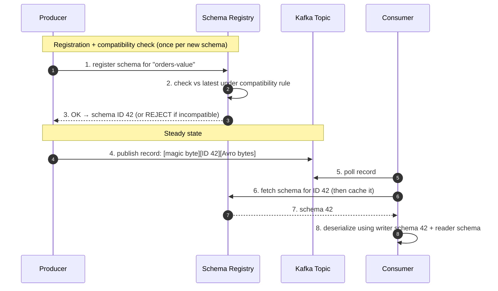
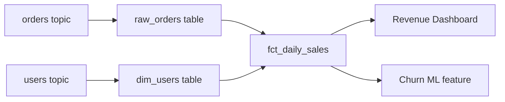

# Data Governance & Contracts — Junior Interview Questions

> **Collection:** [System Design](../README.md) · **Level:** Junior · **Section 42 of 42**
> **Goal:** Confirm you can explain how teams keep data *trustworthy* as it moves
> between producers and consumers — schema registries and compatibility, data
> contracts, lineage, quality checks, master data, and privacy baked in from the start.

A "junior" answer here is not a shallow answer — it is a *correct, concrete, and
honest* one. Governance sounds bureaucratic, but in practice it is plumbing: a
producer changes a field, and either every downstream consumer keeps working or
production dashboards go blank at 3 a.m. Interviewers want to see that you understand
the *mechanisms* that prevent that, using real tools like a Kafka + Avro schema
registry. Each question lists **what the interviewer is really probing**, a **model
answer**, and often a **follow-up** they'll ask next.

---

## Contents

1. [Schema Registry](#1-schema-registry)
2. [Data Contracts](#2-data-contracts)
3. [Data Lineage](#3-data-lineage)
4. [Data Quality](#4-data-quality)
5. [Master Data Management (MDM)](#5-master-data-management-mdm)
6. [Privacy by Design](#6-privacy-by-design)
7. [Rapid-Fire Self-Check](#7-rapid-fire-self-check)

---

## 1. Schema Registry

### Q1.1 — What is a schema registry, and what problem does it solve?

**Probing:** Do you understand it as a *shared source of truth* for message shape, not just a database?

**Model answer:** A schema registry is a central service that stores and versions the
schemas (the field-by-field shape) of the messages flowing through a system — most
commonly the Avro, Protobuf, or JSON schemas for records on Kafka topics. It solves a
coordination problem: a producer and a consumer are written by different teams, deploy
on different days, and never call each other directly — they only meet through bytes on
a topic. Without an agreed schema, the consumer is guessing at the producer's layout.
The registry gives both sides one authoritative, versioned definition of "what a record
looks like," and — crucially — it can *reject* a producer that tries to publish a schema
that would break existing consumers.

**Follow-up:** *"Where does the schema actually travel?"* → With Confluent's Avro
format, the message payload carries only a small **schema ID** (a few bytes), not the
full schema. Consumers fetch the schema for that ID from the registry once and cache it,
so you get full structure without paying to ship the schema on every message.

### Q1.2 — Walk me through what happens when a producer publishes a record.

**Probing:** Mechanical fluency with the produce/consume + registry round trip.

**Model answer:** The producer's serializer first registers (or looks up) the schema for
the topic's *subject* in the registry. The registry checks it against the configured
compatibility rule and either returns a schema ID or rejects the publish. The record
written to Kafka is the Avro bytes prefixed with that schema ID. A consumer reading the
record extracts the ID, fetches the matching *writer* schema from the registry (caching
it so it asks only once per ID), and deserializes. The registry never sees the data
itself — only schemas — so it stays small and fast.

### Q1.3 — Why not just embed the full schema in every message?

**Probing:** Cost intuition and understanding the registry's value.

**Model answer:** Two reasons. First, **size**: an Avro schema can be hundreds of bytes
to kilobytes, while the actual record might be tens of bytes — shipping the schema on
every message would dwarf the payload and waste enormous bandwidth and storage at scale.
Second, and more important, **governance**: a registry is the chokepoint where you can
*enforce* compatibility. If every message just carried its own schema, nothing would
stop a producer from silently changing shape and breaking consumers. The registry turns
"schema" from a per-message detail into a versioned, validated, shared contract.

---

## 2. Data Contracts

### Q2.1 — What is a data contract, and how is it more than just a schema?

**Probing:** Do you see a contract as schema *plus* semantics, ownership, and guarantees?

**Model answer:** A data contract is the explicit, agreed-upon interface between a data
*producer* and its *consumers* — much like an API contract, but for data flowing over a
topic, table, or file. The schema (field names and types) is part of it, but a real
contract also pins down **semantics** (what `status = 3` actually means, units,
timezone), **quality guarantees** (this field is never null, IDs are unique), **freshness
SLAs** (updated within 5 minutes), and **ownership** (which team is on the hook when it
breaks). The point is to make the implicit assumptions consumers already rely on into
*written, testable promises*, so a producer change that violates them is caught before
it ships, not after a dashboard breaks.

**Follow-up:** *"Where is a contract enforced?"* → Ideally in the producer's CI pipeline
(reject a pull request whose schema or values violate the contract) and at the registry
(reject an incompatible schema at publish time) — so violations fail fast and loudly.

### Q2.2 — Explain backward, forward, and full compatibility.

**Probing:** This is the core technical concept of the whole section. Get the directions right.

**Model answer:** Compatibility describes *which side can be upgraded first* without
breaking the other. It's defined relative to **data** written with the old schema and
read with the new one (or vice versa).

| Mode | Plain meaning | Who can deploy first | Safe change examples |
|---|---|---|---|
| **Backward** | New schema can read data written by the **old** schema | **Consumers** upgrade first | Delete a field; add a field **with a default** |
| **Forward** | Old schema can read data written by the **new** schema | **Producers** upgrade first | Add a field; delete a field **that had a default** |
| **Full** | Both backward **and** forward | Either side, any order | Add/remove only fields with defaults |
| **None** | No checks | — (dangerous) | Anything; you accept the risk |

The intuition for Avro: a **default value** is what lets a reader cope with a field that
the writer didn't include. Backward compatibility is the most common default because the
typical pattern is "upgrade consumers first, then producers." "Transitive" variants
(e.g., `BACKWARD_TRANSITIVE`) check the new schema against *all* prior versions, not just
the latest.

### Q2.3 — Which change breaks consumers: adding a required field, or removing an optional one?

**Probing:** Can you reason about a concrete breaking change, not just recite definitions?

**Model answer:** **Adding a required field** (one with no default) is the classic
backward-incompatible break: a consumer using the new schema tries to read an old record,
finds the required field missing, and has no default to fall back on — deserialization
fails. **Removing an optional field that had a default** is backward-compatible, because
a new reader encountering an old record simply uses the default. The senior habit is:
*adding optional fields with defaults is almost always safe; making fields required, or
removing fields others depend on, is where breakage lives.*

**Follow-up:** *"How would you ship a genuinely breaking change?"* → Don't mutate in
place. Publish a **new version of the topic** (e.g., `orders-v2`), let consumers migrate
on their own schedule, then retire `orders-v1`. Breaking changes become *new contracts*,
not edits to the old one.

---

## 3. Data Lineage

### Q3.1 — What is data lineage and why do teams invest in it?

**Probing:** Do you connect lineage to real operational and compliance needs?

**Model answer:** Data lineage is the map of where data *comes from* and where it *goes* —
the chain from source systems, through every transformation, pipeline, and table, to the
final dashboards and ML features that consume it. Teams invest in it for three concrete
reasons. **Debugging:** when a metric looks wrong, lineage lets you trace it back to the
upstream table or job that changed. **Impact analysis:** before you alter a column, lineage
shows every downstream report and model that would break, so the change is informed, not
blind. **Compliance:** regulations like GDPR require you to prove where a user's personal
data lives and flows — lineage is how you answer "show me everywhere this field is used."

### Q3.2 — Sketch a simple lineage graph and explain the direction.

**Probing:** Can you visualize lineage as a directed graph, and read it both ways?

**Model answer:** Lineage is a **directed graph**: edges point from a source toward what's
derived from it. Reading *downstream* (left to right) answers "if `orders` changes, what's
affected?" — here, the daily-sales fact table, the revenue dashboard, and the churn
feature. Reading *upstream* (right to left) answers "the revenue dashboard looks wrong,
where did the number come from?" — back through `fct_daily_sales` to `raw_orders` and the
`orders` topic. Good tooling captures this automatically by parsing SQL and pipeline
definitions, so the graph stays accurate as the system evolves.

### Q3.3 — Column-level vs table-level lineage — what's the difference and when do you need each?

**Probing:** Awareness that lineage has granularity.

**Model answer:** **Table-level** lineage says "table A feeds table B" — enough to know
which jobs and datasets depend on each other. **Column-level** lineage is finer: "column
`B.revenue` is computed from `A.price` and `A.quantity`." You want column-level when doing
precise impact analysis ("does renaming `price` actually affect this dashboard, or only
tables that ignore that column?") and for privacy work ("trace exactly which downstream
columns carry this user's email"). Column-level is more valuable but harder to capture
because it requires parsing the transformation logic, not just the job dependencies.

---

## 4. Data Quality

### Q4.1 — Name the main dimensions of data quality.

**Probing:** Do you have a vocabulary for *what "good data" means*, beyond "it's correct"?

**Model answer:** Data quality is usually broken into a few measurable dimensions:

| Dimension | Question it answers | Failing example |
|---|---|---|
| **Completeness** | Are required values present? | 12% of orders have a null `customer_id` |
| **Validity** | Do values match the expected format/range? | `country` contains `"XX"`; `age` is `-3` |
| **Uniqueness** | Are there unwanted duplicates? | The same order appears twice |
| **Consistency** | Do related values agree across sources? | Order total ≠ sum of line items |
| **Timeliness** | Is the data fresh enough? | The "live" feed is 6 hours stale |
| **Accuracy** | Does it reflect reality? | A shipped order still shows "pending" |

The reason to name these is that each is a *check you can automate* — "is this column
ever null?" becomes a test that runs on every batch, turning vague "the data looks off"
into a specific, alertable assertion.

### Q4.2 — How would you actually enforce a quality rule in a pipeline?

**Probing:** Can you turn a quality dimension into a concrete, automated gate?

**Model answer:** You write **assertions** (data tests) that run as a step in the pipeline,
before the data is published for downstream use. For example: `customer_id` is never null,
`order_total >= 0`, `order_id` is unique, row count is within ±20% of yesterday's. Tools
like dbt tests, Great Expectations, or Soda let you declare these rules and run them on a
schedule or on every load. The key design decision is the **failure policy**: a critical
violation should *block* the bad batch from being published (fail closed), while a softer
anomaly might just raise an alert and quarantine the suspect rows. Quality checks that
only log warnings nobody reads are theater — the value comes from gating the pipeline.

**Follow-up:** *"Where in the pipeline do these run?"* → As close to the source as
possible. Catching a bad value at ingestion stops it from contaminating ten downstream
tables; catching it at the dashboard means it has already spread.

### Q4.3 — A consumer reports the daily numbers "look wrong." How do quality and lineage help you respond?

**Probing:** Can you combine two tools from this section into a workflow?

**Model answer:** First, **lineage** tells me the chain of tables and jobs that produced
the dashboard, so I know exactly where to look instead of guessing. Then I check **quality**
results along that chain: did a freshness check fail (stale source)? a completeness check
(a flood of nulls from an upstream change)? a row-count anomaly (a job double-ran or
dropped data)? Lineage narrows *where* to look; quality checks tell me *what* went wrong
at each step. Together they turn an open-ended "numbers look wrong" into a bounded
investigation — which is exactly why teams invest in both before they're in a crisis.

---

## 5. Master Data Management (MDM)

### Q5.1 — What is master data, and what is MDM?

**Probing:** Can you distinguish *master data* from *transactional data*?

**Model answer:** **Master data** is the set of core, slowly-changing business entities
that many systems share — customers, products, suppliers, accounts. It's the nouns of the
business. **Transactional data** is the events that happen *to* those entities — orders,
payments, clicks. Master Data Management (MDM) is the discipline of maintaining one
**authoritative, consistent definition** of each master entity across the whole
organization, so that "customer 12345" means the same person whether you're looking at
billing, support, or marketing. Without it, the same customer exists as three different
records in three systems and nobody can answer "how many customers do we have?"

### Q5.2 — Why is MDM hard? Give a concrete example.

**Probing:** Do you grasp the entity-resolution problem, not just the definition?

**Model answer:** It's hard because the same real-world entity shows up differently in
each system, and reconciling them — **entity resolution** — is genuinely ambiguous.
Example: the billing system has `"Jon Smith, jsmith@acme.com"`, the CRM has
`"Jonathan Smith, j.smith@acme.com"`, and support has `"J. Smith, +1-555-0100"`. Are
these one customer or three? MDM has to decide, using matching rules on names, emails,
and phones, and pick (or merge into) a **golden record** — the single trusted version.
The difficulty is that matching too aggressively merges two different people, while
matching too cautiously leaves duplicates — and both are expensive mistakes.

**Follow-up:** *"What's a 'golden record'?"* → The single, reconciled, authoritative
version of an entity that MDM produces and that other systems treat as the source of
truth for that entity's core attributes.

### Q5.3 — How does MDM relate to a data contract or schema registry?

**Probing:** Can you connect this section to the rest?

**Model answer:** They operate at different layers and reinforce each other. A schema
registry and data contracts govern the *shape and guarantees* of data **in motion** —
what a message looks like and what promises it keeps. MDM governs the *identity and
consistency* of core entities **across systems** — making sure everyone agrees on what a
"customer" is. A contract might guarantee that an event always carries a valid
`customer_id`; MDM is what makes that `customer_id` resolve to one consistent, deduplicated
customer everywhere. Contracts keep individual pipelines honest; MDM keeps the whole
organization's view of its key entities coherent.

---

## 6. Privacy by Design

### Q6.1 — What does "privacy by design" mean?

**Probing:** Is privacy an afterthought to you, or a default built into the architecture?

**Model answer:** Privacy by design means building privacy protections into a system from
the start — as a default behavior of the architecture — rather than bolting them on after
launch. Concretely: collect only the personal data you actually need (**data
minimization**), restrict who and what can read it (**access control**), protect it in
storage and transit (**encryption**), and make it possible to find and delete a user's
data on request (which is where lineage pays off). The mindset is that the *safe*
configuration should be the *default* one — a new field is private unless someone
deliberately and reviewably exposes it, not public until someone notices.

### Q6.2 — Distinguish anonymization, pseudonymization, and encryption.

**Probing:** Precise vocabulary — juniors often blur these and assume "hashed = anonymous."

**Model answer:**

| Technique | What it does | Reversible? | Example |
|---|---|---|---|
| **Encryption** | Scrambles data; readable only with the key | Yes, with the key | Encrypt the `email` column at rest |
| **Pseudonymization** | Replaces identifiers with tokens; a *separate* mapping can re-link | Yes, via the mapping | Store `user_7f3a` instead of the real name |
| **Anonymization** | Strips/aggregates so individuals can't be re-identified at all | No (the point) | Report "ages 25–34" instead of birthdates |

The trap is assuming pseudonymized data is anonymous — it isn't. As long as a mapping
exists (or the data can be re-identified by combining it with other datasets), it's still
personal data under regulations like GDPR and must be protected accordingly. True
anonymization deliberately destroys the link back to the individual.

### Q6.3 — A user invokes their "right to be deleted." What makes this hard, and what helps?

**Probing:** Can you connect privacy to lineage, MDM, and the realities of distributed data?

**Model answer:** It's hard because a single user's data is rarely in one place — it's
scattered across the primary database, search indexes, caches, analytics warehouses, event
logs in Kafka, backups, and downstream copies in partner systems. To honestly delete it,
you first have to *find every copy*. **Data lineage** is what tells you everywhere a user's
data flowed; **MDM** helps because a stable, resolved identity makes it possible to match
all of that user's records across systems. The remaining tension is operational: immutable
event logs and backups can't be edited row-by-row, so common patterns are **crypto-shredding**
(delete the user's encryption key so their data becomes unreadable) or tombstoning. Knowing
that deletion is a *system-wide* problem, not a single `DELETE` statement, is the senior signal.

---

## 7. Rapid-Fire Self-Check

If you can answer each of these in a sentence, you're ready for the junior bar on this section:

- [ ] What problem does a schema registry solve, and what travels in the message instead of the full schema? *(coordination; a small schema ID)*
- [ ] Backward vs forward compatibility — which lets you upgrade consumers first? *(backward)*
- [ ] Which is the classic breaking change: adding a required field or removing an optional one? *(adding a required field with no default)*
- [ ] What is a data contract beyond a schema? *(semantics, quality guarantees, freshness SLA, ownership)*
- [ ] Reading lineage upstream vs downstream answers which two questions? *("where did this come from?" vs "what does this affect?")*
- [ ] Name three data-quality dimensions. *(completeness, validity, uniqueness, consistency, timeliness, accuracy)*
- [ ] Master vs transactional data — one example each. *(customer vs order)*
- [ ] What is a "golden record"? *(the single reconciled authoritative version of an entity)*
- [ ] Pseudonymized data — is it still personal data? *(yes, as long as a re-linking mapping exists)*
- [ ] Why is "right to be deleted" a system-wide problem? *(data is scattered across DBs, caches, indexes, logs, backups; lineage finds it all)*

---

**Next step:** You've completed the junior track — back to [System Design](../README.md).
